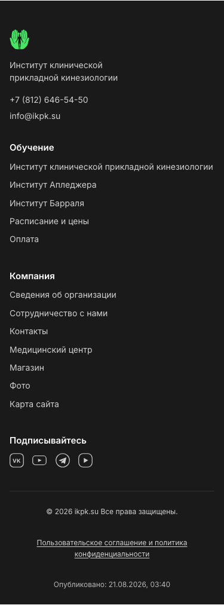
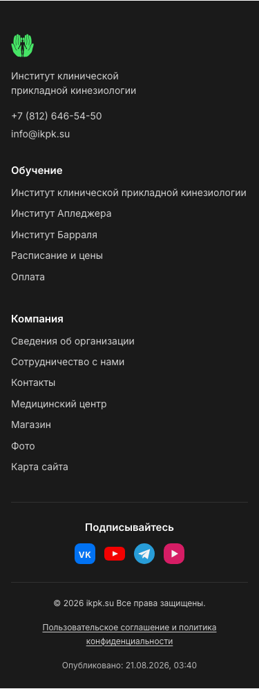

# Мокапы доделок после демо: главная целиком и страница семинара

Два предмета выбора владельца. Оба заблокированы правилом «облик меняется только после
оценки полноценных мокапов страниц в нескольких вариантах»
([`AGENTS.md`](../../../../AGENTS.md), раздел «Изменения облика»), и оба названы в
пункте 9 «Пакетов для OpenSpec»
([`docs/demo-2026-08-19-decisions.md`](../../../demo-2026-08-19-decisions.md)):

1. **главная целиком** — новая секция отзывов (Q7/Q13/Q24), плавающий чат-виджет (Q22),
   строка «Опубликовано» в подвале (Q28), соцсети иконками вместо текста и в составе из
   четырёх (D16 + W1);
2. **страница семинара** — расписание, поднятое вверх (D3, пересмотрено владельцем
   2026-08-22: «точечной правкой» это не является, потому что меняется раскладка).

Главная снята **целиком** намеренно: фрагменты не отвечают на два вопроса, ради которых
мокап и делается, — не сталкивается ли секция отзывов с плавающим чатом и не спорят ли
иконки соцсетей со строкой «Опубликовано» в одном подвале. Ответы — в findings ниже, с
числами.

**Решения не пересматриваются, выбирается только облик.** Что виджет отзывов — официальный
динамический Яндекса, что чат ставим, что метка публикации лежит в отдельном файле, что
Instagram и Facebook уходят — это уже решено и здесь не обсуждается.

- исследуемый коммит: `origin/main@e0c4d1d8b94647f018dec6bd518855cfd2553fcf` (кратко `e0c4d1d`)
- ветка мокапов: `design/demo-followups-mockups`
- дата съёмки: 2026-08-22
- вьюпорты: **1280×800** и **375×812**, `deviceScaleFactor=1`, `reducedMotion=reduce`
- машинный протокол с числами: [`shot-log-main.txt`](shot-log-main.txt) (опорные числа
  нынешнего `main`), [`shot-log-a.txt`](shot-log-a.txt), [`shot-log-b.txt`](shot-log-b.txt),
  [`shot-log-c.txt`](shot-log-c.txt)

## Как это снято и что здесь ненастоящее

**Снято с реальной сборки, не нарисовано.** `npx astro build` четырьмя проходами
(`dist-ref` — чистый `main`, `dist-a`/`dist-b`/`dist-c` — варианты, переключатель
`MOCKUP_VARIANT`), затем Playwright по собранному выводу через свой статический сервер.
Контент настоящий: расписание, преподаватели, цены и тексты семинаров — из
`discovery/entities/*`, а не набраны руками.

**Опорные числа сняты с ЧИСТОГО `main`, а не со сборки «мокап выключен».** Это разные
деревья: даже при `MOCKUP_VARIANT=off` в вывод попадают нейтральные обёртки и лишние
правила CSS, и `diff -rq` показывает расхождение почти на каждой странице. Числа «как
сегодня» взяты только с `dist-ref`, собранного из неизменённых исходников.

**Три вещи в мокапе — замены, и это меняет то, что по нему можно утверждать:**

| Что | Чем заменено | Почему и что отсюда следует |
|---|---|---|
| Виджет отзывов Яндекс.Карт | статическая заглушка с тем же хромом; тексты отзывов — серые полосы | настоящий виджет — `<iframe>` на `yandex.ru`: снимки стали бы недетерминированными, а в каждую сборку уехал бы запрос наружу. Тексты чужих отзывов не выдуманы намеренно — Q19 прямо запрещает переносить их к себе. **Размеры 560×800 (с комментариями) и 420×256 (только рейтинг) — допущение** по типовому коду встраивания; при внедрении снимаются с фактического |
| Чат-виджет Bitrix24 | статическая заглушка: кнопка 60×60, отступ 24 px, панель 400×620, на узком экране почти во весь экран | настоящий виджет создал бы живой канал обращений с демо-съёмки. **Геометрия — допущение**; все выводы о перекрытиях ниже пересчитываются под другой размер, потому что даны в пикселях, а не «налезает/не налезает» |
| Строка «Опубликовано» | зафиксированное значение `21.08.2026, 03:40` | в продукте её подставляет клиент из `/published-at.json` (Q28). Живое значение различалось бы минутами между вариантами, и сравнение снимков врало бы |

**Иконки соцсетей нарисованы здесь и официальными фирменными знаками не являются.** Они
годятся, чтобы выбрать размер, плотность и трактовку (монохром или фирменные цвета); при
внедрении берутся официальные марки, с проверкой условий использования.

**Код мокапа в `web/src` не уходит.** Правки жили только в одноразовом worktree; ради
воспроизводимости они сохранены текстом в [`mockup-code.patch.txt`](mockup-code.patch.txt)
— это артефакт для перепроверки чисел, **а не заготовка реализации**. Реализация пойдёт по
спеке: в мокапе нет ни настоящих виджетов, ни чтения `/published-at.json`, ни гашения на
демо, ни согласия перед первым сообщением — всё это требования, которых заглушка не несёт.

**Гейты `web/` этой ветки не проверяют, и говорить «гейты прошли» было бы неправдой.** В
ветке лежат только PNG и текст: `git diff --name-only e0c4d1d HEAD` даёт 116 файлов, из них
вне `docs/design/mockups/demo-followups/` — ноль (проверено, не предположено; сравнение
именно с базовой ревизией, а не с локальным `main`, который в момент работы отставал на
14 коммитов). Что сборку мокапы не ломают, следует из другого — все четыре сборки зелёные,
иначе снимков бы не было.

---

## Findings: то, что измерено и меняет выбор

1. **Столкновение чата с секцией отзывов реально, и его цена — не «кнопка налезла», а
   «панель закрыла виджет».** Закрытая кнопка задевает виджет на 1280 только в варианте A —
   1 680 px², полоса 28×60 по правому краю; на 375 она лежит поверх виджета целиком
   (3 600 px²) и в A, и в C, и не задевает его только в B, где виджет короткий и кончается
   выше. Раскрытая панель закрывает
   виджет на **48 % (A), 80 % (B), 8 % (C)** на 1280 и на **63 %, 100 %, 79 %** на 375.
   Разброс на десктопе объясняется не размером виджета, а тем, где он стоит по горизонтали:
   у C виджет по центру, у B прижат вправо — прямо под панель.

2. **На телефоне сторона чата не спасает: панель Bitrix24 занимает почти весь экран.**
   359×704 при экране 375×812 — 83 % площади. Поэтому «поставить чат слева» (вариант C)
   решает задачу только на десктопе; на 375 виджет отзывов закрыт на 79 % и там.

3. **Кнопка чата накрывает текст «Опубликовано» ровно в одном варианте — B, и только на
   десктопе: 14 % площади текста (420 px² из 2 925), перекрытие −28 px по горизонтали.**
   Причина в том, что B выравнивает метку по правому краю нижней полосы, то есть кладёт её
   в тот же угол, где живёт чат. В A и C метка центрирована, и зазор до кнопки 459 и 458 px.
   Измерялась рамка **текста** (Range по содержимому), а не рамка блока: блок метки тянется
   во всю ширину контейнера, и пересечение с ним говорило бы лишь о попадании в пустоту.

4. **На 375 метка расходится с кнопкой чата на 6 пикселей — во всех трёх вариантах.**
   Текст кончается на x=285, кнопка начинается на x=291. Формат `21.08.2026, 03:40`
   помещается; любой более длинный (`21 августа 2026, 03:40`) — уже нет. Это не выбор
   между вариантами, а требование к формату метки, общее для всех.

5. **Кнопка чата на 375 закрывает ссылку на пользовательское соглашение: 6 % в A и C, 2 %
   в B.** Ссылка на политику конфиденциальности — не украшение: именно на неё будет
   ссылаться согласие в самом чат-виджете (Q22). Лечится отступом снизу у подвала, и это
   общая работа для всех вариантов, а не различие между ними.

6. **Иконки соцсетей и строка «Опубликовано» не спорят ни в одном варианте.** Пересечение
   ноль везде; вертикальный зазор 302/148 px (A), 248/180 (B), 114/133 (C) на 1280/375.
   Вопрос, ради которого снималась вся главная, закрыт отрицательным ответом — но он был
   поставлен верно: в B нижняя полоса действительно уплотняется до трёх элементов в строку
   (копирайт слева, соглашение по центру, метка справа), и теснит их не друг друга, а чат.

7. **Замена текста иконками НЕ укорачивает подвал на десктопе.** Список из шести текстовых
   ссылок занимает 268×174, ряд иконок — 268×40, но высоту колонок задаёт соседняя
   «Компания» с семью ссылками, и она не меняется. Итог на 1280: подвал 427 px сегодня →
   462 (A), 408 (B), 574 (C). Экономия видна только на 375, где колонки встают друг под
   друга: 1 094 → 987 (A), 1 011 (B), 996 (C).

8. **В монохроме Youtube и Rutube почти неразличимы.** Оба знака — треугольник «play» в
   скруглённой пластине, и без цвета их различает только форма пластины. Это довод не за
   вариант, а за трактовку: фирменные цвета (C) различают их сразу, монохром (A, B) — нет.
   При переходе на официальные марки проверить это заново: у Rutube знак другой.

9. **Секция отзывов удлиняет главную заметно, и цена зависит от формы виджета, а не от
   места.** 6 026 px сегодня → 6 999 (A, +16 %), 6 426 (B, +7 %), 7 291 (C, +21 %) на 1280.
   Полный виджет с комментариями стоит ~840 px высоты; вариант B платит 420 px, потому что
   показывает только рейтинг.

10. **Компактный виджет заставляет выбирать: либо наши числа, либо его.** Первая редакция
    варианта B показывала 4,9, «33 отзыва» и бейдж «Хорошее место 2026» дважды рядом — своей
    сводкой и карточкой виджета. Сводку убрали, числа несёт виджет. Это неустранимое
    свойство короткого режима: он и есть сводка, и всё, что мы напишем рядом, будет её
    повтором.

11. **Сегодня расписание семинара лежит на двух третях глубины страницы, и кнопки записи на
    первом экране нет ни при каком числе дат.** Блок начинается на 2 778 px из 4 199 (66 %)
    на 1280 и на 5 278 из 8 332 (63 %) на 375; первая «Зарегистрироваться» — на 2 876 и
    5 504. Во всех трёх вариантах она поднимается на первый экран: 341/561 (A), 264/518 (B),
    413/505 (C).

12. **Поднять расписание вверх — значит опустить описание, и на телефоне это дорого.** При
    семи датах (максимум в данных) описание начинается на 1 961 px в A, 1 600 в C и 639 в B
    против 335 сегодня. На 1280 вариант C описание не опускает вовсе (243 px, как сегодня):
    расписание уходит вбок, а не вверх.

13. **Вариант A страницы семинара выносит наверх отказ — на 81 странице из 126 (64 %).**
    Столько семинаров не имеют ни одной запланированной даты (посчитано по собранному
    `dist-ref`: 126 страниц семинара, 45 с датами, 81 без). Первое, что видит посетитель
    после заголовка, — «К сожалению, данный курс, в настоящий момент еще не запланирован».
    B на том же месте показывает «Даты пока не назначены» и два телефона, C — короткую
    карточку в боковой колонке.

14. **Липкая колонка (C) сужает читаемую колонку с 1 168 до 792 px** — и это скорее выигрыш:
    длина строки приближается к `--measure: 70ch`, заданной в токенах. Страница при этом
    становится самой короткой из всех на 1280: 3 975 px против 4 199 сегодня.

15. **Колонка расписания с семью датами выше экрана, и внутри неё появляется своя
    прокрутка.** Семь карточек не помещаются в `100vh − шапка`; ограничение по высоте
    задано намеренно, иначе колонка перестала бы быть липкой. Прокрутка внутри липкого блока
    — вещь, которую надо увидеть и одобрить отдельно; она видна на снимке
    `variant-c/seminar-dated-1280-03-mid.png`.

16. **Липкость сначала не работала, и это стоило отдельного круга.** При `align-items: start`
    колонка расписания получает высоту своего содержимого, и `sticky` внутри неё уезжает
    вместе с ней после первого экрана — на снимке правая колонка была пустой. Записано
    потому, что при реализации ошибка повторится: `align-items: start` для такой раскладки
    выглядит естественным выбором.

17. **Снимок блока и снимок экрана отвечают на разные вопросы, и первый пришлось чинить.**
    Playwright режет снимок элемента по его рамке, а липкая шапка ложится поверх — верх
    блока оказывался закрыт. Плавающие слои для снимков блоков скрываются по **вычисленному**
    `position`, а не по списку селекторов: первая редакция проверяла только `fixed`, шапка у
    нас `sticky`, счётчик рапортовал «скрыто 2», и шапка оставалась на снимке. Снимки экрана
    (`-03-`, `-05-`, `-06-`, `-07-`, `-08-`) плавающие слои сохраняют — именно на них и
    смотрят столкновения.

---

## Предмет первый: главная целиком

Во всех трёх вариантах одинаково: соцсетей четыре (ВКонтакте, Youtube, Telegram, Rutube),
Instagram и Facebook сняты; строка «Опубликовано: 21.08.2026, 03:40» есть в подвале; чат
присутствует на странице. Различаются место секции отзывов, форма виджета, сторона чата и
подача подвала.

| | место секции | виджет | чат | иконки | «Опубликовано» |
|---|---|---|---|---|---|
| **A** | после «Преподавателей» | 560×800, с комментариями | справа внизу | монохром в кружках, 4-я колонка | отдельной строкой под соглашением |
| **B** | сразу после «Преимуществ» | 420×256, только рейтинг | справа внизу | монохром без кружков, 4-я колонка | в строке копирайта, справа |
| **C** | перед финальной CTA-полосой | 560×800, по центру | **слева** внизу | фирменные цвета, полосой в подвале | отдельной строкой под соглашением |

### Вариант A — «отзывы разворотом: сводка слева, виджет справа»

Секция стоит там, где посетитель уже посмотрел программы и преподавателей. Слева — наша
сводка (крупные 4,9, звёзды, «33 отзыва · 66 оценки», бейдж, кнопка в Яндекс.Карты) и
объяснение, что отзывы мы не редактируем и не отбираем. Справа — виджет с комментариями во
всю высоту. Подвал прежней четырёхколоночной сеткой, иконки монохромные в кружках 40×40,
метка публикации — отдельной строкой.

Чем платит: страница растёт на 973 px (+16 %); закрытая кнопка чата налезает на правый край
виджета полосой 28×60; раскрытая панель закрывает 48 % виджета на 1280 и 63 % на 375, а
кнопку «Смотреть на Яндекс.Картах» на 375 — целиком.

Что выигрывает: сводка и виджет читаются как одно целое; текст метки публикации кнопкой
чата не задет ни на одном вьюпорте; подвал на телефоне становится короче нынешнего на
107 px.

375 — виджет во всю ширину, панель чата почти во весь экран:

Главная целиком: [1280](variant-a/home-1280-01-full.png) · [375](variant-a/home-375-01-full.png).
Для сравнения — сегодняшняя: [1280](reference/home-1280-01-full.png) ·
[375](reference/home-375-01-full.png).

### Вариант B — «полоса доверия наверху, отзывы читают на Яндексе»

Секция стоит вторым экраном, сразу после «Преимуществ», и подана одной полосой: заголовок
«Что о нас пишут», объяснение и ссылка слева, короткая карточка виджета (только рейтинг)
справа. Полных отзывов на сайте не показываем — за ними уводим на Яндекс.Карты. Подвал
прежней сеткой, иконки без кружков, нижняя полоса собрана в одну строку: копирайт,
соглашение, метка.

Чем платит: **кнопка чата накрывает текст «Опубликовано» на 14 %** — единственное место во
всех вариантах, где чат закрывает саму метку; раскрытая панель закрывает 80 % виджета на
1280 и 100 % на 375; отзывов на странице нет вовсе, доверие держится на числе и переходе
наружу; нижняя полоса подвала уплотняется до трёх элементов в строку.

Что выигрывает: самая дешёвая по высоте — +400 px (+7 %) против +973 и +1 265; доверие
попадает на второй экран, а не на седьмой; подвал на 1280 становится **короче** нынешнего
на 19 px, несмотря на добавленную строку.

Главная целиком: [1280](variant-b/home-1280-01-full.png) · [375](variant-b/home-375-01-full.png).

### Вариант C — «отзывы финалом, чат слева, соцсети цветом»

Секция стоит последней перед CTA-полосой: заголовок, крупная сводка в строку, виджет по
центру, ссылка на карточку организации под ним. Чат перенесён в левый нижний угол.
Подвал перестроен: колонка «Подписывайтесь» убрана, сетка стала трёхколоночной, а иконки —
фирменных цветов — переехали отдельной центрированной полосой в нижнюю часть, над
копирайтом и меткой.

Чем платит: самая дорогая по высоте — +1 265 px (+21 %) на 1280 и +147 px подвала; отзывы
видит только тот, кто долистал до конца (секция начинается на 70 % глубины на 1280 и 78 %
на 375); чат слева на десктопе закрывает не виджет, а текст основной колонки — на странице
семинара это видно прямо на снимке; на 375 перенос чата не помогает вовсе.

Что выигрывает: **лучшая совместимость с чатом на десктопе** — раскрытая панель закрывает
8 % виджета против 48 % и 80 %; фирменные цвета иконок сразу различают Youtube и Rutube;
отзывы стоят там, где посетитель уже решает, записываться ли.

Главная целиком: [1280](variant-c/home-1280-01-full.png) · [375](variant-c/home-375-01-full.png).

### Чат вне часов работы — одинаково во всех вариантах

Поведение «вне часов работы» (D14: пн–пт 10:00–18:00, выходные — у менеджера, но семинары
идут) предметом выбора не является и снято по одному кадру на вариант:
[A](variant-a/home-1280-08-footer-chat-offline.png) ·
[B](variant-b/home-1280-08-footer-chat-offline.png) ·
[C](variant-c/home-1280-08-footer-chat-offline.png).

---

## Предмет второй: страница семинара

Сняты три случая, потому что раскладка ведёт себя по-разному в каждом: **семь дат**
(максимум в данных, `/institut-apledzhera/kraniosakralnaya-terapiya/kraniosakralnaya-terapiya-1`),
**одна дата**
(`/institut-klinicheskoy-prikladnoy-kineziologii/specializirovannye/viscerotoksichnost-i-osnovy-detoksikacii`)
и **без дат**
(`/institut-klinicheskoy-prikladnoy-kineziologii/psihokineziologiya/antistressovaya-kineziologiya-vvedenie-1`).
Третий случай — не редкость, а большинство: 81 страница из 126.

| | 1280: описание с | 1280: кнопка записи | 375: описание с | высота 1280 (7 дат) | случай «без дат» |
|---|---|---|---|---|---|
| **сегодня** | 243 px | 2 876 px, вне экрана | 335 px | 4 199 px | отказ внизу страницы |
| **A** | 930 px | 341 px | **1 961 px** | 4 242 px | **отказ сразу под заголовком** |
| **B** | 387 px | 264 px | 639 px | 4 324 px | «Даты пока не назначены» + два телефона |
| **C** | **243 px** | 413 px | 1 600 px | **3 975 px** | короткая карточка в колонке |

### Вариант A — «расписание целиком сразу под заголовком»

Тот же блок расписания, просто перенесён между заголовком и описанием. Самое буквальное
прочтение просьбы.

Чем платит: описание уезжает под расписание — на 930 px при семи датах на 1280 и на
1 961 px на 375; на 81 странице из 126 первым после заголовка идёт отказ.
Что выигрывает: ничего не меняет в самом блоке — при реализации это перенос, а не переверстка.

### Вариант B — «полоса ближайшей даты вверху, полное расписание на месте»

Под заголовком — компактная полоса: ближайшая дата, город, преподаватель, цена, кнопка
«Записаться на семинар» и ссылка «ещё 6 дат ниже ↓». Полное расписание остаётся внизу и
служит целью этой ссылки. Без дат полоса показывает «Даты пока не назначены» и два телефона.

Чем платит: расписание оказывается на странице дважды — полосой и таблицей; страница
становится самой длинной (4 324 px на 1280, 8 553 на 375); «ещё N дат» требует от посетителя
второго действия.
Что выигрывает: единственный вариант, который поднимает запись вверх, **не опуская
описание** (387 px против 243 сегодня на 1280, 639 против 335 на 375); лучший случай «без
дат» — вместо извинения телефон менеджера.

### Вариант C — «расписание карточками в липкой боковой колонке»

На 1280 страница делится на две колонки: описание слева (792 px), расписание справа
(21 rem) карточками, колонка липкая и остаётся на экране при любой прокрутке. Уже 1024 px
колонка встаёт над описанием.

Чем платит: таблица на шесть колонок в 336 px не помещается — расписание переверстывается в
карточки, то есть при реализации это новый компонент, а не перенос; семь карточек выше
экрана, внутри колонки появляется своя прокрутка; на 375 описание всё равно уезжает на
1 600 px.
Что выигрывает: на десктопе описание начинается там же, где сегодня, а запись видна всегда;
читаемая колонка сужается до 792 px, ближе к `--measure`; страница короче нынешней на 224 px.

Для сравнения — сегодняшняя страница: [1280, верх](reference/seminar-dated-1280-01-top.png) ·
[1280, целиком](reference/seminar-dated-1280-02-full.png) ·
[375, целиком](reference/seminar-dated-375-02-full.png).

---

## Рекомендация

**Главная — вариант C, с одной правкой из A.** Довод один и он измерен: чат и виджет отзывов
конфликтуют по-настоящему только раскрытой панелью, и из трёх раскладок C единственная, где
этот конфликт почти исчезает на десктопе (8 % против 48 % и 80 %). Фирменные цвета иконок
решают вторую измеренную проблему — неразличимость Youtube и Rutube в монохроме. Правка из
A: **метку публикации оставить центрированной отдельной строкой** — C так и делает, и это же
защищает от находки 3.

Цена выбора названа честно: C — самый длинный вариант (+21 % к высоте главной), и отзывы
видит только долиставший. Если для заказчика важнее, чтобы доверие попадало на второй экран,
брать **B**, но тогда обязательно **перенести метку публикации из правого угла нижней
полосы** — иначе чат будет закрывать её текст постоянно.

**Страница семинара — вариант B.** Он единственный решает поставленную задачу (запись на
первом экране), не создавая новой: описание остаётся почти на прежнем месте, а на 81
странице из 126 вместо извинения появляется телефон менеджера. C красивее на десктопе и
короче по высоте, но требует нового компонента расписания и на телефоне ведёт себя хуже B.
A — самая дешёвая реализация и самый плохой результат: она поднимает наверх отказ на двух
третях страниц семинаров.

**Варианты выбираются независимо.** Буква у главной и у страницы семинара общая только по
удобству съёмки: они собраны одним проходом. Взять C для главной и B для семинара — законно.

## Вопросы к владельцу, которые мокап не решает

1. **Формат метки публикации.** На 375 текущий формат расходится с кнопкой чата на 6 px.
   Оставляем `21.08.2026, 03:40` и фиксируем это как требование к формату — или закладываем
   отступ снизу у подвала и разрешаем формат подлиннее?
2. **Отступ подвала под плавающий чат.** Кнопка на 375 закрывает ссылку на пользовательское
   соглашение (2–6 %) во всех вариантах. Это общая правка; её место — в change про виджеты
   или в change про соцсети?
3. **Прокрутка внутри липкой колонки** (только если выбран C для семинара): семь дат в
   колонку не помещаются. Ограничивать высоту с внутренней прокруткой, как в мокапе, или
   отпускать колонку и терять липкость на длинных списках?
4. **Официальные марки соцсетей.** Нарисованные глифы надо заменить фирменными; у Rutube знак
   отличается от нашего, и различимость с Youtube надо проверить заново на настоящих марках.
5. **Фактические размеры обоих виджетов.** 560×800 / 420×256 у Яндекса и 400×620 у Bitrix24 —
   допущения. Все числа перекрытий даны в пикселях и пересчитываются, но пересчитать их
   должен тот, кто снимет размеры с живых виджетов.
