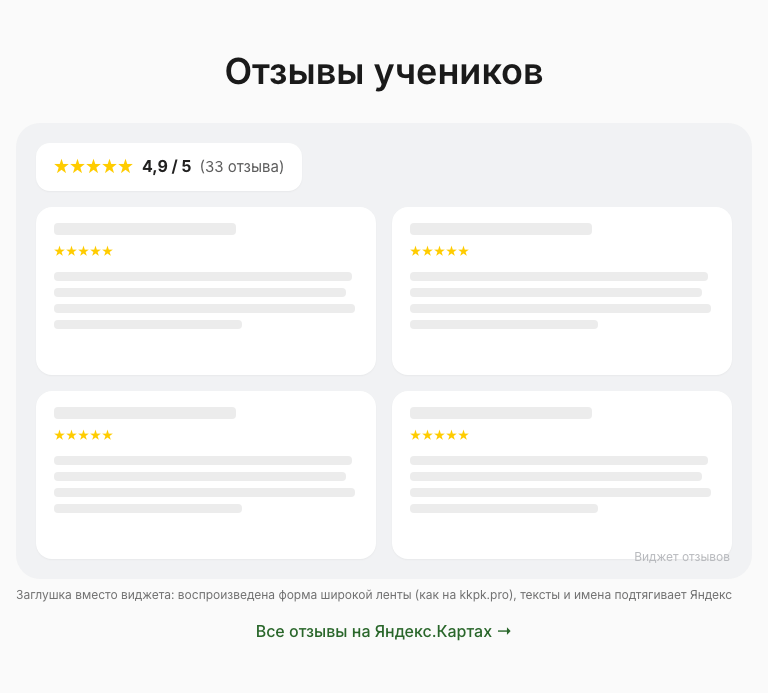
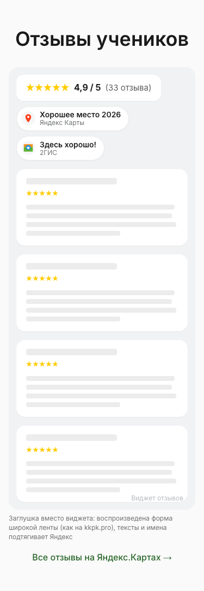
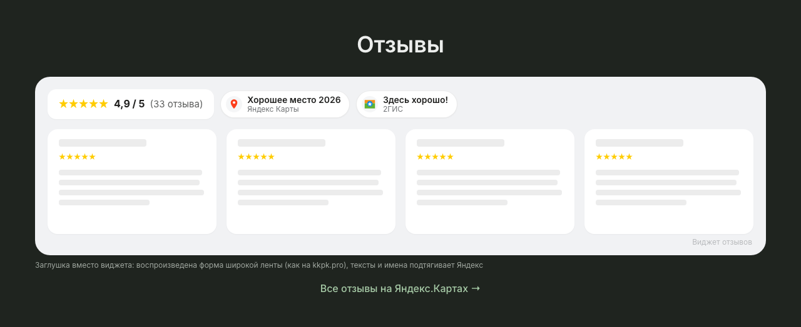

# Мокапы доделок после демо: главная целиком и страница семинара

Два предмета выбора владельца. Оба заблокированы правилом «облик меняется только после
оценки полноценных мокапов страниц в нескольких вариантах»
([`AGENTS.md`](../../../../AGENTS.md), раздел «Изменения облика»), и оба названы в
пункте 9 «Пакетов для OpenSpec»
([`docs/demo-2026-08-19-decisions.md`](../../../demo-2026-08-19-decisions.md)):

1. **главная целиком** — новая секция отзывов (Q7/Q13/Q24), плавающий чат-виджет (Q22),
   строка «Опубликовано» в подвале (Q28), соцсети иконками вместо текста и в составе из
   четырёх (D16 + W1);
2. **страница семинара** — расписание, поднятое вверх (D3, пересмотрено владельцем
   2026-08-22: «точечной правкой» это не является, потому что меняется раскладка).

Главная снята **целиком** намеренно: фрагменты не отвечают на два вопроса, ради которых
мокап и делается, — не сталкивается ли секция отзывов с плавающим чатом и не спорят ли
иконки соцсетей со строкой «Опубликовано» в одном подвале. Ответы — в findings 1–7, с
числами.

**Решения не пересматриваются, выбирается только облик.** Что виджет отзывов — официальный
динамический Яндекса, что чат ставим, что метка публикации лежит в отдельном файле, что
Instagram и Facebook уходят — это уже решено и здесь не обсуждается.

- исследуемый коммит: `origin/main@e0c4d1d8b94647f018dec6bd518855cfd2553fcf` (кратко `e0c4d1d`)
- ветка мокапов: `design/demo-followups-mockups`
- дата съёмки: 2026-08-22, варианты A–D пересняты 2026-08-23 после добавления знаков наград
  (опорные кадры `reference/` не менялись — `main` тот же)
- вьюпорты: **1280×800**, **768×1024**, **375×812** и **1280×800 в тёмной теме**,
  `deviceScaleFactor=1`, `reducedMotion=reduce`
- машинный протокол с числами: [`shot-log-main.txt`](shot-log-main.txt) (опорные числа
  нынешнего `main`), [`shot-log-a.txt`](shot-log-a.txt), [`shot-log-b.txt`](shot-log-b.txt),
  [`shot-log-c.txt`](shot-log-c.txt), [`shot-log-d.txt`](shot-log-d.txt)
- красный прогон негативной проверки съёмки: [`negative-check.txt`](negative-check.txt)

## Как это снято

**Снято с реальной сборки, не нарисовано.** `npx astro build` пятью проходами
(`dist-ref` — чистый `main`, `dist-a`…`dist-d` — варианты, переключатель
`MOCKUP_VARIANT`), затем Playwright по собранному выводу через свой статический сервер.
Контент настоящий: расписание, преподаватели, цены и тексты семинаров — из
`discovery/entities/*`, а не набраны руками.

**Уже принятое поведение во всех вариантах ОДИНАКОВО.** Мокап выбирает раскладку, поэтому
всё, что решено вне его, держится константой: состав соцсетей, наличие метки, наличие чата и
— отдельно важное — текст на странице семинара без запланированных дат. По решению Q11 это
«Даты пока не назначены» плюс телефоны менеджера, и так во всех вариантах. Первая редакция
оставляла в варианте A прежнее «К сожалению, данный курс… не запланирован» и затем ставила
это ему в вину: сравнение смешивало раскладку с поведением, а вывод про «81 страницу из 126»
опирался на разницу, к раскладке не относящуюся. Исправлено, finding 16 пересчитан.

**Опорные числа сняты с ЧИСТОГО `main`, а не со сборки «мокап выключен».** Это разные
деревья: даже при `MOCKUP_VARIANT=off` в вывод попадают нейтральные обёртки и лишние
правила CSS, и `diff -rq` показывает расхождение почти на каждой странице. Числа «как
сегодня» взяты только с `dist-ref`, собранного из неизменённых исходников.

**Перекрытия надписей считаются по рамке ТЕКСТА, а не по рамке блока.** Строка
«Опубликовано» — блок во всю ширину контейнера (1168 px при тексте в 195 px), и пересечение
с блоком говорит лишь о попадании кнопки в пустое место строки. Рамку текста даёт `Range`
по содержимому узла; в протоколе это поля `publishedText` и `gaps`. Разница не
академическая: по блоку кнопка «перекрывает» метку во всех трёх вариантах, по тексту — в
одном.

**У снимков экрана есть постусловие: кнопка чата обязана быть НА КАРТИНКЕ.** Считается доля
пикселей цвета кнопки во всей её рамке; порог 25 %. Измеренные значения: **67–68 %** там, где
кнопка нарисована (вписанный круг дал бы ~78 %, но белый значок внутри съедает часть),
**52–53 %** на кадрах с раскрытой панелью, где её тень перекрывает край, и **0 %**, когда
кнопки нет. Прогон, где хоть один кадр не прошёл, завершается ненулевым кодом; итоговые
доли по каждому кадру записаны последней строкой каждого `shot-log-*.txt`.

Границы этой проверки названы, чтобы её зелёный цвет не читался шире, чем он есть:
она стоит **только на снимках экрана**. Кадры `-01-full` (полностраничные) и `-02`/`-04`
(снимки блоков, где плавающие слои прячутся намеренно) ею не покрыты. Цвет кнопки в
проверке — константа, продублированная из CSS заглушки: при смене цвета покраснеют все
кадры сразу, то есть ошибка пойдёт в сторону ложного отказа, а не ложного зелёного.
Постусловие появилось не для красоты — оно поймало реальный дефект съёмки, см. «Что
чинилось по ходу».

**У снимков блока отзывов постусловие своё: знаки наград обязаны быть в кадре.** Проверяется
не наличие узла в разметке, а видимая рамка каждой подписи («Хорошее место 2026»,
«Здесь хорошо!») **внутри рамки секции отзывов** — именно эта рамка и режется на снимок
блока. Видимость проверяется **по всей цепочке предков** (`checkVisibility` плюс обход до
`<html>` ради внятного сообщения), а не по самому узлу: `opacity` не наследуется, и первая
редакция была зелёной на кадре, где знаки погашены прозрачностью контейнера. Узел,
схлопнувшийся в ноль, уехавший за границу секции или погашенный где-то выше по дереву,
разметку прошёл бы, а на снимке его бы не было. Подписи ищутся по тексту, а не по числу элементов: список наград
может измениться, и проверка «их два» отстала бы от предмета молча. Для варианта ноль
проверок — отказ, а не успех; для опорной сборки проверка не применяется, и так и написано
в протоколе. Негативная проверка — в [`negative-check.txt`](negative-check.txt).

**Оптимизация PNG — часть сценария съёмки, и постусловие считается ПОСЛЕ неё.** Пережатие
не lossless: `sharp` с `effort` переводит изображение в палитру, то есть цвета сдвигаются
(суммарно 38,1 → 14,9 МБ). Пока оптимизация была отдельной командой после проверки, гейт
стерёг не те файлы, которые уезжают в поставку: доля пикселей менялась на **45 кадрах из 98**.
Теперь она внутри скрипта, доля пересчитывается по финальным файлам, и в протокол идут оба
числа в форме `до→после`. Минимум по финальным файлам — 48 % при пороге 25 %.

**Снимки блоков делаются на отдельной загрузке страницы.** Снимок элемента требует спрятать
плавающие слои (Playwright режет по рамке элемента, а липкая шапка ложится поверх), и
страница после этого больше не используется: состояние, от которого зависят следующие
кадры, не мутируется вовсе.

**Кадров 194, в тексте разобраны не все.** В README вынесено то, что различает варианты;
остальное лежит в каталогах `reference/`, `variant-a/`, `variant-b/`, `variant-c/`,
`variant-d/` под
говорящими именами: `home-<вьюпорт>-<NN>-<что>` и `seminar-<случай>-<вьюпорт>-<NN>-<что>`,
где вьюпорт — `1280`, `768`, `375` или `1280d` (тёмная тема), случай — `dated` (7 дат),
`two`, `single`, `undated`, а `NN`: `01` страница целиком, `02` блок, `03` экран с блоком,
`04` подвал блоком, `05` экран с подвалом, `06`/`07` то же с раскрытым чатом, `08` чат вне
часов работы, `-01-top`/`-02-full`/`-03-mid` для страницы семинара.

## Что здесь ненастоящее

| Что | Чем заменено | Почему и что отсюда следует |
|---|---|---|
| Виджет отзывов Яндекс.Карт | статическая заглушка с тем же хромом; тексты отзывов — серые полосы | настоящий виджет — `<iframe>` на `yandex.ru`: снимки стали бы недетерминированными, а в каждую сборку уехал бы запрос наружу. Тексты чужих отзывов не выдуманы и не перенесены сюда намеренно: их источник — виджет, а мокап решает раскладку. Q19 при этом запрещает переносить к себе **фотографии** («чужие фото к себе не копируем — остаются в виджете»), про тексты решения нет. **Размеры 560×800 (с комментариями) и 420×256 (только рейтинг) — допущение** по типовому коду встраивания; при внедрении снимаются с фактического. Хром сверен с живым виджетом 23.08.2026 и по итогам сверки исправлен — finding 21. **Режим «широкая лента» (вариант D) воспроизводит не официальный виджет, а форму стороннего сервиса** — finding 25 |
| Знаки наград «Хорошее место 2026» и «Здесь хорошо!» | нарисованы здесь: метка Яндекса и плитка 2ГИС нарисованы в SVG, подписи набраны текстом | официальных марок для сайта ни один из двух сервисов не выдаёт (finding 22), поэтому при внедрении знак либо рисуется, либо берётся макетом из кабинета — и тогда его вид может отличаться от снимка. Сам факт наград взят с фотографии наклеек на двери центра (владелец, 23.08.2026), а не из открытых источников |
| Чат-виджет Bitrix24 | статическая заглушка: кнопка 60×60, отступ 24 px, панель 400×620, на узком экране почти во весь экран | настоящий виджет создал бы живой канал обращений с демо-съёмки. **Геометрия — допущение**; все выводы о перекрытиях даны в пикселях и процентах и пересчитываются под другой размер. **Приветственный пузырь рядом с закрытой кнопкой не смоделирован** — у Bitrix24 он бывает, и тогда закрытый след шире замеренного |
| Строка «Опубликовано» | зафиксированное значение `21.08.2026, 03:40` | в продукте её подставляет клиент из `/published-at.json` (Q28). Живое значение различалось бы минутами между вариантами, и сравнение снимков врало бы |
| Иконки соцсетей | глифы нарисованы здесь | официальными фирменными знаками они не являются. Годятся, чтобы выбрать размер, плотность и трактовку; при внедрении берутся официальные марки, с проверкой условий использования — и различимость Youtube с Rutube проверяется заново на них (finding 8) |

**Код мокапа в `web/src` не уходит.** Правки жили только в одноразовом worktree; ради
воспроизводимости они сохранены текстом в [`mockup-code.patch.txt`](mockup-code.patch.txt)
— это артефакт для перепроверки чисел, **а не заготовка реализации**. Реализация пойдёт по
спеке: в мокапе нет ни настоящих виджетов, ни чтения `/published-at.json`, ни гашения на
демо, ни согласия перед первым сообщением — всё это требования, которых заглушка не несёт.

**Гейты `web/` этой ветки не проверяют, и говорить «гейты прошли» было бы неправдой.** В
ветке лежат только PNG и текст, вне `docs/design/mockups/demo-followups/` — ноль файлов
(проверено `git diff --name-only`, сравнение с базовой ревизией `e0c4d1d`, а не с локальным
`main`). Что сборку мокапы не ломают, следует из другого — все сборки зелёные, иначе
снимков бы не было.

## Что этими мокапами не решается

Названо явно, чтобы не оказалось молчаливым допущением.

- **Демо-режим.** Гашение на демо решено для обоих виджетов
  ([решения, раздел «Факты…»](../../../demo-2026-08-19-decisions.md)); ссылаться при этом
  надо на само решение, а не на аналогию с Метрикой — в Q22 эта аналогия прямо признана
  неверной для чата. Чем замещается погашенный виджет — дырой в ~840 px
  (A, C) или малозаметной карточкой (B) — здесь не показано и должно стать требованием в
  change «внешние виджеты». Вопрос 3 ниже.
- **Остальные шаблоны сайта.** Чат живёт в общем layout, то есть на каждой странице, а
  столкновения измерены на двух шаблонах — главной и странице семинара. Страница `/oplata`
  с липкой панелью формы (PR #151) и каталоги не проверялись. «Слева безопасно» — вывод про
  эти два шаблона, не про сайт.
- **Состояние метки до загрузки и без JavaScript.** Значение приходит с клиента; в мокапе
  оно зашито в разметку, поэтому на снимках этого состояния нет вовсе. Что будет видно —
  **выбор реализации, который делает спека, а не свойство варианта**: подача влияет лишь на
  форму пропажи (у A и C отсутствует целая строка, у B — фрагмент внутри строки копирайта).
  Вопрос 1 ниже.
- **Планшет снят сокращённым набором** (768×1024, без полностраничных кадров и без
  раскрытого чата) — ровно ради одного вопроса: как раскладки ведут себя между 375 и 1280.
  Ответ оказался существенным, см. finding 15.
- **Тёмная тема снята только на 1280 и только по секции отзывов, подвалу и странице
  семинара.** Полностраничных тёмных кадров нет.
- **Вариант D снят только по главной.** Он меняет форму виджета и ничего не меняет на
  странице семинара, поэтому её кадры для него не снимались: они совпали бы с опорными.
- **Порядок фокуса, чтение экранным диктором и поведение чата с клавиатуры** не
  проверялись. Доступные имена у иконок заданы (`aria-label`), но это не проверка
  доступности.

---

## Findings: то, что измерено и меняет выбор

1. **Столкновение чата с секцией отзывов реально, и его цена — не «кнопка налезла», а
   «панель закрыла виджет».** Закрытая кнопка задевает виджет на 1280 только в варианте A —
   1 680 px², полоса 28×60 по правому краю; на 375 она лежит поверх виджета целиком
   (3 600 px²) в A и C и не задевает его в B, где виджет короткий и кончается выше.
   Раскрытая панель закрывает виджет на **48 % (A), 80 % (B), 8 % (C), 32 % (D)** на 1280 и
   на **68 %, 100 %, 74 %, 81 %** на 375. Разброс на десктопе объясняется не размером виджета,
   а тем, где он стоит по горизонтали: у C виджет по центру, у B прижат вправо — прямо под
   панель, у D лента идёт во всю ширину и панель накрывает только её правый край.

2. **На телефоне сторона чата не спасает: панель Bitrix24 занимает почти весь экран.**
   359×704 при экране 375×812 — 83 % площади. Поэтому «поставить чат слева» (вариант C)
   решает задачу только на десктопе; на 375 виджет отзывов закрыт на 74 % и там, у D — на 81 %.
   В A и B раскрытая панель на 375 закрывает и кнопку перехода на Яндекс.Карты — на 100 %.

3. **Кнопка чата накрывает текст «Опубликовано» ровно в одном варианте — B, и только на
   десктопе: 14 % площади текста (420 px² из 2 925), перекрытие −28 px по горизонтали.**
   Причина в том, что B выравнивает метку по правому краю нижней полосы, то есть кладёт её
   в тот же угол, где живёт чат. В A, C и D метка центрирована, и зазор до кнопки 459, 458 и
   459 px.

4. **На 375 метка расходится с кнопкой на 6 пикселей — во всех трёх вариантах.**
   Текст кончается на x=285, кнопка начинается на x=291. Формат `21.08.2026, 03:40`
   помещается; любой более длинный (`21 августа 2026, 03:40`) — уже нет. Это не выбор
   между вариантами, а требование к формату метки, общее для всех четырёх. На 768 запас
   202–203 px.

5. **Кнопка чата на 375 закрывает ссылку на пользовательское соглашение: 6 % в A, C и D,
   2 % в B.** Ссылка на политику конфиденциальности — не украшение: именно на неё будет
   ссылаться согласие в самом чат-виджете (Q22). Лечится отступом снизу у подвала, и это
   общая работа для всех вариантов, а не различие между ними.

6. **Иконки соцсетей и строка «Опубликовано» не спорят ни в одном варианте.** Пересечение
   ноль везде; вертикальный зазор 302/302/148 px (A), 248/291/180 (B), 113/114/133 (C),
   303/302/149 (D) на 1280/768/375. Вопрос, ради которого снималась вся главная, закрыт отрицательным ответом
   — но он был поставлен верно: в B нижняя полоса действительно уплотняется до трёх
   элементов в строку (копирайт слева, соглашение по центру, метка справа), и теснит их не
   друг друга, а чат.

7. **Замена текста иконками НЕ укорачивает подвал на десктопе.** Список из шести текстовых
   ссылок занимает 268×174, ряд иконок — 268×40, но высоту колонок задаёт соседняя
   «Компания» с семью ссылками, и она не меняется. Итог на 1280: подвал 427 px сегодня →
   462 (A), 408 (B), 574 (C), 462 (D). Экономия видна только на 375, где колонки встают друг
   под друга: 1 094 → 987 (A), 1 011 (B), 996 (C), 987 (D).

8. **В монохроме Youtube и Rutube почти неразличимы.** Оба знака — треугольник «play» в
   скруглённой пластине, и без цвета их различает только форма пластины. Это довод не за
   вариант, а за трактовку: фирменные цвета (C) различают их сразу, монохром (A, B, D) — нет.
   При переходе на официальные марки проверить заново: у Rutube знак другой.

9. **Секция отзывов удлиняет главную заметно, и цена зависит от формы виджета, а не от
   места.** 6 026 px сегодня → 6 999 (A, +16 %), 6 426 (B, +7 %), 7 353 (C, +22 %),
   **6 584 (D, +9 %)** на 1280. Полный виджет с комментариями стоит ~840 px высоты; B платит
   420 px, потому что показывает только рейтинг; **D платит 523 px и при этом отзывы
   показывает** — за счёт того, что раскладывает их вширь, а не вглубь.

10. **Компактный виджет заставляет выбирать: либо наши числа, либо его.** Первая редакция
    варианта B показывала 4,9 и «33 отзыва» дважды рядом — своей сводкой и карточкой
    виджета (бейдж «Хорошее место 2026» тогда стоял и в заглушке виджета — неверность,
    снятая по finding 21). Сводку убрали, числа несёт виджет. Это неустранимое
    свойство короткого режима: он и есть сводка, и всё, что мы напишем рядом, будет её
    повтором. **Вариант D снимает эту дилемму иначе:** рейтинг живёт плашкой внутри самой
    ленты, отдельной сводки у нас нет вовсе, и дублировать нечего.

11. **В тёмной теме белый iframe виджета — довод за компактную форму.** Настоящий виджет
    Яндекса белый и темы сайта не знает. На тёмном полотне полноразмерная карточка 560×800
    (A и C) читается как белое полотно в пол-экрана; карточка 420×256 (B) — как обычная
    светлая плашка; лента D — светлая полоса во всю ширину, то есть по площади она между
    ними, но по форме ближе к полотну. Тёмные кадры:
    [A](variant-a/home-1280d-02-reviews-block.png) ·
    [B](variant-b/home-1280d-02-reviews-block.png) ·
    [C](variant-c/home-1280d-02-reviews-block.png) ·
    [D](variant-d/home-1280d-02-reviews-block.png).

12. **Тёмная тема вскрыла дефект НЕ в мокапе, а в репозитории: роль `--text-primary` в
    тёмной теме почти чёрная.** `web/src/styles/tokens.css:167` в блоке
    `:root[data-theme='dark']` переобъявляет `--text-primary: var(--color-light-100)`, а
    `--color-light-100` в том же блоке уже перевёрнут в `#171a17`. Двойная инверсия:
    измерено в браузере — `rgb(23,26,23)` на фоне `rgb(31,36,31)`, **контраст 1,11:1** при
    требуемых 4,5:1. Тем же механизмом задеты `--text-inverse` и `--surface-inverse`. На
    боевых страницах роль сегодня не используется (все девять секций главной берут
    `--color-dark-700` напрямую — проверено поимённо, ноль вхождений); она живёт в 44 местах,
    и все они — секции-прототипы каркаса под `/preview/*`, то есть демо-сборка. Но смысл
    этих токенов, объявленный в самом файле, — «фундамент под master template»: любой новый
    компонент, который их примет, в тёмной теме исчезнет. Мокап принял их и исчез с первой
    попытки. **Это дефект, а не предмет выбора:** маршрут — red/green отдельным изменением,
    долг записан как **TD-42** (PR #157) и от судьбы этих мокапов не зависит. В самом мокапе
    роль заменена на `--color-dark-700`, который верен в обеих темах.

13. **Статическая сводка в A и C — протухающая копия чисел живого виджета.** «4,9»,
    «33 отзыва» и «66 оценок» в нашей половине секции — константы, снятые 2026-08-20 и
    подтверждённые живым виджетом 23.08.2026 (finding 21), а виджет рядом обновляется сам.
    При 34-м отзыве страница покажет два разных числа рядом.
    Это тот же класс, из-за которого затевались Q23 и Q28. **В варианте B этот дефект был
    и убран:** первая редакция полосы несла в нашей собственной ссылке «Читать все 33 отзыва»
    рядом с карточкой виджета, где стоит то же число; теперь ссылка без числа, и все числа
    в B принадлежат виджету. **В D его нет по построению** — своей сводки у нас там вовсе не
    предусмотрено. Для A и C выбор придётся сделать явно: либо сводка без чисел,
    либо числа с объявленным порядком ручного обновления. Вопрос 4 ниже.

14. **Сегодня расписание семинара лежит на двух третях глубины страницы, и кнопки записи на
    первом экране нет ни при каком числе дат.** Блок начинается на 2 778 px из 4 199 (66 %)
    на 1280 и на 5 278 из 8 332 (63 %) на 375; первая «Зарегистрироваться» — на 2 876 и
    5 504. Во всех трёх вариантах она поднимается на первый экран: 341/561 (A), 264/518 (B),
    413/505 (C) на 1280/375.

15. **Преимущество варианта C на планшете исчезает.** На 1280 боковая колонка не опускает
    описание вовсе (243 px, как сегодня). Уже на 768 колонка встаёт над текстом, и при семи
    датах описание уезжает на **1 447 px** против 285 сегодня — почти как у A (1 911) и
    втрое хуже B (458). То есть «C не опускает описание» верно ровно для десктопа, и это
    надо знать до выбора. Кадры: [C, 768](variant-c/seminar-dated-768-01-top.png) ·
    [B, 768](variant-b/seminar-dated-768-01-top.png) ·
    [A, 768](variant-a/seminar-dated-768-01-top.png).

16. **Случай «без дат» — большинство (81 страница из 126, 64 %), и на нём варианты почти не
    различаются.** Столько семинаров не имеют ни одной запланированной даты (посчитано по
    собранному `dist-ref` **по типу пути**: страниц семинара 126, с датами 45, без дат 81;
    страницы преподавателей лежат на той же глубине пути и в знаменатель не входят). Текст в
    этом состоянии — принятое решение Q11, одинаковое во всех вариантах: «Даты пока не
    назначены» плюс два телефона. При равном поведении описание начинается с 387 px (A),
    389 (B), 243 (C) на 1280 и с 597, 570, 599 на 375 — против 243 и 402 сегодня. **То есть
    на двух третях страниц A и B стоят вровень, а выигрывает C**, у которого блок уходит вбок.

    Записано подробно, потому что первая редакция этого пункта была нечестной: она оставляла
    в A прежнюю формулировку «К сожалению, данный курс… не запланирован», а в B — принятую, и
    ставила разницу в вину раскладке A. Довод против A остаётся, но он теперь только про
    датированные страницы (таблица ниже), а не про 64 % каталога.

17. **Липкая колонка (C) сужает читаемую колонку с 1 168 до 792 px** — и это скорее выигрыш:
    длина строки приближается к `--measure: 70ch`, заданной в токенах. Страница при этом
    самая короткая из всех на 1280: 3 975 px против 4 199 сегодня.

18. **Колонка расписания с семью датами выше экрана, и внутри неё появляется своя
    прокрутка.** Семь карточек не помещаются в `100vh − шапка`; ограничение по высоте задано
    намеренно, иначе колонка перестала бы быть липкой. Прокрутка внутри липкого блока — вещь,
    которую надо увидеть и одобрить отдельно; она видна на снимке
    [`variant-c/seminar-dated-1280-03-mid.png`](variant-c/seminar-dated-1280-03-mid.png).

19. **Случай «две даты» проверяет то, чего не проверяют 7/1/0: склонение в ссылке.** У B
    полоса говорит «ещё 1 дата ниже» — форма считается, а не подставляется. Кадры:
    [A](variant-a/seminar-two-1280-01-top.png) · [B](variant-b/seminar-two-1280-01-top.png) ·
    [C](variant-c/seminar-two-1280-01-top.png).

20. **Форма ленты (D) даёт отзывы на сайте почти по цене их отсутствия — но официальным
    виджетом она недостижима, см. finding 25.** Секция 523 px
    против 420 у B, где отзывов не видно вовсе, и против 938–1181 у A и C; страница +9 %
    против +7 % у B и +16…22 % у A и C. Раскрытая панель чата закрывает ленту на 32 % — вдвое
    меньше, чем у A, потому что лента широкая и панель попадает только на её правый край.
    Цена другая: **видно четыре отзыва и по три-четыре строки каждого**, дальше — переход на
    Яндекс.Карты, тогда как у A и C виден вертикальный список с полными текстами.

21. **Заглушка виджета показывала награду, которой в настоящем виджете нет — снято.**
    Сверка с живым виджетом 23.08.2026:
    `curl -s 'https://yandex.ru/maps-reviews-widget/112883331290?comments'` → HTTP 200,
    16 004 байта. В нём: логотип «Яндекс Карты», имя организации, «4,9»,
    «33 отзыва • 66 оценок», строка «Поставьте нам оценку» со звёздами, ссылка «Оставить
    отзыв», карточки отзывов с настоящими аватарами (`avatars.mds.yandex.net`) и ссылка
    «Ещё отзывы». Награды «Хорошее место» в нём **нет**; нет и категории «Учебный центр» с
    вкладкой «Сначала новые», которые рисовала наша заглушка. Прежняя редакция тем самым
    обещала владельцу знак, приходящий вместе с виджетом, — он не приходит. Заглушка
    приведена к факту: бейдж из неё убран, вкладки заменены строкой оценки, шапка получила
    логотип. Заодно сверились числа: 4,9 / 33 / 66 — те же, что снимались 2026-08-20, за три
    дня не изменились.

22. **Знака награды для сайта не даёт ни Яндекс, ни 2ГИС — ни картинкой, ни кодом.**
    По документации Яндекс Бизнеса победитель «Хорошего места» получает отметку в карточке
    организации и **физическую наклейку** с годом, которую заказывают в кабинете; цифрового
    бейджа или кода для сайта там нет. «Здесь хорошо!» у 2ГИС — тоже физическая наклейка,
    выдаётся по запросу после проверки модераторами. Три следствия, и все три — про
    внедрение, а не про выбор варианта: знак на странице будет **нашим собственным
    утверждением**, а не плашкой, подтверждённой сервисом; **год «2026» придётся обновлять
    руками**, а просроченный год хуже отсутствующего — это требование к спеке, иначе он
    протухнет молча, как числа из finding 13; **условия использования марок** проверяются
    до внедрения, тот же класс, что с иконками соцсетей (finding 8). В мокапе оба знака
    нарисованы здесь.

23. **Встраиваемого виджета отзывов у 2ГИС нет: всё, что находится, — сторонние сервисы.**
    GameLead, SmartWidgets, ReviewLab, MyReviews — все они подтягивают отзывы 2ГИС **своим
    скриптом со своего домена**, по подписке. Это не «виджет 2ГИС», а посредник между нами
    и 2ГИС: чужой JavaScript на наших страницах, чужая доступность, чужая политика данных.
    Против такого решения — та же рамка, по которой Метрику сняли с demo. Карточка
    организации в 2ГИС при этом поиском **не найдена** (нашлась карточка другого центра —
    Янушанца), поэтому ни рейтинга, ни числа отзывов 2ГИС в мокапе нет и выдумывать их
    нельзя. Вопрос 8 ниже.

24. **Виджет Яндекса приносит с собой Метрику — не пиксель, а полноценный счётчик.** В его
    ответе inline-скрипт грузит `mc.yandex.ru/metrika/tag.js` и вызывает
    `ym(57020224, 'init', {clickmap: true, trackLinks: true, accurateTrackBounce: true})`,
    плюс `<noscript>`-пиксель `mc.yandex.ru/watch/57020224`. Счётчик чужой, не наш, и с
    картой кликов. То есть встраивание — это не только `<iframe>` с отзывами, но и третья
    сторона со своей аналитикой внутри страницы. Гашение на демо уже решено; здесь важно
    другое — это факт для change «внешние виджеты» и для текста о куки, а не деталь
    оформления. Второй скрипт в виджете безобиден: он вешает «читать дальше» на длинные
    отзывы; раскладку не меняет ни он, ни что-либо ещё — media-query в виджете нет вовсе
    (это же и доказывает finding 25).
25. **Форма варианта D — не режим официального виджета, а продукт стороннего сервиса.**
    Проверено на живой странице конкурента 23.08.2026: `curl -s https://kkpk.pro/` → HTTP 200,
    367 740 байт. В разметке — `

` и
    `<script src="https://web-widgets.ru/reviews/kkpkpromtc1mzmxmzgzmzc4na.js" async>`;
    **iframe Яндекса на странице нет вовсе**, от Яндекса там только обычная ссылка
    «Смотреть все отзывы» с `utm_source=maps-reviews-widget`. Со стороны Яндекса вывод тот
    же: в ответе официального виджета **нет ни одной media-query**, карточки отзывов идут
    блоками друг под другом — многоколоночной раскладки он не умеет. Значит четырёхкарточную
    ленту официальным embed получить нельзя, и путей ровно два, оба — решение владельца, а не
    оформление: **(1)** сторонний сервис-посредник (подписка, чужой скрипт на наших
    страницах, свои куки, своё поведение на демо) — то есть смена принятого решения Q7/Q13 и
    ровно то, против чего finding 23; **(2)** выводить отзывы самим. Второй путь **решениями не закрыт**, и
    называть его запрещённым было ошибкой: Q19 запрещает копировать к себе чужие
    **фотографии** («остаются в виджете»), про тексты в решениях не сказано ничего. То есть
    это **отдельная неразрешённая альтернатива**, а не запрет: под неё нужны свои ответы —
    права на тексты и условия Яндекса на их использование вне виджета, порядок обновления
    (иначе повторится finding 13 в худшем виде: не два числа разойдутся, а весь список),
    аватары придётся выбросить по Q19, и всё это тоже новое решение, а не оформление.
    **Поэтому D убран из рекомендации** и оставлен как облик для оценки — если решение меняется, он возвращается
    в выбор первым. Первая редакция утверждала обратное — «конкурент встраивает тот же
    официальный виджет Яндекса»; это было сказано по внешнему сходству и не проверено.
    Нашло внешнее ревью, не я.

---

## Предмет первый: главная целиком

Во всех четырёх вариантах одинаково: соцсетей четыре (ВКонтакте, Youtube, Telegram,
Rutube), Instagram и Facebook сняты; строка «Опубликовано: 21.08.2026, 03:40» есть в
подвале; чат присутствует на странице; **в секции отзывов стоят оба знака наград** —
«Хорошее место 2026» Яндекс Карт и «Здесь хорошо!» 2ГИС. Знаки добавлены во все четыре
намеренно, чтобы ось сравнения осталась одна: форма и место отзывов, а не наличие наград.
Различаются место секции отзывов, форма виджета, сторона чата и подача подвала.

| | место секции | глубина (1280) | виджет | высота секции | чат | иконки | «Опубликовано» |
|---|---|---|---|---|---|---|---|
| **A** | после «Преподавателей» | 67 % | 560×800, с комментариями | 938 px | справа внизу | монохром в кружках, 4-я колонка | отдельной строкой под соглашением |
| **B** | сразу после «Преимуществ» | 22 % | 420×256, только рейтинг | 420 px | справа внизу | монохром без кружков, 4-я колонка | в строке копирайта, справа |
| **C** | перед финальной CTA-полосой | 70 % | 560×800, по центру | 1 181 px | **слева** внизу | фирменные цвета, полосой в подвале | отдельной строкой под соглашением |
| **D** | после «Преподавателей» | 71 % | **широкая лента, 4 карточки в ряд — НЕ режим официального виджета (finding 25)** | 523 px | справа внизу | монохром в кружках, 4-я колонка | отдельной строкой под соглашением |

**D отличается от A ровно одним — формой виджета.** Место секции, сторона чата и подвал у
них совпадают намеренно, чтобы сравнение шло по одной оси: «вертикальный список с полными
текстами» против «горизонтальная лента из четырёх карточек».

**Оси можно смешивать не все.** Свободно рекомбинируются три: **место секции**, **сторона
чата** и **трактовка иконок** — они ничего друг о друге не знают. Связаны конструктивно
две пары: (1) **форма виджета и наличие нашей сводки** — короткий виджет без сводки
осмыслен, короткий виджет со сводкой даёт удвоение чисел (finding 10), полный виджет без
сводки оставляет полсекции пустыми; (2) **фирменные иконки и перестройка подвала в три
колонки** в варианте C идут вместе только потому, что так снято, — цветные иконки в
четвёртой колонке (как в A и B) законны и мокапа не требуют, это смена заливки глифа.
Строка «Опубликовано» переносится между подачами свободно, и находка 3 говорит, что
правый угол нижней полосы для неё — худшее место. Форма виджета из варианта D
(широкая лента) по месту тоже переносится — но она **не является режимом официального
виджета Яндекса** и требует стороннего сервиса (finding 25), то есть переносится вместе с
этим условием, а не сама по себе.

### Вариант A — «отзывы разворотом: сводка слева, виджет справа»

Секция стоит там, где посетитель уже посмотрел программы и преподавателей. Слева — наша
сводка: крупные 4,9, звёзды, «33 отзыва · 66 оценок», два знака наград в ряд и кнопка в
Яндекс.Карты. Справа
— виджет с комментариями во всю высоту. Подвал прежней четырёхколоночной сеткой, иконки монохромные в кружках 40×40,
метка публикации — отдельной строкой.

Чем платит: страница растёт на 973 px (+16 %); закрытая кнопка чата налезает на правый край
виджета полосой 28×60; раскрытая панель закрывает 48 % виджета на 1280 и 68 % на 375, а
кнопку «Смотреть на Яндекс.Картах» на 375 — целиком; сводка дублирует числа виджета своими
константами (finding 13); на тёмной теме белое полотно 560×800.

Что выигрывает: сводка и виджет читаются как одно целое; текст метки публикации кнопкой
чата не задет ни на одном вьюпорте; подвал на телефоне становится короче нынешнего на
107 px.

375 — виджет во всю ширину, панель чата почти во весь экран; 768 и тёмная тема:

Главная целиком: [1280](variant-a/home-1280-01-full.png) · [375](variant-a/home-375-01-full.png).
Для сравнения — сегодняшняя: [1280](reference/home-1280-01-full.png) ·
[375](reference/home-375-01-full.png).

### Вариант B — «полоса доверия наверху, отзывы читают на Яндексе»

Секция стоит вторым экраном, сразу после «Преимуществ» (22 % глубины), и подана одной
полосой: заголовок «Что о нас пишут», ссылка и два знака наград слева, короткая карточка
виджета (только рейтинг) справа. Полных отзывов на сайте не показываем — за ними уводим на
Яндекс.Карты. Подвал прежней сеткой, иконки без кружков, нижняя полоса собрана в одну
строку: копирайт, соглашение, метка.

Чем платит: **кнопка чата накрывает текст «Опубликовано» на 14 %** — единственное место во
всех вариантах, где чат закрывает саму метку; раскрытая панель закрывает 80 % виджета на
1280 и 100 % на 375; отзывов на странице нет вовсе, доверие держится на числе и переходе
наружу; нижняя полоса подвала уплотняется до трёх элементов в строку; при выключенном
JavaScript на месте метки остаётся дыра посреди строки, а не отсутствующая строка.

Что выигрывает: самая дешёвая по высоте — +400 px (+7 %) против +973 и +1 327; доверие
попадает на второй экран, а не на седьмой; подвал на 1280 становится **короче** нынешнего
на 19 px, несмотря на добавленную строку; в тёмной теме белая карточка виджета не
доминирует; числа не дублируются — все они принадлежат виджету (в первой редакции наша
ссылка несла «33», это убрано).

Главная целиком: [1280](variant-b/home-1280-01-full.png) · [375](variant-b/home-375-01-full.png).

### Вариант C — «отзывы финалом, чат слева, соцсети цветом»

Секция стоит последней перед CTA-полосой: заголовок, крупная сводка в строку, знаки наград
центрированным рядом под ней, виджет по центру, ссылка на карточку организации под ним. Чат перенесён в левый нижний угол.
Подвал перестроен: колонка «Подписывайтесь» убрана, сетка стала трёхколоночной, а иконки —
фирменных цветов — переехали отдельной центрированной полосой в нижнюю часть, над
копирайтом и меткой.

Чем платит: самая дорогая по высоте — +1 327 px (+22 %) на 1280 и +147 px подвала; отзывы
видит только тот, кто долистал до конца (70 % глубины на 1280 и 78 % на 375); чат слева на
десктопе закрывает не виджет, а текст основной колонки — на странице семинара это видно
прямо на снимке; на 375 перенос чата не помогает вовсе; сводка дублирует числа виджета
(finding 13); на тёмной теме белое полотно 560×800.

Что выигрывает: **лучшая совместимость с чатом на десктопе** — раскрытая панель закрывает
8 % виджета против 48 % и 80 %; фирменные цвета иконок сразу различают Youtube и Rutube;
отзывы стоят там, где посетитель уже решает, записываться ли.

Главная целиком: [1280](variant-c/home-1280-01-full.png) · [375](variant-c/home-375-01-full.png).

### Вариант D — «лента карточек, как у kkpk.pro» (требует стороннего сервиса)

**Читать этот вариант надо вместе с finding 25.** Форма подсмотрена у конкурента, и первая
редакция этого раздела утверждала, что он встраивает «тот же официальный виджет Яндекса».
Это неправда: kkpk.pro грузит скрипт стороннего сервиса, а официальный виджет такой
раскладки не умеет вовсе. То есть D показывает облик, которого **нельзя получить в рамках
принятого решения Q7/Q13** — он либо требует смены решения, либо остаётся картинкой.
Дальше — описание облика как он снят:
заголовок «Отзывы» (у конкурента он «Отзывы учеников» — по решению владельца от 23.08.2026
взят короткий, как в варианте A), серый контейнер со скруглением, белая плашка с рейтингом
слева вверху и **знаки наград рядом с ней в той же строке**, четыре белых карточки отзывов в
ряд, каждая с именем, звёздами и обрезанным текстом, и подпись «Виджет отзывов» в правом
нижнем углу. Место секции, сторона чата и
подвал — как в A.

Чем платит: **сторонний сервис-посредник** между нами и Яндексом — чужой скрипт на наших
страницах, подписка, своя политика данных, отдельные решения по демо-режиму и куки
(finding 25); видно **четыре отзыва по три-четыре строки**, а не вертикальный список
целиком — за подробностями посетитель уходит на Яндекс.Карты; секция стоит на 71 % глубины,
то есть её видит только долиставший; на 375 карточки встают в столбец и секция вырастает до
1 082 px.

Что выигрывает: отзывы **видны на сайте** ценой всего 523 px против 938–1181 у A и C и
всего +9 % к высоте главной против +16…22 %; раскрытая панель чата закрывает ленту на 32 %
против 48 % у A; своей сводки нет, поэтому нечего дублировать и нечему протухать
(finding 13); форма знакома тем, кто видел её у конкурентов. Все эти выигрыши остаются в
силе **только при смене решения Q7/Q13** — без неё вариант не реализуем.

Главная целиком: [1280](variant-d/home-1280-01-full.png) · [375](variant-d/home-375-01-full.png).
Подвал у D совпадает с A: [блоком](variant-d/home-1280-04-footer-block.png) ·
[на экране](variant-d/home-1280-05-footer-viewport.png).

### Чат вне часов работы — одинаково во всех вариантах

Поведение «вне часов работы» (D14: пн–пт 10:00–18:00, выходные — у менеджера, но семинары
идут) предметом выбора не является и снято по два кадра на вариант:
A [1280](variant-a/home-1280-08-footer-chat-offline.png) · [375](variant-a/home-375-08-footer-chat-offline.png) ·
B [1280](variant-b/home-1280-08-footer-chat-offline.png) · [375](variant-b/home-375-08-footer-chat-offline.png) ·
C [1280](variant-c/home-1280-08-footer-chat-offline.png) · [375](variant-c/home-375-08-footer-chat-offline.png) ·
D [1280](variant-d/home-1280-08-footer-chat-offline.png) · [375](variant-d/home-375-08-footer-chat-offline.png).

---

## Предмет второй: страница семинара

Сняты четыре случая, потому что раскладка ведёт себя по-разному в каждом: **семь дат**
(максимум в данных), **две даты** (проверяет склонение «ещё 1 дата ниже»), **одна дата** и
**без дат**. Последний случай — не редкость, а большинство: 81 страница из 126.

Числа — при семи датах, максимуме в данных. В скобках сдвиг относительно сегодняшнего
положения описания.

| | 1280: описание с | 1280: кнопка записи | 768: описание с | 375: описание с | высота 1280 | «без дат»: описание с (1280 / 375) |
|---|---|---|---|---|---|---|
| **сегодня** | 243 px | 2 876 px, вне экрана | 285 px | 335 px | 4 199 px | 243 / 402 |
| **A** | 930 px (+687) | 341 px | 1 911 px (+1 626) | **1 961 px (+1 626)** | 4 242 px | 387 / 597 |
| **B** | 387 px (+144) | 264 px | **458 px (+173)** | **639 px (+304)** | 4 324 px | 389 / 570 |
| **C** | **243 px (0)** | 413 px | 1 447 px (+1 162) | 1 600 px (+1 265) | **3 975 px** | **243 / 599** |

Текст состояния «без дат» одинаков во всех вариантах — это принятое решение Q11, а не
предмет выбора.

### Вариант A — «расписание целиком сразу под заголовком»

Тот же блок расписания, просто перенесён между заголовком и описанием. Самое буквальное
прочтение просьбы.

Чем платит: описание уезжает под расписание — на 930 px при семи датах на 1280, на 1 911 на
768 и на 1 961 на 375. Это худший сдвиг из трёх, и на телефоне он больше двух экранов.
На страницах без дат (81 из 126) A стоит вровень с B: 387 против 389 px.
Что выигрывает: ничего не меняет в самом блоке — при реализации это перенос, а не переверстка,
и это единственный вариант, не требующий нового компонента.

### Вариант B — «полоса ближайшей даты вверху, полное расписание на месте»

Под заголовком — компактная полоса: ближайшая дата, город, преподаватель, цена, кнопка
«Записаться на семинар» и ссылка «ещё 6 дат ниже ↓». Полное расписание остаётся внизу и
служит целью этой ссылки. Без дат полоса показывает «Даты пока не назначены» и два телефона.

Чем платит: полоса — **новый компонент**, а не перенос существующего; расписание оказывается
на странице дважды — полосой и таблицей; страница становится самой длинной (4 324 px на
1280, 8 553 на 375); «ещё N дат» требует от посетителя второго действия.
Что выигрывает: **наименьший сдвиг описания из трёх** — и единственный, у которого он мал
на всех вьюпортах: +144 px на 1280, +173 на 768, +304 на 375. Последнее число честнее
назвать вслух: на телефоне это 37 % высоты экрана, то есть описание всё-таки опускается
заметно, просто втрое меньше, чем у A и C.

### Вариант C — «расписание карточками в липкой боковой колонке»

На 1280 страница делится на две колонки: описание слева (792 px), расписание справа
(21 rem) карточками, колонка липкая и остаётся на экране при любой прокрутке. Уже на 768
колонка встаёт над описанием.

Чем платит: таблица на шесть колонок в 336 px не помещается — расписание переверстывается в
карточки, то есть при реализации это **новый компонент**; семь карточек выше экрана, внутри
колонки появляется своя прокрутка; **преимущество «не опускает описание» держится только на
десктопе** — на 768 описание уезжает на 1 447 px, на 375 на 1 600.
Что выигрывает: на десктопе описание начинается там же, где сегодня, а запись видна всегда;
читаемая колонка сужается до 792 px, ближе к `--measure`; страница короче нынешней на 224 px.

Для сравнения — сегодняшняя страница: [1280, верх](reference/seminar-dated-1280-01-top.png) ·
[1280, целиком](reference/seminar-dated-1280-02-full.png) ·
[375, целиком](reference/seminar-dated-375-02-full.png).

---

## Рекомендация

**Страница семинара — вариант B, с одной названной оговоркой.** Он решает поставленную
задачу (запись на первом экране) и сдвигает описание меньше всех на каждом вьюпорте: +144 px
на 1280, +173 на 768, +304 на 375. Оговорка — как раз последнее число: на телефоне это 37 %
высоты экрана, и описание всё-таки уходит ниже сгиба. У A на 375 сдвиг +1 626, у C +1 265,
так что B выигрывает с большим запасом, но «не опускает описание» о нём сказать нельзя.

C выигрывает на десктопе (сдвиг ноль) и проигрывает на планшете и телефоне; A — самая
дешёвая реализация: перенос блока без нового компонента, но худший сдвиг из трёх. **На
страницах без дат, а это 81 из 126, все три почти равны** — после того как принятое
поведение Q11 стало одинаковым, этот довод перестал различать варианты. Цена B: полоса —
новый компонент, и расписание появляется на странице дважды.

**Главная — здесь выбор ценностный, и он ваш.** Числа его не решают, потому что сравнивать
приходится разнородное. **Выбор идёт между A, B и C: вариант D из него выбыл** — его форму
официальный виджет Яндекса не умеет, и она требует стороннего сервиса, то есть смены
принятого решения Q7/Q13 (finding 25). Он остаётся на снимках как облик и возвращается в
выбор первым, если решение меняется.

- **C** лучше всех уживается с чатом (панель закрывает 8 % виджета против 48 % и 80 %) и
  единственный различает Youtube и Rutube. Но перекрытие панелью — состояние **переходное**:
  посетитель сам его включает и сам закрывает. Против него у C стоит **постоянная** цена:
  +22 % высоты главной и отзывы на 70–78 % глубины, то есть их видит только долиставший.
- **B** дешевле всех по высоте (+7 %), ставит доверие на второй экран, не дублирует числа и
  лучше держится в тёмной теме. Его цена — отзывов на сайте нет вовсе, и **метку публикации
  придётся перенести из правого угла нижней полосы** (finding 3), иначе чат будет закрывать
  её текст постоянно. **Эта конфигурация не снята, и её цена не измерена:** выигрыш «подвал
  короче нынешнего на 19 px» получен именно с меткой в строке копирайта, а отдельная строка
  добавляет ряд — у A с отдельной строкой подвал 462 px против 408 у B. Скорее всего выигрыш
  уходит и меняет знак; если это важно для решения, конфигурацию надо доснять.
- **A** — середина по всем осям и ни в одной не лучший: отзывы показывает, но панель чата
  закрывает виджет на 48 % против 8 % у C, и монохромные Youtube с Rutube не различает.
- **D** — вне выбора до решения по Q7/Q13. Если решение меняется, он берёт почти всю
  дешевизну B (523 px, +9 %) и при этом показывает отзывы, а панель чата закрывает ленту на
  32 %. Цена — не только четыре отзыва по три-четыре строки, но и новый посредник со своей
  подпиской, своими куками и отдельным поведением на демо.

**Рекомендую C.** Довод: секция затевалась, чтобы показывать отзывы, — этим сразу отпадает
B, у которого их на странице нет вовсе; между A и C у C лучше единственная ось, где они
вообще расходятся всерьёз (уживаемость с чатом, 8 % против 48 %), плюс различимость иконок.
Платит C высотой: +1 327 px и глубина 70 %. **Это рекомендация со слабым отрывом**, и если
дороже всего высота главной — B законен, но тогда надо честно назвать, что отзывов на сайте
не будет, а доверие держится на числе и переходе наружу. При выборе C или A остаётся
вопрос 4 (протухающие числа нашей сводки).

**Не снята комбинация, которая может оказаться лучше обеих:** полный виджет (форма A/C) на
месте B — вторым экраном. Оси «место секции» и «форма виджета» рекомбинируются свободно,
но такой кадр в наборе отсутствует, и его цена по высоте и глубине не измерена. Называю,
а не подсовываю: рекомендовать неснятое нельзя.

**Варианты выбираются независимо.** Буква у главной и у страницы семинара общая только по
удобству съёмки: они собраны одним проходом. Взять C для главной и B для семинара — законно;
какие оси внутри главной свободно рекомбинируются, сказано выше.

## Вопросы к владельцу, которые мокап не решает

1. **Формат метки публикации и её поведение без JavaScript.** На 375 текущий формат
   расходится с кнопкой чата на 6 px. Оставляем `21.08.2026, 03:40` и фиксируем это как
   требование к формату — или закладываем отступ снизу у подвала? И что показывать, пока
   `/published-at.json` не загрузился: у A и C строки просто нет, у B остаётся дыра в строке
   копирайта.
2. **Отступ подвала под плавающий чат.** Кнопка на 375 закрывает ссылку на пользовательское
   соглашение (2–6 %) во всех вариантах. Это общая правка; её место — в change про виджеты
   или в change про соцсети?
3. **Что показывать вместо погашенных виджетов на демо.** Чат на демо гасится, виджет отзывов
   — того же класса. У A и C на месте виджета остаётся ~840 px пустоты. Нужен фолбэк, и он
   станет требованием в change «внешние виджеты».
4. **Статические числа сводки — только в A и C.** «4,9 · 33 отзыва · 66 оценок» рядом с
   живым виджетом протухнут. Убираем числа из нашей половины — или объявляем порядок ручного
   обновления и принимаем расхождение? В B и D вопроса нет: там все числа принадлежат
   виджету.
5. **Прокрутка внутри липкой колонки** (только если выбран C для семинара): семь дат в
   колонку не помещаются. Ограничивать высоту с внутренней прокруткой, как в мокапе, или
   отпускать колонку и терять липкость на длинных списках?
6. **Официальные марки соцсетей.** Нарисованные глифы надо заменить фирменными; у Rutube
   знак отличается от нашего, и различимость с Youtube надо проверить заново на настоящих
   марках.
7. **Фактические размеры обоих виджетов.** 560×800 / 420×256 у Яндекса и 400×620 у Bitrix24
   — допущения, и приветственный пузырь Bitrix24 не смоделирован. Все числа перекрытий даны
   в пикселях и пересчитываются, но снять размеры с живых виджетов должен тот, кто их
   поставит.
8. **Карточка в 2ГИС: есть ли она и какой у неё адрес.** Поиском карточка организации не
   нашлась (нашлась чужая — Центр прикладной кинезиологии Янушанца). Знак «Здесь хорошо!» в
   мокапе стоит без ссылки и без чисел — как и знак Яндекса: в мокапе оба знака не ссылки,
   наружу ведёт только ссылка самой секции. Нужен адрес карточки 2ГИС — тогда знак можно
   сделать ссылкой; если карточки нет, знак остаётся утверждением, которое посетителю негде
   проверить, и это стоит знать до показа.
9. **Менять ли решение Q7/Q13 ради формы варианта D.** Четырёхкарточная лента официальным
   виджетом Яндекса не делается (finding 25). Получить её можно только через сторонний
   сервис-посредник: чужой скрипт на наших страницах, подписка, своя политика данных,
   отдельные решения по демо-режиму и куки. Есть и третий ответ — **выводить отзывы
   самим**: решениями он не закрыт (Q19 запрещает копировать чужие фото, про тексты в
   решениях ничего нет), но требует своих ответов о правах на тексты, условиях Яндекса,
   порядке обновления и отказе от аватаров. Ответ «нет» оставляет выбор между A, B и C и
   ничего больше не требует; «сторонний сервис» и «выводим сами» — оба новое решение и
   отдельный change, а не правка оформления.
10. **Ставить ли знак 2ГИС вообще и кто обновляет год.** Официальных марок для сайта нет ни у
   одного из сервисов (finding 22): и знак, и год «2026» — наши. Год придётся обновлять
   руками каждый год, а просроченный хуже отсутствующего. Варианты: оба знака, только
   Яндекс, или ни одного (тогда доверие держится на самом виджете). Сторонний виджет отзывов
   2ГИС (finding 23) я **не рекомендую** — это чужой скрипт на наших страницах.

## Что чинилось по ходу

Записано, потому что две из этих ошибок повторятся при реализации, а одна — при следующей
съёмке мокапов.

- **Класс секции совпал с классом внутренней обёртки** (`reviews-split` стоял и на
  `<section>`, и на гриде внутри): секция сама стала гридом, вариант A разъехался, а числа
  при этом выглядели правдоподобно. Ловится только взглядом на снимок.
- **`align-items: start` ломает `position: sticky` в колонке.** Колонка получает высоту
  своего содержимого и уезжает вместе с ним после первого экрана — на снимке правая колонка
  была пустой. Нужен `stretch`. Выглядит естественным выбором, поэтому повторится.
- **Снимок элемента закрывается липкой шапкой.** Прятать плавающие слои надо по
  **вычисленному** `position`, включая `sticky`: проверка только `fixed` рапортовала «скрыто
  2» и оставляла шапку на снимке.
- **Восстановление спрятанных слоёв молча не сработало после второго снимка блока** — и в
  поставку уехали снимки экрана подвала **без кнопки чата**, то есть ровно те кадры, ради
  которых съёмка и делается. Причину в самом восстановлении воспроизвести не удалось (в
  изолированной пробе оно работает), поэтому чинится не причина, а класс: снимки блоков
  делаются на отдельной загрузке страницы, после которой на ней больше ничего не снимается.
  Отсюда же появилось постусловие про кнопку на картинке.
- **Первая редакция постусловия брала один пиксель в центре кнопки** — и попадала в белый
  значок внутри неё: проверка краснела на кадрах, где кнопка нарисована. Считать надо долю
  по всей рамке. Ровно ту же ошибку независимо повторило внешнее ревью, заключив по
  центральному пикселю, что кнопки нет ни на одном снимке.
- **Негативная проверка постусловия.** Мутация — ``
  в `dist-a/index.html`; прогон покраснел на 14 кадрах, **все — главная, ни одного
  семинарского**, то есть проверка различает предмет: мутирован один файл, и красное пришло
  ровно оттуда. Сам красный прогон сохранён — [`negative-check.txt`](negative-check.txt), а не
  пересказан. Контрольная сумма дерева `dist-a` **до мутации** и **после восстановления**:
  `d8b74993f64e0927f5c2bb54a485e6423fd3cb69` в обоих случаях, то есть дерево возвращено
  побайтово; `git status` здесь слеп — `dist` в `.gitignore`.
- **Ветви постусловия пройдены не все, и это названо.** Пройдены две, обе мутацией с
  контрольной суммой: «в рамке кнопки 0 % нужного цвета» (`visibility:hidden`) и «кнопки нет
  в DOM» (переименование признака `data-mockup-chat-button`). Оба красных прогона целиком —
  в [`negative-check.txt`](negative-check.txt). **Не пройдена** ветвь «рамка кнопки вне
  кадра»: сценария, который её вызывает, в наборе нет.
  Первая попытка пройти вторую ветвь была негодной и это стоит записать: прогон против
  опорной сборки упал раньше — по таймауту локатора секции отзывов, которой там нет. Код
  выхода был тот же, `1`, и по нему ветвь легко было счесть пройденной, хотя проверка до неё
  не дошла. Скрипт теперь на этом месте говорит вслух, что не выполнил проходы, а не падает
  таймаутом. Вакуумный случай (ноль проверок) тоже не выдаёт себя за успех: скрипт печатает,
  что ничего не измерил, и последняя строка `shot-log-main.txt` говорит «проверок не было».
- **Заглушка виджета обещала то, чего виджет не даёт.** Она рисовала в шапке бейдж
  «Хорошее место 2026»; сверка с живым виджетом показала, что его там нет (finding 21).
  Класс ошибки тот же, что у иконок и размеров: **заглушка, нарисованная по памяти о том,
  «как это выглядит», а не по факту**. Лечится дёшево — заглушку надо один раз сверить с
  оригиналом, а не только договориться, что она заглушка. Сверка заодно подтвердила, что
  числа 4,9 / 33 / 66 живы и не изменились за три дня.
- **Форму варианта D я приписал официальному виджету, не проверив источник.** В разделе D
  стояло «конкурент, который встраивает тот же официальный виджет Яндекса» — по внешнему
  сходству. Живая проверка (finding 25) показала сторонний сервис у конкурента и полное
  отсутствие многоколоночной раскладки у Яндекса. Цена ошибки была не косметическая:
  **рекомендация опиралась на вариант, нереализуемый в рамках принятого решения.** Нашло
  внешнее ревью. Класс тот же, что у заглушки с бейджем (finding 21): о чужом продукте
  утверждается по виду, а не по его коду.
- **«D отличается от A ровно одним» стало правдой только после правки заголовка.**
  До 23.08.2026 у D стоял заголовок «Отзывы учеников» (как у конкурента), у A — «Отзывы»,
  то есть различий было два, а в тексте объявлено одно. Владелец выбрал короткий заголовок,
  и утверждение сошлось с кадрами. Само расхождение — из класса «сравнение по одной оси»,
  который в этой работе всплыл уже трижды.
- **И на четвёртой ветви — вторая дыра в том же гейте, уже найденная не мной.** Внешнее
  ревью применило `.awards { opacity: 0 !important }`: знаков на итоговых PNG нет, прогон
  зелёный. Причина — проверка читала `opacity` только у самой подписи, а `opacity` **не
  наследуется**: ноль на контейнере оставляет у подписи её собственную единицу. Я
  воспроизвёл это у себя (тот же зелёный код выхода 0), затем заменил проверку на
  `el.checkVisibility({opacityProperty, visibilityProperty, contentVisibilityAuto})` с
  обходом цепочки предков — та же мутация краснит все четыре кадра. Общий вывод, который
  стоит унести: **видимость по одному узлу — не видимость**; за две правки подряд гейт,
  уже считавшийся пройденным, дважды оказывался зелёным на кадре без предмета.
- **Негативная проверка нашла дыру в собственном гейте — на третьей ветви.** Мутация
  «прижать знаки к вьюпорту» (`position: fixed`) сработала: съёмка распознала их как
  плавающий слой и **спрятала сама** (счётчик спрятанных слоёв 3 → 4). Знаков на снимке
  нет, а гейт зелёный: `visibility: hidden` рамку не схлопывает, и проверка по рамке
  отрапортовала успех о кадре, где предмета нет. Добавлена проверка вычисленных
  `visibility`, `display` и `opacity`; та же мутация теперь краснит все четыре кадра.
  Красные прогоны всех трёх ветвей — в [`negative-check.txt`](negative-check.txt).
- **Мутация для негативной проверки не подействовала, и зелёный прогон это скрыл.** Ветвь
  «рамка нулевая» проверялась вставкой `` в собранный
  `index.html` — прогон остался зелёным. Причина не в гейте: Astro скоупит стили компонента
  атрибутом, и его правило `.awards[data-astro-cid-…]` (специфичность 0-2-0) перебивает
  вставленное `.awards` (0-1-0). То есть знаки остались на месте, и мутация ничего не
  убрала. С `!important` тот же прогон покраснел на всех четырёх кадрах. Общее правило
  здесь уже записано в `AGENTS.md` («зелёный прогон после мутации значит одно из двух»);
  частное следствие для этого репозитория: **мутация стилей в собранном выводе Astro
  требует `!important`**, иначе она молча не применяется.
- **Знаки наград добавлены во все четыре варианта, а не только в тот, где их не хватало.**
  Ось сравнения между вариантами должна оставаться одна; добавить знак только в D значило бы
  сравнивать «ленту со знаками» с «разворотом без знаков» и приписать разницу форме виджета.
  Тот же класс, что и находка владельца про поведение «без дат» в варианте A.

## Что нашли независимые проходы

Два круга. **Первый** — по редакции `c1aa3ad`, в двух исполнителях с разными уклонами, оба
строго на чтение: Codex — соответствие фактам, проход на другой модели — полнота
последствий. **Второй** — по дельте `c1aa3ad..c55023f`, тем же составом, потому что правки по
ревью сами вносят дефекты (на первой спеке проекта так пришли четыре находки из шестнадцати).
Проход по дельте на соответствие фактам **поставку не прислал** — вместо него числа сверены
самостоятельно: 38 сверок README против новых `shot-log-*.txt` без расхождений и проверка
внутренних отсылок. Своя проверка стережёт то, о чём автор уже знает, поэтому дырой это
считать надо, а не закрытым пунктом.

### Круг первый

Принято и внесено: тёмная тема и её последствия (findings 11 и 12), демо-режим и метка без
JS (вопросы 1 и 3), протухающие числа сводки (finding 13 и вопрос 4), планшет (finding 15),
случай «две даты» (finding 19), склонение «66 оценок», перекос гроссбуха (у B страницы
семинара теперь тоже записан новый компонент), ссылки на кадры 375 offline, абзац про
рекомбинацию осей, границы утверждения о чате (раздел «Что не решается»), приветственный
пузырь Bitrix24 в допущениях, и ценностный характер выбора главной, отданный владельцу
вместо вывода формулой.

Принято по существу, хотя утверждение было неверным: **числа перекрытий метки не
проверялись по поставке.** Текстовые рамки снимались отдельным прогоном и в протокол не
попадали, поэтому `shot-log` выглядел противоречащим тексту. Теперь `publishedText` и
`gaps` считает основной скрипт, и находка 3 проверяется по приложенному.

Отклонено с причиной:

- **«81 из 126 — неверный знаменатель, на самом деле 155».** 155 — это 126 страниц семинаров
  **плюс 29 страниц преподавателей**: `/institut-*/prepodavatel/<код>` лежат на той же
  глубине пути. Пересчитано по типу пути: семинарных ровно 126, из них без дат 81.
- **«Findings 3 и 4 противоречат shot-log: у A и C перекрытие 17 %».** 17 % — это доля рамки
  **блока**, которая тянется во всю ширину контейнера; findings говорят о рамке **текста**.
  Оба измерения верны и относятся к разному; именно поэтому текстовые рамки теперь в
  протоколе.
- **«Кнопка чата не видна ни на одном снимке».** Доля пикселей цвета кнопки в её рамке —
  67 % на `home-1280-03-reviews-viewport`, 67 % на `seminar-dated-1280-01-top`, 52 % на
  `home-1280-07-footer-chat-open`; полный список по каждому кадру — последняя строка
  `shot-log-*.txt`. Верно это было только для кадров `home-*-05-footer-viewport` (0 %) —
  и именно этот дефект починен: в нынешней поставке там тоже 67 %.

### Круг второй, по дельте

Семь находок, отклонено ноль.

- **Вариант B всё-таки дублировал число.** Наша ссылка несла «Читать все 33 отзыва» рядом с
  карточкой виджета, где стоит то же число, — а README четырежды утверждал обратное, и это
  был один из доводов рекомендации. Число из ссылки убрано, вариант B переснят, finding 13
  переписан.
- **Цена рекомендуемой конфигурации «B с перенесённой меткой» не была названа** — выигрыш
  «подвал короче на 19 px» измерен с меткой в строке копирайта. Внесено в рекомендацию.
- **Дефект `tokens.css` рискует уехать вместе с непринятой веткой.** Записанного хватало,
  чтобы завести red/green, но жило оно абзацем в README мокапов, судьба которого зависит от
  выбора владельца. Заведена отдельная запись **TD-42** (PR #157), независимая от этих
  мокапов.
- **Две ветви гейта не были пройдены, вакуумное сообщение называло причину догадкой.**
  Ветвь «нет в DOM» пройдена мутацией, сообщение перестало утверждать про «опорный набор»,
  непройденная ветвь названа.
- **«Вписанный круг даёт ~78 %»** — числа, которого нет ни в одном логе. Заменено
  измеренными 67–68 % с объяснением, куда девается остальное.
- **«Сумма до и после мутации совпала»** буквально означало, что мутация ничего не изменила.
  Формулировка исправлена на «до мутации и после восстановления», хеш дан полностью, красный
  прогон сохранён файлом, а не пересказан.
- **Два места читались как решение, не будучи им:** аналогия с Метрикой (в Q22 она прямо
  признана неверной для чата) и поведение метки без JavaScript, которое является выбором
  реализации, а не свойством варианта. Переписаны.

### Круг третий, по правкам второго круга

Три находки, отклонено ноль. Первая — самая тяжёлая за всю работу, потому что била не в
формулировку, а в вывод.

- **Сравнение смешивало раскладку с поведением.** Решение Q11 («уточняйте у менеджера» с
  телефоном) соблюдали только B и C, а A оставался с прежним извинением — и именно это
  несоответствие на 81 странице из 126 шло аргументом против A и в пользу B. Принятое
  поведение выровнено во всех вариантах, A переснят, **finding 16 пересчитан: на страницах
  без дат A и B стоят вровень** (387 против 389 px), и довод против A сжался до
  датированных страниц. Рекомендация по семинару устояла, но её основание изменилось.
- **Оптимизация PNG была вне сценария, и она не lossless.** `sharp` с `effort` квантует в
  палитру; проверка шла до неё, то есть стерегла не те файлы, что уезжают в поставку — доля
  пикселей менялась на 45 кадрах из 98. Оптимизация перенесена внутрь скрипта, постусловие
  считается по финальным файлам, в протоколе оба числа `до→после`.
- **«Не опуская описание» противоречило собственным числам:** на 375 описание сдвигается с
  335 до 639 px, то есть на 37 % высоты экрана. Формулировка заменена на «наименьший сдвиг
  из трёх», мобильная цена внесена в рекомендацию, а слова «без оговорок» из неё убраны.

Отдельно в этом же круге по просьбе владельца: убран поясняющий абзац «Отзывы собираются на
Яндекс.Картах…» — из A и из B, где он стоял в своей редакции, — и добавлен **вариант D**,
лента карточек в форме kkpk.pro.

### Круг четвёртый, по знакам наград

Две находки, отклонено ноль. Обе — про утверждения о чужом продукте и про
собственный гейт; обе внесены целиком.

- **[P1] Вариант D основан не на официальном виджете.** Раздел D утверждал, что конкурент
  встраивает «тот же официальный виджет Яндекса». Живая проверка: `kkpk.pro` грузит
  `web-widgets.ru/reviews/…js` в `
`, iframe Яндекса на странице
  нет, а у самого виджета Яндекса нет ни одной media-query, то есть многоколоночной
  раскладки он не умеет. Значит форма D требует стороннего посредника — смены решения
  Q7/Q13 — либо самостоятельного вывода отзывов, что решениями не закрыто и требует
  отдельных ответов (в первой редакции этой правки я назвал такой вывод запрещённым по Q19 —
  неверно, Q19 про фотографии; исправлено пятым кругом). **Рекомендация переписана:
  D выбыл, рекомендуется C** (finding 25).
- **[P2] Проверка видимости читала `opacity` только у самой подписи.** `opacity` не
  наследуется, поэтому `.awards { opacity: 0 }` давал зелёный прогон на кадре без знаков.
  Воспроизведено у себя, исправлено обходом предков через `checkVisibility`, мутация внесена
  в [`negative-check.txt`](negative-check.txt) четвёртой ветвью.

Подтверждено этим же проходом: патч собирается для A и D, все 98 значений постусловия
совпадают с финальными PNG, 194 файла читаются, PR mergeable, красные — только два
Dependabot-гейта, к обычному PR неприменимые.

### Круг пятый, по правкам четвёртого

Одна находка, отклонено ноль.

- **[P2] Q19 запрещает фотографии, а не тексты.** Я написал, что самостоятельный вывод
  отзывов запрещён решением Q19, и на этом закрыл альтернативу. В самом решении сказано
  только «чужие фото к себе **не копируем** — остаются в виджете»; про тексты решений нет.
  Проверил по `docs/demo-2026-08-19-decisions.md` на `034e050`. Исправлено в трёх местах:
  вариант «выводим отзывы сами» назван **неразрешённой альтернативой** со своим списком
  вопросов (права на тексты, условия Яндекса, порядок обновления, отказ от аватаров по
  Q19), а не запретом. Вывод об исключении D при текущем Q7/Q13 не меняется — он держался
  на первом доводе, официальный виджет такой раскладки не умеет.
