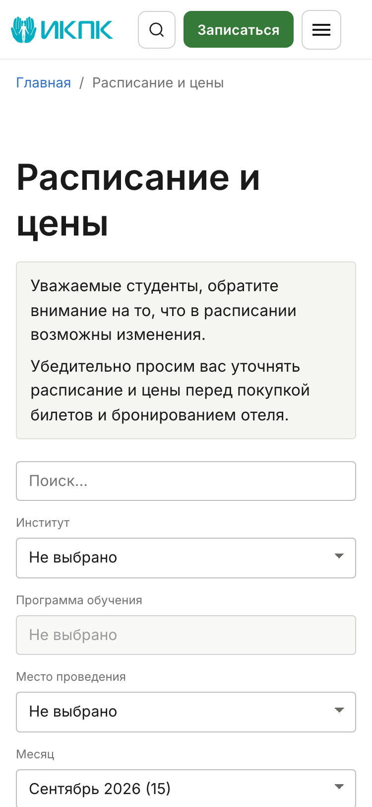
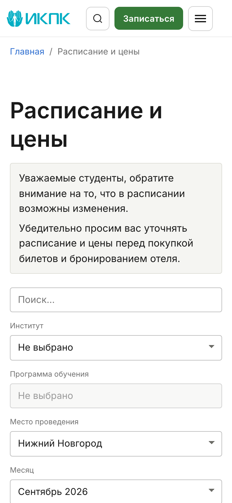
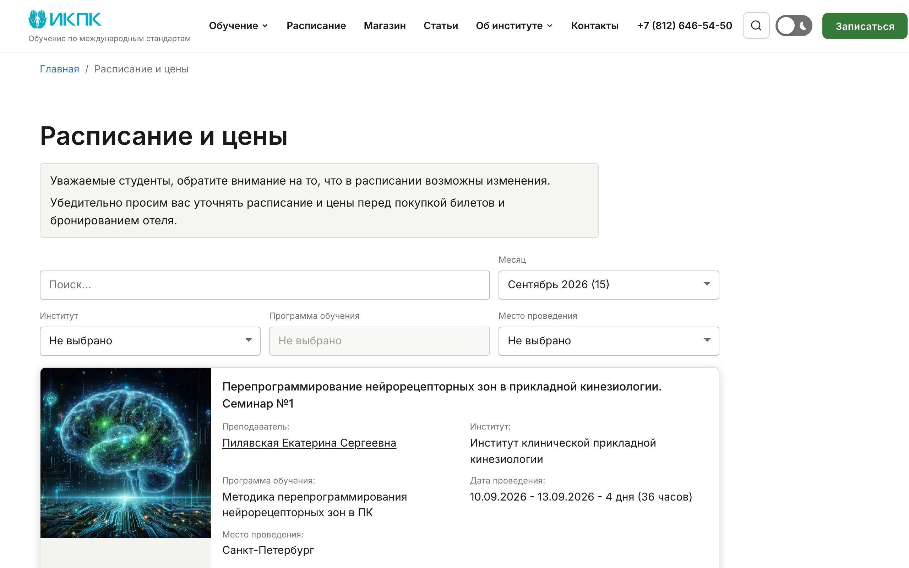
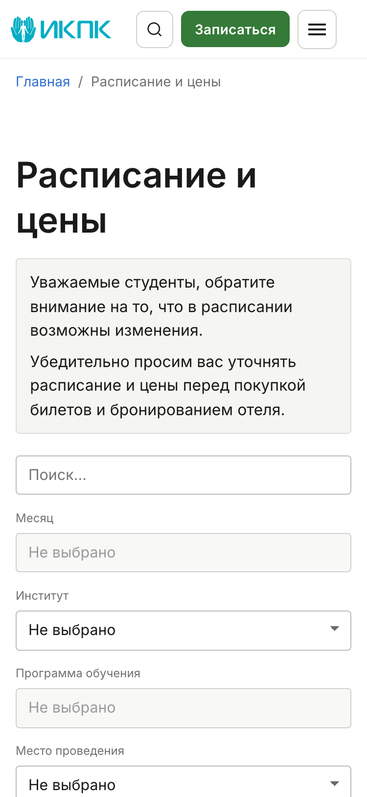
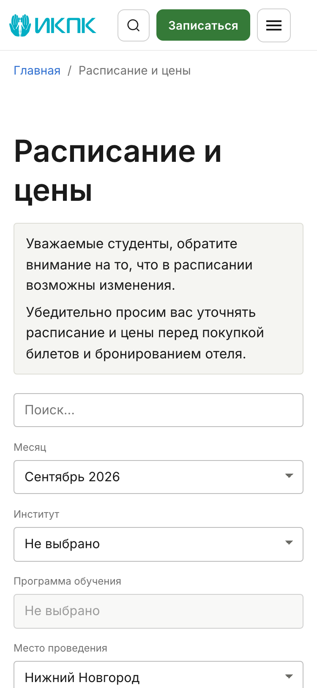
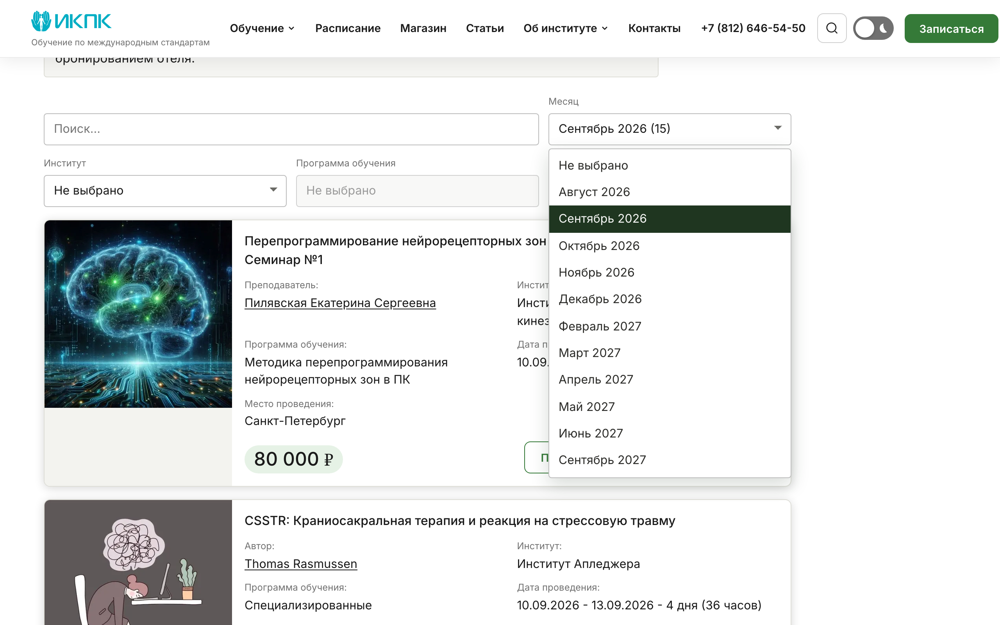

# Мокапы контрола месяца в панели фильтров расписания

Предмет выбора владельца по задаче 1.1–1.5 change `schedule-month-filter`: **раскладка
панели фильтров из пяти элементов** и два вопроса оформления подписи месяца. Поведение
фильтра спекой уже зафиксировано и здесь не обсуждается — выбирается только облик.

Снято с реальной сборки, не нарисовано: `npm ci && npm run build` в `web/`, затем
Playwright по `astro preview`. Данные настоящие.

- исследуемый коммит: `origin/main@873fa75da6c0ebeeeb37a66c14e405f6293921ee` (`873fa75`)
- ветка мокапов: `design/month-filter-mockups`
- дата съёмки и опорная дата сборки: 2026-08-11
- данные: 64 записи после окна актуальности, 11 месяцев (2026-08 … 2027-09), сумма ключей
  месяцев 66 — то есть две записи идут через границу месяца; самый населённый месяц —
  «Сентябрь 2026» (15 записей). Числа совпадают с приведёнными в спеке
- вьюпорты: **1280×800** и **375×812**. Первый экран снят при `deviceScaleFactor: 2`,
  полностраничные снимки уменьшены до 1x (иначе каталог весил бы 22 МБ)
- машинный протокол съёмки с числами: [`shot-log.txt`](shot-log.txt)

**Код мокапа в ветку не попал.** Временные правки (`raspisanie-i-tseny.astro`,
`SchedulePage`, `ScheduleFilters`, `ScheduleListing`, `ScheduleControlsScript`) жили только
в одноразовом worktree; реализация пойдёт по спеке отдельной работой, а не копированием
этих правок — спека требует чистого модуля `schedule-months.ts`, отсечения в выводе ключей
и подписи таблицей, чего в мокапе нет.

---

## Находки, влияющие на выбор (числа, а не «на глаз»)

1. **Вариант A обрезает подпись с числом записей.** В пятой колонке под текст остаётся
   **132px**, самой длинной подписи «Сентябрь 2026 (15)» нужно **144px** — в закрытом
   контроле она обрезается (видно на `variant-a-1280-04-open-rich.png`). Без числа
   подпись занимает 113px и влезает. В варианте B под текст 265px — влезает и то, и другое.
   То есть **вопросы «раскладка» и «число в подписи» не независимы**: «A + число» на 1280
   требует либо расширить колонку (за счёт остальных), либо отказаться от числа.
2. **Вариант A сужает и три существующих фильтра.** Сегодня под текст в них 173px, в
   варианте A — 132px. Из-за этого начинает обрезаться самое длинное название города
   («Набережные Челны», 150px), которое сегодня влезает; это видно на снимке пустого
   состояния, где выбран «Нижний Новгород». Название института обрезается **уже сегодня**
   (370px против 173px) — это не следствие ни одного из вариантов.
3. **На 375 оба варианта удлиняют панель одинаково** (351px и 357px против 273px и 278px
   без месяца, то есть +78px). Разница не в высоте, а в том, куда попадает месяц:
   в A он пятый и его нижняя кромка оказывается на 814px при экране 812px — то есть
   контрол виден не целиком; в B он второй, сразу под поиском, нижняя кромка на 583px.
4. **На 1280 вариант A не удлиняет панель вовсе** (65px, как сегодня), а B делает её
   двухрядной (145px) и сдвигает список событий на 80px вниз.

---

## Вариант A — «пятая колонка»

Пятый элемент встаёт в тот же ряд последним, после «Места проведения». Сетка
`minmax(0, 1.1fr) repeat(4, minmax(150px, 1fr))` вместо сегодняшней
`minmax(0, 1.2fr) repeat(3, minmax(180px, 1fr))`; на ≤1100px две колонки, на ≤700px одна —
как сейчас.

Выключенное состояние до исполнения скрипта (серый, **без стрелки** — так же выглядит
сегодня «Программа обучения»):

Выбран «Сентябрь 2026», подпись с числом записей — видно обрезание подписи:

То же без числа в подписи:

Пустое сочетание фильтров (месяц выбран, город всё отфильтровал):

375: контрол месяца пятый, его нижняя кромка уходит за первый экран.

Полная страница: [1280](variant-a-1280-07-selected-full.png) ·
[375](variant-a-375-07-selected-full.png) — 15 настоящих событий сентября,
постраничная навигация скрыта (записей меньше 25).

---

## Вариант B — «время впереди»

Панель становится двухрядной: поиск и месяц в первом ряду, институт, программа и место —
во втором. Сетка из шести колонок, поиск занимает четыре, остальные по две. На ≤1100px и
≤700px — те же две колонки и одна, но месяц остаётся вторым.

375: месяц вторым, целиком на первом экране.

Полная страница: [1280](variant-b-1280-07-selected-full.png) ·
[375](variant-b-375-07-selected-full.png).

---

## Два вопроса к владельцу

### 1. Показывать ли число записей в подписи месяца

«Сентябрь 2026 (15)» против «Сентябрь 2026». Сравнить: снимки `02-selected` (с числом) и
`03-selected-plain` (без числа) в каждом варианте, плюс раскрытый список ниже.

За число: сразу видно, где расписание плотное, а где одна запись — в данных разброс от 1
до 15. Против: в варианте A подпись обрезается (находка 1), и спека требует, чтобы число
совпадало с выдачей, то есть появляется ещё один проверяемый гейт (задача 2.21) и второй
источник правды о выдаче.

### 2. Отделять ли следующий год

В данных разрыв: после «Декабря 2026» идёт «Февраль 2027», затем «Сентябрь 2027» — января,
июля и августа 2027 в списке нет, потому что в них нет записей.

С группировкой по годам и с числами:

Без группировки и без чисел:

Оба оформления сняты в обоих вариантах: `04-open-rich` и `05-open-flat`.

**Оговорка про эти два снимка.** Раскрытый список — **реплика**, а не нативный попап
`<select>`: попап рисует операционная система, и Playwright снять его не может. Реплика
собрана из тех же токенов панели и нужна ровно для сравнения двух оформлений подписи, а не
как спецификация вида попапа. На 375 реплики нет вовсе: там попап — системная «шторка» или
колесо, её вид от нас не зависит, поэтому изображать её было бы обманом. Ответ на этот
вопрос в разметке выражается `<optgroup>` по году.

---

## Что этими мокапами не решается

- **Выбор каркаса может отменить выбор здесь.** Прототипы каркасов
  (`/preview/[variant]/schedule`) имеют свою разметку страницы расписания без панели
  фильтров вовсе. Если владелец выберет каркас, подачу панели придётся перерешать и мокап
  переснимать (`design.md`, раздел рисков).
- **Пустое состояние своего оформления не получает.** На снимках `06-empty` — существующее
  сообщение «По вашему запросу ничего не найдено»; менять его этот change не предлагает.
- **Состояние до JS показано как есть.** В нём перечислены все 64 события без постраничной
  навигации: скрипт, который её строит, не исполнялся. Это существующее поведение
  страницы, а не следствие фильтра по месяцу.
- **Тёмная тема не снималась** — правила `:disabled` и границ для неё в компоненте уже
  есть, отдельного решения раскладка не требует.
