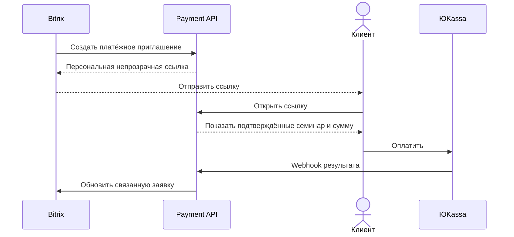

## Context

Мотивация и объём — в `proposal.md`. Здесь — только то, что определяет техническое
решение.

**О ссылках на `payment-request-flow` ниже (P1-A):** каталог `openspec/changes/payment-request-flow/`
удалён **в PR #90** (`a35b4051a7f707c2c89f373f83e61e4799a3f248`, сокращённо `a35b405`) — прежняя
редакция говорила «этим же PR», что было верно при написании и стало неверным после merge #90
(см. `proposal.md`, «Отношение к `payment-request-flow`») —
`payment-request-flow` замещён, а его требование `request-form-transport` скопировано в
`specs/request-form-transport/` этого change. Многочисленные ссылки на
`payment-request-flow/design.md` ниже цитируют происхождение уже принятых решений и
относятся к историческому состоянию, доступному через git (коммит `0a77a5b`, #34), а не
к файлу, существующему в рабочем дереве.

Ограничения, из которых всё следует:

- сайт статический (`output: 'static'`); исполняемого кода в сборке нет вообще. На
  демо-стенде собранный `dist` раздаётся Nginx на VPS; на проде — GitHub Pages (см. ниже,
  «прод-контур раздваивается» — это разные раздатчики, не один и тот же Nginx);
- создание платежа ЮKassa требует Basic-авторизации `shopId:секретный_ключ` в заголовке
  запроса к `https://api.yookassa.ru/v3/payments` — секрет обязан оставаться на сервере,
  которого сейчас не существует;
- `request-form-transport` — собственная возможность **этого** change
  (`specs/request-form-transport/spec.md`), скопированная из уже дважды отревьюенной
  делты `payment-request-flow` (P1-4а) — описывает модальное окно, доступность, согласие
  на ПДн, идемпотентный повтор по `requestId`, честные состояния и поведение без
  скриптов;
- в проекте уже есть режим сборки для форм (`DEMO_FORMS`, `web/src/lib/forms.ts`) и
  fail-closed гейт состава адресов в `scripts/deploy-web.sh` (Решение 5
  `payment-request-flow/design.md`) — новый адрес (платёжный эндпоинт) обязан встроиться
  в тот же механизм;
- живые данные о цене семинаров существуют: `discovery/entities/schedule_entries.json`
  (уточнён путь по ревью, m2 PR #90), **63 записи, все в статусе `active`**; у 57 из них
  задана цена (`newPrice > 0`), диапазон **10 000 – 80 000 ₽**. Сумму посетитель вводит
  сам (её называет куратор по телефону/почте) — сайт не может подставить или проверить
  её по прайсу. **Вывод про границу суммы отсюда снят 2026-08-13:** прежняя редакция
  заключала, что этот диапазон «даёт эмпирическую границу для защиты от ошибки и от
  card-testing», и именно из этого вывода выросло отменённое ограничение `1 000 – 200 000 ₽`.
  Решение 6 теперь говорит обратное — границы не подтверждены ничем внешним и вводить их
  самостоятельно запрещено, а от card-testing защищает лимит частоты (Решение 5б). Факт про
  прайс остаётся как факт: он описывает, какие суммы встречаются, и ничего не разрешает;
- **прод-контур раздваивается, и это существенно** (найдено ревью PR #90, B2, разбор — в
  `proposal.md`, «Развилка 1»): прод сайта публикуется на **GitHub Pages**
  (`.github/workflows/deploy.yml`, `actions/deploy-pages`), а Nginx на VPS
  (`scripts/bootstrap-vps.sh`) держит только демо-стенд. Решения 1 и 5 ниже написаны
  для контура «страница и API на одном origin через Nginx» — это верно для демо-стенда
  уже сегодня и **неверно для прода**, пока Развилка 1 не решена владельцем. Каждое
  решение ниже, зависящее от этого, отмечено явно.

## Goals / Non-Goals

**Goals:**

- провести реальный платёж через ЮKassa так, чтобы секрет ни разу не покинул сервер —
  ни во frontend-коде, ни в `dist`, ни в логах, ни в тестах;
- дать посетителю честный результат после возврата с оплаты, не дожидаясь webhook,
  которого стенд пока технически не может принять (нет HTTPS);
- удержать `request-form-transport` неизменным: `online-payment-flow` — потребитель его
  требований, а не редактор.

**Non-Goals:**

- настройка автоматической выдачи чека на стороне мерчант-аккаунта ЮKassa (какой
  фискальный накопитель используется, включена ли автогенерация) — решение
  бухгалтерии/владельца на уровне личного кабинета ЮKassa, не код этого change.
  **Уточнение по решению владельца (P1-4в):** состав данных, которые наш контракт
  передаёт для чека, при этом определён нормативно уже сейчас (Решение 2, «Что уходит в
  ЮKassa») — предварительным остаётся не контракт, а **значения полей чека: `vat_code`,
  `payment_subject`, `payment_mode` и сам факт включения механизма чеков**, подтверждаемые по
  тестовому магазину до написания красных тестов (`tasks.md`, 2.2a) и письменно до боевого
  запуска (Ограничение объёма №6, `tasks.md`, 2.9). **Исправлено 2026-08-13:** прежняя редакция
  называла предварительным только `vat_code` — то есть противоречила Решению 2г и №6, из-за чего
  сессия тестов, читающая этот абзац, зафиксировала бы `"service"`/`"full_payment"` как
  нормативные;
- журнал платежей как отчётный инструмент — данные о том, кто и за что заплатил, живут в
  панели ЮKassa (см. `docs/architecture/new-architecture.md`, «Payments»); наша сторона
  хранит только то, что нужно для идемпотентности и для ответа на вопрос «что показать
  посетителю» (см. Решение 4);
- защита от мошенничества сверх границ, которые можно проверить без обращения к
  человеку (см. Решение 6) — как и в `payment-request-flow`, серьёзная фильтрация лежит
  на принимающей стороне.

## Decisions

### Решение 1: рантайм секрета — минимальный сервис на VPS, colocated с Nginx

**Кандидаты:**

| Вариант | За | Против |
|---|---|---|
| **Минимальный сервис на VPS** (~50 строк, как оценивает `docs/plans/004-mvp-plan.md` и `docs/architecture/new-architecture.md`, «Payments») | VPS и Nginx уже есть; секрет — файл окружения с ограниченными правами на том же хосте; никакой новой инфраструктуры | Новый процесс на сервере: systemd-юнит, перезапуск при падении, обновления зависимостей — обязанность, которой раньше не было |
| **Функция** (например, Yandex Cloud Functions — РФ-хостинг, совместимо с ограничением проекта на размещение в РФ) | Нет процесса, который надо перезапускать; секрет — в консоли провайдера, не на диске сервера | Новый внешний контур деплоя и управления секретами, которого в проекте нет вовсе; холодный старт добавляет задержку созданию платежа; для ~50 строк кода — несоразмерная новая зависимость |
| **CMS (Strapi custom route)** | Архитектурный документ называет это одним из двух вариантов реализации | Strapi по `docs/architecture/wbs.md` («Strapi/YooKassa work moved to Post-MVP») сейчас не развёрнут в проекте вообще; платёж оказался бы заложником срока запуска CMS. Смешивает домены: управление контентом и обращение с деньгами — разные требования к аудиту и обновлениям |

**Решено владельцем: минимальный сервис на VPS**, отдельный от Strapi. **Решено по
Развилке 1 `proposal.md` (B2): прод-API живёт на `https://api.ikpk.su`, сайт остаётся на
GitHub Pages.**

**Подтверждено владельцем 2026-08-12 по разбору четырёх вариантов
(`docs/decisions/payment-runtime-options.md`, слит #107); владелец env-файла пересмотрен
владельцем 2026-08-18 — абзац ниже.** Принятая форма — та же, что
описана ниже, названная целиком, чтобы её не приходилось собирать по файлу: **минимальный
отдельный сервис на существующей VPS, ровно одна реплика (Решение 1б), секрет и ключ
отпечатка — файл окружения `/etc/ikpk-payments/env`, владелец `root:root`, права `0600`**
(Решение 7, задача 4.5). Разбор — материал для решения, **не источник требований**: при
расхождении побеждает этот change (`AGENTS.md`, «Source of Truth»).

**Владелец env-файла — `root:root`, права `0600`: решение владельца 2026-08-18,
заменяющее в этой части решение от 2026-08-12** (тогда была принята форма «файл
окружения, принадлежащий отдельному системному пользователю сервиса»; упоминания той
формы в `proposal.md` и задаче 0.6 — исторические записи исходного решения, при них
стоит указатель сюда). Основание: systemd читает `EnvironmentFile=` процессом PID 1 —
**до** понижения привилегий до `User=ikpk-payments`, — поэтому сервисному пользователю
доступ на чтение не нужен вовсе, а скомпрометированный процесс сервиса не может
подменить собственную постоянную конфигурацию. Границы решения: **пользователь процесса
не меняется** — unit остаётся `User=ikpk-payments`; **изменяемые данные сервиса**
(хранилище идемпотентности, журнал canary, резервные копии) принадлежат `ikpk-payments`
и живут отдельно от конфигурации (например, `/var/lib/ikpk-payments`); **обычный деплой
не получает и не перезаписывает секреты** — он обновляет код и unit, env-файл не входит
ни в его вход, ни в его выход, секрет попадает на хост из кабинета ЮKassa вне Git и CI
(задача 4.5).

Основание выбора **не** «единственное соответствие спеке»: по соответствию требованиям
сервис на VPS и маршрут внутри Strapi неразличимы, а переоткрывать спеку пришлось бы
только для бессерверной функции (она ломает Решение 1б, наблюдаемый исход Решения 1в и
локальные счётчики Решения 5б). Различает варианты состояние проекта: Strapi по
`docs/architecture/wbs.md` заморожен и его `audit:prod` намеренно report-only
(`.github/workflows/security.yml`), то есть деньги оказались бы в единственном пакете, чей
гейт уязвимостей молчит по построению, — а не то, что вариант противоречит требованиям.

**Четвёртый вариант — «отдельная VPS только под платежи» — ОТЛОЖЕН, а не отвергнут.**
Он даёт ровно одну вещь сверх принятого: секрет не лежит на хосте, где живёт демо-стенд и
куда деплой ходит под `root` (`scripts/deploy-web.sh:50-52`). По требованиям спеки разница
нулевая — это решение про периметр, а не про код, поэтому его отложили, а не закрыли.
**Условие возврата:** появление боевого секрета ЮKassa (тестовый контур такой изоляции не
требует — тестовые платежи денег не двигают) **и** решение владельца о том, что платёжный
периметр должен быть отдельным. Цена возврата названа заранее: перенос одной реплики с
двумя файловыми хранилищами на другой хост дешевле первичной постройки, поэтому
откладывание не создаёт долга, который придётся выплачивать переписыванием.

«За тем же Nginx» относится к демо-стенду, где страница и API уже
сегодня на одном origin; на проде origin страницы и API разные — это принятое решение,
а не временное состояние, и Решение 1а ниже описывает его следствия. Причина выбора
рантайма: не зависеть от срока разворачивания CMS, не заводить новый внешний контур
ради одного эндпоинта, и не завязывать код, работающий с реальными деньгами, на
компонент общего назначения.

**Оценка «~50 строк» в таблице кандидатов выше — унаследованная и неверная.** Она взята из
`docs/architecture/new-architecture.md` («Payments»), написанного до этой спеки и прямо
утверждающего, что webhook и отслеживание статуса на нашей стороне не нужны. После четырёх
раундов ревью объём другой: два эндпоинта плюс webhook, отпечаток с версионированием
ключа, контрольное значение, два хранилища с fail-closed проверками, резервное
копирование, два лимита частоты, два режима работы. На выбор рантайма это не влияет (цена
кода одинакова для всех вариантов), но планировать по «полдня работы» нельзя.

### Решение 1а: CORS — allowlist ровно на `ikpk.su`, а не отражённый `Origin`

**Найдено ревью (B2), поднято в нормативный статус по решению владельца (P1-4б):**
первая редакция называла CORS только в проекте и задачах, не в контракте — сессия
тестов могла спроектировать политику сама, разойдясь с тем, что реализация сочтёт
удобным.

Платёжный API SHALL отвечать заголовками CORS, разрешающими запросы **только** с
origin `https://ikpk.su` (и `https://<DEMO_FORMS>`-эквивалента для демо-сборки, если
она выведена на отдельный поддомен предпросмотра — иначе только `https://ikpk.su`).
Значение `Access-Control-Allow-Origin` SHALL быть равно этому origin буквально, а не
отражением заголовка `Origin` входящего запроса — отражение впускает **любой** origin,
приславший его, и это была бы CORS-политика, работающая как её отсутствие. Preflight-
запросы (`OPTIONS`) SHALL получать ответ с тем же ограничением до тела основного
запроса.

*Альтернатива «отражать `Origin`, если он в списке демо-адресов»* отвергнута:
список демо-адресов заранее не известен весь (демо-стенд может получить кастомный
`DEMO_FORMS=<host>` — Решение из `payment-request-flow`), а любое отражение произвольного
`Origin`, даже «проверенного» по неполному списку, снова открывает CORS шире
необходимого.

**Найдено ревью (MAJOR-2 #97, владелец): контрактные тесты (3.12b) мокают ЮKassa, но
не проверяют настоящую пару origin.** CORS существует ровно ради прод-специфичного
кросс-origin (`ikpk.su` → `api.ikpk.su`, Развилка 1); демо-стенд — не заменяет эту
проверку, потому что там страница и API на одном origin (Решение 1), и браузер вообще
не применяет CORS к запросу в пределах одного origin — приёмка на стенде остаётся
зелёной при полностью неработающем CORS на проде. Приёмка настоящим браузером против
развёрнутого `api.ikpk.su` — обязательный отдельный шаг (`tasks.md`, 7.3a), не
покрываемый ни контрактными тестами, ни демо-приёмкой.

### Решение 1б: допущение об одной реплике сервиса — названо прямо

**Найдено ревью (minor #97, владелец): допущение было неявным.** Ключ ЮKassа и ключ
HMAC читаются процессом один раз при старте (Решения 7, 3б); ротация — замена файла и
перезапуск; хранилище идемпотентности (Решение 4/4а) — локальный файл на одном хосте.
Всё это верно **только при ровно одной работающей реплике сервиса**. Схема, где рядом
запущены две реплики (например, blue-green на том же VPS во время выкладки новой
версии), нарушает допущение сразу в двух местах: реплики могут получить команду
ротации не одновременно (сервер А уже перечитал новые `HMAC_KEY_*`, сервер Б — ещё
нет), и обе реплики пишут в разные копии локального хранилища, если оно не общее.
Устойчивые версии ключа (Решение 3б) не решают это сами по себе — они решают другую
проблему (роль не путается с личностью ключа); при двух репликах с рассинхронизацией
конфигурации по времени нужна координация ротации, а её здесь нет.

Минимальный сервис (Решение 1) в объёме этого change **разворачивается ровно одной
репликой**. Если операционная практика позже потребует нескольких (масштабирование,
безостановочная выкладка) — это отдельное архитектурное решение (общее хранилище,
координация ротации ключей), не покрытое этим change, и назвать его нужно будет
отдельно, а не выводить из уже принятых решений задним числом.

### Решение 1в: `PAYMENT_MODE` — один переключатель демо/прод, одна точка проверки обязательных секретов, один наблюдаемый исход

**Найдено ревью #97, MAJOR-4 (владелец): проверка старта покрывала только
`RECEIPT_ENABLED`, а этим же PR введены два новых обязательных секрета
(`HMAC_KEY_CURRENT` и его версия) без проверки вовсе.** В Node.js
`createHmac('sha256', '')` — валидный вызов, не исключение: незаданный ключ HMAC даёт
результат, который выглядит как отпечаток, но вычислен пустым ключом — защита
«Повтор с изменённым содержимым отклоняется» (`specs/online-payment/spec.md`) молча
перестаёт работать, а не падает заметно. Перечислять переменные поимённо в
требовании — тот же класс ошибки, что запрещён `AGENTS.md` («не перечислять частные
случаи») — список отстаёт от предмета молча при следующем секрете.

**Найдено ревью #97, MAJOR-6 (владелец): наблюдаемый исход и его адресат были
описаны трижды по-разному** — «не обрабатывает запросы» (посетитель), «не стартует»
(процесс), «деплой падает» (CI). Три разных сценария не могут быть одним требованием.

**Решение: единый переключатель режима и единая проверка при старте процесса.**

- `PAYMENT_MODE=demo|prod` — обязательная переменная окружения серверного процесса,
  по прецеденту `DEPLOY_MODE` статической сборки (`scripts/deploy-web.sh`) и по той
  же причине: умолчания нет, потому что обе ошибки дорогие в разные стороны.
- **Найдено ревью #97, MAJOR-6 (владелец): сам `PAYMENT_MODE` не был нормативен, а
  неизвестное значение не было описано вовсе.** `DEPLOY_MODE` в проекте уже защищён
  двумя барьерами — не задан (`scripts/deploy-web.sh:63`) и неизвестное значение
  (`:93`, `case … *)`, отвергающее и опечатку). `PAYMENT_MODE` SHALL быть защищён так
  же: если переменная не задана, пуста, или её значение не входит в множество
  `{demo, prod}` (включая опечатку вида `production`, `Prod`) — процесс завершается
  тем же единственным исходом, что и недостающий секрет (см. ниже), а не трактует
  нераспознанное значение как `demo` по умолчанию. Прежняя редакция определяла
  «умолчания нет» только в этом файле (`design.md`), который не переезжает в
  `openspec/specs/`, — нормативная часть правила перенесена в спеку (см.
  `specs/online-payment/spec.md`).
- **`PAYMENT_MODE=demo`**: процесс не проверяет `RECEIPT_ENABLED`, `HMAC_KEY_*` и
  секрет ЮKassa вовсе — демонстрационный обработчик к ЮKassa не обращается и не
  создаёт записей идемпотентности (Requirement «Демонстрационная сборка не создаёт
  платежей в ЮKassa»), поэтому эти секреты ему не нужны.
- **`PAYMENT_MODE=prod`**: при старте процесс проверяет **весь список** обязательных
  для боевого режима секретов (секрет ЮKassa, `HMAC_KEY_CURRENT` и его версия,
  `RECEIPT_ENABLED`; парность `HMAC_KEY_PREVIOUS`/`_VERSION`, если задан один из
  них; уникальность `HMAC_KEY_CURRENT_VERSION` относительно `HMAC_KEY_PREVIOUS_VERSION`
  — Решение 3б). Список — не перечисление в тексте требования, а то, что реализация
  обязана вывести из своего собственного набора обязательных переменных: новая
  переменная, добавленная будущим change, попадает в проверку тем, что помечена как
  обязательная в коде, а не тем, что кто-то вспомнил дополнить список здесь.
- **Единственный наблюдаемый исход при провале:** процесс завершается **до того, как
  начинает слушать порт**. Он не отвечает ни `5xx`, ни `503` — соединение просто не
  устанавливается (`connection refused`/таймаут на уровне TCP), потому что
  слушающего сокета нет. Это не то же самое, что `verification_required` (Решение
  3б) — тот отвечает **на конкретный запрос уже работающего сервиса**; это же
  решение — о том, что сервис не запускается вовсе.
- **Единственный адресат:** оператор, через код возврата процесса и сообщение в
  stderr/журнал systemd, называющее непройденную проверку. Посетитель этого
  сообщения не видит никогда — если процесс не поднялся, до него не доходит ни один
  запрос; это следствие архитектуры (Nginx/деплой перед процессом), а не
  дополнительное решение.
- Деплой (CI/CD), если он проверяет доступность сервиса после выкладки, узнаёт о
  провале тем же способом, что и о любом другом не поднявшемся процессе — это
  следствие первого пункта, а не отдельный механизм проверки.

**Рассогласование «боевая сборка × демо-сервер» (найдено ревью #97, MAJOR-6,
владелец).** Сборка сайта и режим сервера, на который она указывает, конфигурируются
раздельно (`DEMO_FORMS`/адрес формы — на стороне сборки; `PAYMENT_MODE` — на стороне
сервера) — рассогласование (боевая сборка указывает на сервер, поднятый с
`PAYMENT_MODE=demo`, или наоборот) не проверяется контрактом эндпоинта, потому что
запрос в обоих направлениях выглядит одинаково; поймать его может только проверка
разворачивания (см. задачу 7.3a — уже требует ручной приёмки настоящим браузером
против развёрнутого `api.ikpk.su`; она же обязана проверить, что режим сервера
соответствует режиму сборки, тестовой картой или явной меткой ответа, а не только
факт отсутствия ошибки CORS). Демонстрационный обработчик получает и обрабатывает
запрос в том же формате, что боевой (Requirement «Демонстрационная сборка не создаёт
платежей в ЮKassa») — его ответ на `POST .../payments` **всегда** `200 { "status":
"created_demo" }` (добавлено в таблицу кодов ниже), независимо от того, ждёт ли его
боевой или демонстрационный клиент. Боевой клиент, получивший `created_demo` вместо
ожидаемых кодов, SHALL трактовать его как ошибку адресата (не описанный контрактом
код/тело — общее правило неизвестного ответа, см. ниже) — это не диагностирует
причину рассогласования посетителю, но и не выдаёт демо-ответ за успех или за
частный случай другого известного состояния.

**Общее правило для не описанного контрактом ответа.** Любой код или тело, не
названные ни в одной из двух таблиц контракта, SHALL трактоваться клиентом как ошибка
адресата — так же, как отсутствие ответа за предел ожидания. Это правило существует
ради полноты: перечисление всех кодов, которые сервер MOЖЕТ вернуть, не может быть
исчерпывающим на дату написания спеки, а неизвестный ответ не имеет права молча
пройти как один из перечисленных исходов.

### Решение 2: контракт эндпоинта — минимальный и записанный целиком

По аналогии с Решением 2 `payment-request-flow/design.md`: словесного описания
недостаточно, контракт фиксируется дословно, чтобы тесты можно было писать независимо
от реализации.

**`POST <адресат платежа>/payments`** — создание платежа.

Тело запроса — та же нагрузка, что в `payment-request-flow` (Решение 2), без изменений
состава полей, плюс явная проверка формата `requestId` (находка m6 PR #90 — прежде не
была названа отдельно):

| Поле | Тип | Обяз. | Ограничение |
|---|---|---|---|
| `requestId` | string | да | валидный UUID v4 (тот же, что описан в `request-form-transport`); формат проверяется — не-UUID отклоняется `400` до всякого обращения к ЮKassa |
| `firstName` | string | да | 1–100 символов |
| `lastName` | string | да | 1–100 символов |
| `seminar` | string | да | 1–300 символов |
| `amount` | number | да | целое число рублей, **строго больше нуля** (см. Решение 6 — диапазон `1 000 – 200 000` убран 2026-08-13, границы не приняты) |
| `startDate` | string \| null | нет | `YYYY-MM-DD` |
| `venue` | string \| null | нет | до 300 символов |
| `email` | string | да | содержит `@` и доменную часть |
| `phone` | string | да | не менее 10 цифр |
| `consent` | boolean | да | только `true` |
| `duplicateConfirmed` | boolean | нет | признак намерения клиента подтвердить повторную оплату; **сам по себе платежа не создаёт** (Решение 2к) |
| `duplicateConfirmationToken` | string | нет | одноразовый токен, выданный сервером вместе с исходом `duplicate_confirmation_required`, привязанный к паре «`requestId` + отпечаток». Платёж по совпадению с подтверждённой записью создаётся **только** при действительном токене. **Ни он, ни `duplicateConfirmed` в отпечаток не входят** — иначе подтверждение меняло бы отпечаток и обходило саму проверку |

Ответ и HTTP-коды (найдено m1 Codex-ревью — таблица кодов отсутствовала, хотя
`payment-request-flow` её для своего конверта имеет):

| HTTP-код | Тело | Состояние |
|---|---|---|
| `201` | `{ "status": "created", "confirmationUrl": "<адрес страницы оплаты ЮKassa>" }` | платёж создан, посетителя редиректит браузер (не сервер: подтверждение остаётся видно посетителю, редирект делает клиентский код формы) |
| `200` | `{ "status": "created", "confirmationUrl": "..." }` при повторе с уже известным `requestId`, платёж ещё не оплачен | см. Решение 2а — повтор возвращает состояние существующего платежа. **Адрес подтверждения сервер получает запросом к оператору платежей по `yookassaPaymentId`, а не хранит** (Решение 4). Повтор внутри того же `POST` — ещё одно обращение к оператору с внутренним пределом 8 секунд (Решение 2б) |
| `200` | `{ "status": "already_paid" }` при повторе с `requestId`, платёж которого уже `succeeded` | см. Решение 2а — на `confirmationUrl` не редиректим |
| `200` | `{ "status": "canceled" }` при повторе с `requestId`, платёж которого уже `canceled` | см. Решение 2а, шаг 4 — терминальный, но не успешный исход; `requestId` не переиспользуется дальше, посетитель отправляет новую попытку с новым `requestId` |
| `400`, `422` | `{ "status": "rejected", "errors": [{ "field": "...", "message": "..." }] }` | отклонена по проверке (та же форма ошибки, что в `request-form-transport`), включая невалидный формат `requestId` |
| `409` | `{ "status": "rejected", "errors": [{ "field": "_content", "message": "..." }] }` | **только** при повторе с `requestId`, платёж которого уже `canceled`, и содержимым, отличным от исходного (Решение 2а, шаг 4) — терминальный исход делает совет «нужен новый `requestId`» безопасным. Для нетерминального статуса (`pending`/`unknown`) несовпадение содержимого даёт `verification_required`, не `409` (найдено MAJOR-2 ревью #97) |
| `409` | `{ "status": "duplicate_confirmation_required", "confirmationToken": "<одноразовый>" }` | отпечаток совпал с записью, платёж по которой **подтверждён не ранее 14 суток назад**, действительного токена нет (решение владельца 2026-08-13). Платёж не создаётся; `requestId` прежней записи в ответе **не передаётся** — сервер найдёт её по отпечатку снова, а раскрывать идентификатор для этого исхода незачем. Отличается от `409 rejected` полем `status`: клиент разбирает тело, а не только код. Токен одноразовый, срок 15 минут (Решение 2к) |
| `429` | `{ "status": "rejected", "errors": [{ "field": "_rateLimit", "message": "..." }] }` | превышен лимит частоты (Решение 5а) |
| `503` | `{ "status": "verification_required", "requestId": "<канонический requestId>" }` | статус записи не терминален (`pending`/`unknown`), и либо версия ключа не входит в число хранимых, либо содержимое не совпало (Решение 2а, шаги 5–6; Решение 3б, «Третий исход») — не `409`, `requestId` не заменяется автоматически. **Тот же ответ на новый, неизвестный серверу `requestId`, отпечаток которого совпал с незавершённой записью** (Решение 2е, шаг 1а «Итогового порядка»). Поле `requestId` обязательно во всех случаях и несёт **канонический** идентификатор той попытки, к которой относится исход: на шагах 5–6 он совпадает с присланным, на шаге 1а — это идентификатор совпавшей по отпечатку записи, то есть тот, что лежит в `metadata.requestId` у оператора платежей (Решение 2е, «Канонический `requestId` в ответе»). Клиент переключается на него и удерживает попытку по нему |
| `5xx` | `{ "status": "error" }` | сбой создания платежа (наш сервер либо ЮKassa вернула ошибку). **Класс пересекается с предыдущей строкой, и различает их только тело:** `503` с телом `{ "status": "verification_required" }` — предыдущая строка; `503` без тела, с телом иной формы или с HTML-страницей (в частности от Nginx, когда обработчик не поднялся) — эта. Правило целиком — Решение 2б, «Различение `503`» |
| `200` | `{ "status": "created_demo" }` | ответ демонстрационного обработчика — всегда этот код и это тело, независимо от режима клиента (Решение 1в, «Рассогласование…»); боевой клиент, получивший этот ответ, трактует его как ошибку адресата (не описанный для боевого режима ответ). **Исход терминальный и демонстрационный:** записи он не создаёт, удержания не ставит (Решение 2е, «Демонстрационная сборка удержания не создаёт»), и следующая отправка на демо-стенде формирует новый `requestId` — как после любого терминального исхода. Терминальность здесь названа явно, потому что без неё демо-исход попадал бы в класс «незавершённых» и запирал бы демо-стенд после первой отправки |

**Порядок обработки запроса** (уточнение Codex-ревью к идемпотентности): сервер
**сначала** ищет `requestId` в собственной таблице сопоставления (Решение 4) и **только
при отсутствии** обращается к API ЮKassa. Это не деталь реализации, а обязательное
условие корректности: собственное окно идемпотентности ЮKassa по `Idempotence-Key` —
24 часа, и без проверки по своей таблице **до** вызова API поведение после этого окна
не определено контрактом.

**`GET <адресат платежа>/payments/{requestId}/status`** — проверка статуса со страницы
возврата.

Ответ: `{ "status": "pending" | "succeeded" | "canceled" | "verification_required" |
"unknown" | "demo" }` при `200`, и
**`404` с телом `{ "status": "not_found" }`, если записи по этому `requestId` у сервера
нет**. Значение `"demo"` — ответ демонстрационного обработчика на проверку статуса: платежа
не создавалось, удержание этой попытки снимается (Решение 2е, «Снятие удержания»). Идентификатор запроса в пути — `requestId`, а не `id` платежа ЮKassa: страница
возврата знает только то, что сама отправила, а платёжный `id` ЮKassa ей не принадлежит и
не должен быть виден в адресной строке (см. Риски).

**`not_found` внесён вторым раундом ревью #112 (Б1/Б2) и не является косметикой.** До него
контракт `GET` не описывал вовсе, что отвечать на незнакомый `requestId`, а различить
«запись есть, статус не определён» (`unknown`) и «записи нет» обязательно: первое означает
«платёж мог быть создан, держим удержание», второе — «по этому идентификатору платежа не
создавалось, удержание бессмысленно» (Решение 2е, «Снятие удержания»). Реализация,
отвечающая `unknown` на незнакомый идентификатор, запирала бы клиента навсегда.

**`verification_required` в домен ответа `GET` входит, потому что это сохраняемое
состояние записи, а не свойство одного ответа на `POST` (решение владельца от
2026-08-13).** Возражение против этого было такое: исход рождается сравнением
*присланного содержимого* с записью (Решение 2а, шаги 5–6), а у `GET` содержимого нет —
значит воспроизвести сравнение он не может. Возражение верно и решением не отменено:
`GET` сравнение и **не воспроизводит**, он читает результат, который сервер уже записал.
Сравнение выполняется один раз, при `POST`, и его результат остаётся на записи.

**Хранимое поле и кто его ставит.** Запись (Решение 4) получает два поля: `verificationAt`
— время, когда сервер впервые ответил по этой записи исходом «нужна сверка», и
`verificationReason` — причина из того же перечня, что уходит в журнал (неизвестная версия
ключа / неизвестный `requestId` с совпавшим отпечатком; Решение
2е, «Об исходе „нужна сверка“ должен узнать не только посетитель»). Ставит их **сервер**, в
той же операции, в которой отвечает `verification_required` и пишет журнальную запись, —
шаг 6 «Итогового порядка» Решения 2а и шаг 1а с оговоркой ниже. **Шаг 5 пометки не ставит.**

**Пометка ставится не на всякую совпавшую запись (решение владельца от 2026-08-13, находка
MAJOR-5 ревью #112).** На шаге 1а поля ставятся на **совпавшую по отпечатку (каноническую)
запись** — записи по присланному `requestId` не существует и создавать её нечем, — но **только
если у этой записи нет `yookassaPaymentId`** — признак один, без дисъюнктов: запись с известным
идентификатором платежа разрешается проверкой статуса сама, в том числе из статуса «не
определён». Если каноническая запись исправна (идентификатор платежа известен, платёж идёт),
сервер отвечает запросившей стороне `verification_required` с каноническим `requestId` и
**запись не меняет**, журнальной записи не делает. Прежняя редакция помечала её безусловно, и
тогда чужая вторая отправка переводила попытку первого посетителя в тревожное состояние: тот,
вернувшись с оплаты незавершённым, видел «исход нельзя подтвердить автоматически» вместо «оплата
ещё идёт». Второй стороне пометка и не нужна — она удерживает попытку по каноническому
идентификатору, а предупреждение обязательно для удержанных состояний, кроме пяти исключений:
отправка (предупреждение преждевременно); отклонение по проверке, лимит частоты, демо, вопрос
о повторной оплате (в последних четырёх ответ доказывает отсутствие платежа). Состояние
«нужна сверка» снова в обязательном предупреждении. Заодно перестаёт засоряться журнал: в него попадали обычные двойные отправки, и
полезный сигнал в нём тонул.

**Приоритет при чтении.** `GET` отвечает `verification_required`, если `verificationAt`
стоит, **идентификатора платежа у записи нет** и статус не терминален. Третий конъюнкт внесён
по находке 6 ревью #112 и согласован здесь по MAJOR-5 ревью r5: как только идентификатор
появился — по безопасному продолжению или по восстановлению из уведомления, — ответ даёт
фактический статус, иначе восстановленная запись навсегда показывала бы «нужна сверка» вместо
реального `pending`. Терминальный статус старше: как только запись
стала `succeeded` или `canceled`, `GET` отвечает статусом, и клиент снимает удержание —
иначе разрешившаяся попытка осталась бы запертой собственной историей. Отдельного действия
по снятию поля для этого не нужно, и обратной дороги из терминального статуса нет.

Следствие для проверок: после перезагрузки состояние берётся **из ответа сервера**, а не
из клиентской памяти. Клиент хранит `requestId` и время создания попытки (Решение 2е, «Что
хранит удержание»), исход же спрашивает у сервера — то есть у единственной стороны, которая
его вычислила.

### Решение 2д: одностадийный платёж, и статус вне нашего набора — незавершённый, никогда не успех

**Найдено четвёртым раундом ревью #97: во всём change ни разу не встречается ни режим
создания платежа (одностадийный против двухстадийного), ни то, что делать со статусом
ЮKassa, которого нет в наборе выше** (проверено поиском по каталогу change: совпадений
на `capture` — ноль). Набор `pending|succeeded|canceled|unknown` — это **наш** словарь
ответа клиенту, а не перечень того, что может прислать ЮKassa; отображение внешних
статусов на него нигде не задано, и «полнота по осям» проверялась до сих пор только по
трём осям повтора (см. Решение 2а), где эта ось не участвует вовсе.

Почему это дороже, чем неполнота словаря. У платёжных провайдеров, включая ЮKassa,
жизненный цикл платежа предусматривает **промежуточное состояние между успешной
авторизацией и списанием**: деньги на карте посетителя удержаны, но не списаны, и
списание требует отдельного действия — либо флага в запросе создания, либо
последующего вызова подтверждения. Если платёж создан в таком режиме, а наша сторона
об этом состоянии не знает, получается худший из возможных исходов: у посетителя
деньги заморожены, наш сервер не видит `succeeded` и показывает «статус не удалось
проверить», сотрудник о необходимости подтвердить платёж не знает, а удержание тихо
истекает через несколько суток. Ни один тест раздела 3 такого пути не проверяет,
потому что мок отвечает только статусами из нашего словаря.

**Два нормативных правила, оба не зависящие от точных имён в API ЮKassa** (намеренно:
Решение 2г появилось именно из ошибки «утверждать поведение ЮKassa, не проверив его» —
P1-B; здесь та же осторожность):

1. **Платёж создаётся так, чтобы подтверждение оплаты не требовало отдельного
   действия сотрудника** — то есть одностадийным. Двухстадийный сценарий (удержание
   с последующим подтверждением) в объём этого change не входит: у него нет ни
   интерфейса для сотрудника, ни требования о сроке подтверждения, ни состояния формы,
   и вводить его молча, одним значением поля в запросе, недопустимо.
2. **Любой статус, полученный от ЮKassa и не отображающийся ни на один из
   `succeeded`/`canceled`/`pending`, SHALL трактоваться как незавершённый** и
   отображаться в `unknown` — никогда в `succeeded`. Из этого следует и поведение
   повтора: такая запись нетерминальна, значит идёт по шагам 5–6 «Итогового порядка»
   (Решение 2а), а посетителю не предлагается новый `requestId`. Правило
   сформулировано через «не отображается ни на один известный», а не через перечень
   чужих имён статусов, — перечень отставал бы от API ЮKassa молча (`AGENTS.md`, «не
   перечислять частные случаи того, что проверяешь»).

**Точное имя поля режима создания и точный перечень статусов ЮKassa проверяются на
тестовом магазине до написания красных тестов** (`tasks.md`, 2.2a расширена) — как и
`vat_code`. Если наблюдение покажет, что одностадийное создание требует иного поля или
что существует статус, который нельзя отобразить ни на один наш, контракт правится до
тестов, а не после.

**Наблюдено 17.08.2026 на тестовом магазине. Оба нормативных правила подтверждены, ни
одно не изменено.**

- Имя поля режима — **`capture`**, значение **`true`** в теле `POST /v3/payments`.
  Умолчание ЮKassa — двухстадийный платёж, поэтому отсутствие поля даёт ровно тот исход,
  который правило 1 запрещает. Причинность закрыта **контролем**, а не рассуждением: один
  магазин, один кошелёк, одна сумма — без поля оплаченный платёж перешёл в
  `waiting_for_capture` (`paid: true`, `expires_at` через 7 суток), с `capture: true` — в
  `succeeded` с заполненным `captured_at`.
- Статусы, **наблюдённые живьём**: `pending`, `waiting_for_capture`, `succeeded`,
  `canceled`. Три отображаются на наш словарь напрямую; `waiting_for_capture` — ни на
  один, и по правилу 2 уходит в `unknown`. То есть правило 2 сработало как написано, и
  формулировка через отрицание оказалась именно той, что нужна: этот статус не был назван
  заранее нигде. Перечень остаётся **наблюдённым, а не полным** — ЮKassa вправе вернуть
  иной, и правило 2 поэтому и сформулировано через «не отображается ни на один известный».
- Цена пропуска, ради истории: правило 2 без правила 1 даёт худший исход из возможных —
  деньги посетителя удержаны, форма говорит «нужна сверка», сотрудник о необходимости
  подтвердить не знает, удержание истекает само. Ровно это и наблюдалось до исправления,
  потому что вторая половина задачи 3.3a («объявляет одностадийный режим») была помечена
  выполненной, а теста не имела: слово `capture` не встречалось ни в одном тесте и ни в
  одном исходнике. **Мок этого поймать не мог** — он отвечает то, что ему велели, и
  требований чужого API не знает. Обнаружение здесь принципиально ручное (задача 7.4);
  мок-тест стережёт проводку, а не поведение оператора.

**Отображение на состояния формы** — по конверту `request-form-transport` для общих
исходов создания (отклонено проверкой / ошибка / нет ответа за 10 секунд / принято к
обработке), плюс специфичные для платежа, описанные возможностью `online-payment` в
спеке:

| Ответ | Состояние |
|---|---|
| `201`/`200 created` | редирект на `confirmationUrl` |
| `200 already_paid` | «оплата уже подтверждена» без редиректа (Решение 2а) |
| `200 canceled` | «оплата отклонена или отменена» (то же состояние, что и через `GET .../status`); форма готова к новой попытке с новым `requestId` |
| `400`/`422 rejected` | отклонена по проверке (как в `request-form-transport`) |
| `409 rejected` (`_content`) | «данные попытки изменились, отправьте как новую попытку» — достижимо только для уже `canceled` записи (Решение 2а, шаг 4); форма готова к новой попытке с новым `requestId` |
| `409 duplicate_confirmation_required` | «по этим данным оплата уже подтверждена — создать ещё один платёж?» с явным подтверждением; при подтверждении повтор идёт с тем же новым `requestId`, `duplicateConfirmed: true` **и `duplicateConfirmationToken`, взятым из `confirmationToken` этого ответа**; без действительного токена запрос не отправляется (Решение 2к; задача 5.5f) |
| `429` | лимит частоты превышен (как в `request-form-transport`, «ошибка адресата», с уточнением текста) |
| `503 verification_required` | «исход этой попытки нельзя подтвердить автоматически, свяжитесь с нами» — отдельное состояние, не «оплата отклонена» и не «исход неизвестен»; `requestId` НЕ заменяется автоматически **вместо** удерживаемой попытки; явное действие «оплатить другой семинар» разрешено (Решение 2л). Элемент продолжения этой же попытки обязателен (Решение 2а, шаги 5–6; Решение 3б) |
| ошибка / нет ответа за 10 секунд | ошибка адресата / исход неизвестен (как в `request-form-transport`) |
| `GET .../status` → `succeeded` | «оплата подтверждена» |
| `GET .../status` → `canceled` | «оплата отклонена или отменена» |
| `GET .../status` → `pending` (после возврата) | продолжение опроса в пределах 15 секунд (Решение 2б — предел **не совпадает** с пределом создания платежа) |
| `GET .../status` → `unknown` (сервер не смог получить статус у ЮKassa за 8 секунд, либо клиент не дождался ответа сервера за 15) | «статус не удалось проверить» + способ связаться напрямую |
| `GET .../status` → `demo` | удержание снято, предупреждения нет (платежа не создавалось; демонстрационный обработчик) |

**Что уходит в ЮKassa (M1 Opus-ревью — не было описано вовсе).** Запрос создания
платежа передаёт: `description` — строка вида «Оплата за семинар: {seminar},
{firstName} {lastName}» (видна заказчику в панели ЮKassa, нужна, чтобы платёж без
нашего журнала можно было опознать и сверить); `metadata.requestId` — для сопоставления
записи в панели ЮKassa с нашей собственной таблицей при разборе инцидента; **`metadata.source`
— неизменяемый признак канала, например `"ikpk-site"`** (внесён решением владельца от
2026-08-13). Признак канала нужен не для удобства: на восстановлении записи по webhook
(Решение 5а, п. 4а) он единственный способ отличить наш платёж от платежа, созданного в том же
магазине виджетом Bitrix. Нормативна в спеке не строка `"ikpk-site"`, а существование
стабильного признака канала — имя и значение остаются деталью этого решения. Оба поля
существуют ради того, чтобы Non-Goal «журнал платежей — не наш» (см. «Goals /
Non-Goals») был выполним: без `description`/`metadata` панель ЮKassa показывала бы
голые суммы без контекста, и Non-Goal превращался бы в потерю данных, а не в
сознательный перенос ответственности.

**Чек (54-ФЗ) — см. Решение 2г ниже.** Первая редакция этого абзаца утверждала, что
поле `receipt` можно передавать всегда и что ЮKassa «просто игнорирует» его при
неподключённой автогенерации — **это утверждение не подтверждено документацией и
отклонено находкой ревью (P1-B, владелец)**: по документации ЮKassa `receipt`
используется решением чеков, которое требует явного включения в личном кабинете, а
некорректные или неожиданные данные чека приводят к ошибке, а не к молчаливому
игнорированию. Решение 2г ниже заменяет прежний абзац веткой по конфигурации.

### Решение 2г: передача `receipt` — по явному флагу конфигурации, а не всегда

**Найдено ревью (P1-B, владелец):** нельзя было утверждать, как поведёт себя ЮKassa на
`receipt` без автогенерации, не проверив это на тестовом магазине — а первая редакция
утверждала это без проверки. Контракт ветвится по конфигурации, которую сервер знает
заранее, а не выясняет запросом:

- **Флаг `RECEIPT_ENABLED`** — переменная окружения сервера, отражающая факт: включена
  ли на мерчант-аккаунте ЮKassa автогенерация чеков (решение чеков ЮKassa либо
  сторонняя касса, подключённая через ЮKassa). Значение флага устанавливает тот, кто
  настраивает мерчант-аккаунт (внешний prerequisite, как и сам аккаунт, Ограничение
  объёма №2) — сервер не определяет это динамически.
- **`RECEIPT_ENABLED=true`** — запрос создания платежа передаёт объект `receipt`:
  `receipt.customer.email` (значение поля `email` формы); `receipt.items` — один
  элемент с `description` (значение `seminar`, обрезанное до 128 символов — ограничение
  поля у ЮKassa), `quantity: "1.00"`, `amount.value` равным `amount` запроса,
  `amount.currency: "RUB"`, `vat_code`, `payment_subject`, `payment_mode`. **Значения
  `vat_code`, `payment_subject` и `payment_mode` подтверждаются по тестовому магазину
  (`tasks.md`, 2.2a) — нормативна здесь структура объекта, а не они.** Прежняя редакция
  фиксировала `payment_subject: "service"` и `payment_mode: "full_payment"` как решённые;
  **исправлено 2026-08-13** — подтверждения им нет ни от заказчика, ни от наблюдения (checkout
  серверного тела запроса не раскрывает — `proposal.md`, «Восстановленный контракт замещаемого
  сайта»), а «услуга» и «полная оплата» выглядят очевидными ровно настолько, насколько
  очевидной выглядела нижняя граница суммы 1 000 ₽. Все три значения — Ограничение объёма №6.

  **Наблюдено 17.08.2026 на тестовом магазине — разделилось на обязательное и принимаемое:**

  - **`vat_code` обязателен.** Чек без него отвергается: `400`, `code: invalid_request`,
    `description: Invalid request parameter`, `parameter: receipt.items[0].vat_code`.
    Негодное значение (99) отвергается тем же ответом. То есть при `RECEIPT_ENABLED=true`
    платёж без этого поля не создаётся **никогда**.
  - **`payment_subject` и `payment_mode` не обязательны:** чек с одним `vat_code`
    принимается (`200 pending`), и с ними тоже. Поэтому в реализацию они **не введены** —
    добавить их значило бы узаконить непроверенные значения, а наблюдение показало, что
    без них контур работает. Остаются Ограничением объёма №6 до ответа заказчика.
  - **Какое значение `vat_code` верно для ИКПК, наблюдением не выясняется** — это НДС
    заказчика (задача 2.9). Поэтому значение берётся из переменной окружения
    **`RECEIPT_VAT_CODE`**, обязательной при `RECEIPT_ENABLED=true` и проверяемой
    fail-closed до открытия порта (по тому же доводу, что и сам `RECEIPT_ENABLED` ниже:
    отсутствующее значение — «неизвестно», не «сойдёт»). Проверка требует целого
    положительного и **не перечисляет** допустимые коды: наблюдением известно лишь, что
    `1` принимается, а `99` нет, и список чужих кодов отставал бы молча.
  - Цена молчания, ради истории: до исправления причина отказа скрывалась за нашим
    `502 {"status":"error"}` — по ответу нашего сервера узнать, что дело в `vat_code`,
    было нельзя. Существующий тест «RECEIPT_ENABLED=true — запрос содержит
    receipt.customer.email и items» проверял непустоту `items` и молчал о полях внутри.
- **`RECEIPT_ENABLED=false`** (записано явно) — запрос создания платежа **не содержит**
  поля `receipt` вовсе. Это осознанное решение владельца, что фискализация на этом
  контуре не подключена, а не значение по умолчанию.
- **Переменная не задана в боевом режиме — сервис SHALL NOT запускаться.** Найдено
  ревью (P2-2, владелец): первая редакция трактовала `false` и отсутствие переменной
  одинаково — «нет receipt». Это fail-open по вопросу, регулируемому 54-ФЗ: забытая
  переменная окружения на проде молча отключила бы чеки, и никто не увидел бы явного
  сигнала о том, что решение не принято, а не принято намеренно. Отсутствующее
  значение — это «неизвестно», не «выключено».
- **Механизм и единый наблюдаемый исход — Решение 1в, не повторяется здесь.**
  `RECEIPT_ENABLED` — один из списка секретов, обязательных при `PAYMENT_MODE=prod`;
  в демонстрационном режиме (`PAYMENT_MODE=demo`) эта переменная не проверяется вовсе,
  потому что демонстрационный обработчик к ЮKassa не обращается и к чекам отношения не
  имеет (Requirement «Демонстрационная сборка не создаёт платежей в ЮKassa»). Найдено
  ревью #97 (MAJOR-4, MAJOR-6): первая редакция здесь описывала свой собственный,
  отдельный механизм проверки и свой исход — при появлении второго секрета (ключ HMAC)
  оказалось бы два похожих, но разных механизма вместо одного.
- **Ошибка валидации чека от ЮKassa** (ответ с кодом, относящимся к `receipt`, при
  `RECEIPT_ENABLED=true` и структурно корректных данных — например, рассинхронизация
  настроек мерчант-аккаунта) обрабатывается как любая другая ошибка создания платежа
  (Решение 7): посетитель видит общее состояние ошибки, сервер логирует код ответа
  ЮKassa и `requestId`, не содержимое `receipt`. Специального восстановления (например,
  повторной попытки без `receipt`) контракт не предусматривает — это увеличило бы
  поверхность непроверенного поведения, а не уменьшило.

**Проверка перед тест-сессией (`tasks.md`, 2.2a, расширена):** фактическое поведение
тестового магазина при обоих значениях `RECEIPT_ENABLED` (включая намеренно вызванную
ошибку чека) проверяется до написания красных тестов раздела 3 — если наблюдение
разойдётся с описанным здесь ветвлением, контракт обновляется до, а не после написания
тестов (то же правило, что закрыло саму Развилку 3).

### Решение 2а: повторная попытка после терминального исхода получает новый `requestId`

**Тупик найден ревью (B3):** `requestId` постоянен для одной попытки посетителя, платёж
со статусом `canceled` в ЮKassa терминален, а Решение о запрете второго платежа по тому
же `requestId` (ниже) без этого уточнения означало бы, что посетитель с отклонённой
картой не может заплатить снова — каждая следующая отправка формы с тем же
`requestId` возвращала бы состояние того же отменённого платежа.

Правило то же, что Решение 2а `payment-request-flow/design.md`, перенесённое на
платёж, а не на заявку — **но найдено ревью #97 (BLOCKER-1): клиентское правило,
записанное здесь изначально, разрешало ровно тот путь ко второму платежу, для защиты
от которого сервер получил третий исход.** Первая формулировка «новый `requestId` —
при любой сознательной новой отправке… и при изменении данных формы» не проверяла, был
ли исход терминальным, — а именно нетерминальный исход (`pending`/`unknown`) и есть
случай, где новый `requestId` опасен: платёж по прежнему `requestId` мог быть создан на
стороне ЮKassa и оставаться в процессе. Клиент, увидев непонятный отказ
(`verification_required` или отказ по контенту при незавершённом платеже), делает то,
что делает человек: правит поле и жмёт «Отправить» — а форма, следуя прежнему правилу,
формирует новый `requestId` именно тогда, когда этого делать нельзя.

Правило теперь связано с исходом, а не с фактом правки данных:

- **прежний** `requestId` сохраняется при **любом** повторе, пока платёж по нему не
  достиг терминального состояния (`succeeded` или `canceled`) — независимо от того,
  изменил ли посетитель данные формы, и независимо от того, каким ответом сервер
  встретил этот повтор (`200` с состоянием существующего платежа, `409` при
  терминальном несовпадении — см. «Итоговый порядок» ниже, или `verification_required`).
  Форма SHALL NOT формировать новый `requestId` и SHALL NOT отправлять новый запрос по
  этой попытке, пока не получит терминальный ответ, **даже если посетитель изменил
  данные**;
- **новый** `requestId` формируется только при сознательной новой отправке **после**
  терминального исхода (`succeeded` → `already_paid`, дальнейших действий не
  предполагается; `canceled` → новая попытка законна).

**Разрешение конфликта, найденного тем же ревью:** прежняя формулировка одновременно
требовала «прежний `requestId` — только при… ошибке сервера» и «новый `requestId` —
при… изменении данных формы», а `503 verification_required` — это и есть ошибка
сервера, и одновременно повод для посетителя счесть, что данные нужно поправить.
Разрешается в пользу первого: **ошибка сервера, включая `verification_required`, SHALL
удерживать прежний `requestId` без исключений** — формулировка «при изменении данных
формы» относится только к сознательной новой попытке **после терминального исхода**,
а не к любому изменению данных вообще.

**Смежный случай, тоже найденный ревью:** если по существующему `requestId` платёж уже
`succeeded`, повторный `POST` **не редиректит** на `confirmationUrl` — эта страница
принадлежит уже завершённой сессии оплаты и может быть недействительна к моменту
повтора. Вместо этого возвращается `already_paid` (см. таблицу кодов выше), и клиент
показывает состояние «оплата уже подтверждена» напрямую, без перехода на ЮKassa.

**BLOCKER, найдено ревью #97 (полнота последствий): порядок проверок ломал этот самый
случай.** Задача 4.1a (`tasks.md`) в прежней редакции проверяла отпечаток (Решение 3а)
**раньше** статуса — а Решение 3б трактовало запись с устаревшей (пережившей две
ротации) `keyVersion` как несовпадение отпечатка, `409`, независимо от статуса
платежа. Сложение двух решений давало путь: запись пережила аварийную ротацию
(Решение 3б это разрешает), платёж по ней на самом деле `succeeded` — но код до
проверки статуса не доходил, посетитель получал «данные изменились, нужен новый
`requestId`» вместо обязательного (см. Requirement выше) `already_paid`, и штатным
путём (новый `requestId` по этому же Решению 2а) отправлял повторную оплату за уже
оплаченное. Это не тот риск, что назван в Risks как «двойная оплата двумя независимыми
`requestId`» — там расхождение создаёт сам посетитель; здесь один и тот же `requestId`,
чью идемпотентность спека обязана держать, был нарушен порядком проверок, а не
действием посетителя.

**P3-A (в сообщении владельца — «P1-A»; переименовано здесь, чтобы не совпадать с
P1-A предыдущего раунда про удаление `payment-request-flow`), найдено владельцем:
первое исправление закрыло только `succeeded`, а не всю проблему.** Шаг 4 ниже (в
редакции сразу после BLOCKER) всё равно отвечал `409` «данные изменились» для записи с
устаревшим `keyVersion`, чей статус **не** `succeeded` (например, «статус неизвестен»).
Посетителю в этом случае так же нельзя советовать новый `requestId`: платёж по
прежнему `requestId` мог реально создаться на стороне ЮKassa и оставаться в процессе —
новый `requestId` означает новый `Idempotence-Key`, то есть шанс на второй настоящий
платёж, просто позже, чем в исходном BLOCKER, и по другому статусу. Аварийная ротация
не может определить, было подменено содержимое или нет — значит `409` («данные
изменились») здесь ложное утверждение, а не осторожность.

**MAJOR-2, найдено тем же ревью: та же ветка сохранялась и при известной версии
ключа.** Шаг 4 отвечал `409` с советом создать новый `requestId` для **любого**
несовпадения содержимого у записи со статусом «не `succeeded`» — но «не `succeeded`»
объединяет два разных по риску случая. Для `canceled` совет безопасен: статус
терминален и подтверждён (наш сервер получил его авторитетным запросом к ЮKassa —
Решение 5/5а, а не выведен из отпечатка), денег по этому `requestId` уже точно не
будет. Для `pending`/`unknown` тот же совет опасен ровно как в P3-A: платёж мог
создаться и остаться в процессе. Шаг делится по терминальности статуса, а не по
одному лишь совпадению версии ключа.

**Итоговый порядок (закрывает BLOCKER, P3-A и MAJOR-2 вместе):**

1. Сервер ищет `requestId` в собственной таблице (Решение 3/4).
1а. **Если запись по `requestId` не найдена — прежде обычного создания сервер ищет
   совпадение по отпечатку** (внесено Решением 2е; расщеплено по статусу совпавшей записи
   решением владельца от 2026-08-13). Порядок внутри шага **исправлен по блокеру 3
   независимого ревью `9ab7e7e`: незавершённое совпадение проверяется ПЕРВЫМ.** Сначала
   **живые незавершённые** записи (живая блокировка по отпечатку: созданы не ранее 14 суток
   назад, известной версии ключа). Истёкшая незавершённая живой не является и совпадением не
   считается. Отменённая или отклонённая живой незавершённой не является: сама по себе новой
   попытке не мешает; обычное создание — только если нет подтверждённой младше 14 суток с
   известной серверу версией HMAC. Только если живого совпадения среди незавершённых нет — **подтверждённые не
   ранее 14 суток назад, известной версии ключа** (отпечаток
   пересчитывается под версией, записанной в самой сравниваемой записи; запись неизвестной версии
   для этого поиска невидима — BLOCKER-A состязательного ревью `r5-adv`): при совпадении и
   отсутствии действительного одноразового токена подтверждения ответ `409 duplicate_confirmation_required`, платёж не
   создаётся, запись не меняется (Решение 2к); с действительным токеном — обычное создание,
   **но поиск по отпечатку выполняется заново и неделимо с созданием**, потому что между
   вопросом и подтверждением могла появиться живая незавершённая попытка того же состава, и она
   снова имеет приоритет. Прежний порядок (сначала `succeeded`, создание сразу по клиентскому
   флагу) при одновременных подтверждённой и живой незавершённой записях одного состава давал
   **третий** платёж. Итак, живые незавершённые: если
   отпечаток содержимого запроса совпадает с отпечатком живой незавершённой записи, версия
   ключа которой известна серверу, — ответ `verification_required` с
   **каноническим `requestId` этой совпавшей записи** (Решение 2е, «Канонический
   `requestId` в ответе»), платёж не создаётся. Присланный идентификатор нигде не
   сохраняется: записи по нему нет и не будет. Сервер ставит на каноническую запись
   состояние «нужна сверка» (`verificationAt`, `verificationReason` — Решение 2, «Хранимое
   поле и кто его ставит») и пишет журнальную запись **только если у этой записи нет
   `yookassaPaymentId`; исправную запись с известным `yookassaPaymentId` чужой запрос не
   ухудшает — при любом её статусе**
   (решение владельца от 2026-08-13 по находке MAJOR-5 ревью #112 — см. Решение 2е,
   «Пометка ставится не на всякую совпавшую запись»). Поиск по отпечатку и создание новой
   записи выполняются атомарно (Решение 2е, «Поиск по отпечатку обязан быть атомарным»).
   Шаг существует потому, что запрет на новый `requestId` до завершения исхода адресован
   клиенту, а клиентское обещание защитой не является (тот же довод, что в Решении 3а).
2. Если совпадения нет ни по `requestId`, ни по отпечатку — обычное создание (проверка
   формата, положительности суммы — границ у неё больше нет, Решение 6, — вызов ЮKassa).
3. Если запись найдена и её статус **`succeeded`** — сервер немедленно возвращает
   `already_paid`. Отпечаток и `keyVersion` этой записи **не проверяются вовсе**:
   для уже подтверждённого платежа их несовпадение ничего не меняет — платёж уже
   состоялся, и отклонять его подтверждение через `409` неверно по построению.
4. Если запись найдена и её статус **`canceled`** (терминальный, но не успешный —
   тоже установлен авторитетным запросом к ЮKassa, не отпечатком): если версия ключа
   записи среди хранимых — сравнивается отпечаток; совпадение → сервер сообщает
   `canceled` без создания чего-либо; несовпадение → `409`, «данные изменились, нужен
   новый `requestId`» — **здесь совет безопасен**, потому что деньги по этому
   `requestId` уже точно не движутся. Если версия ключа не входит в число хранимых —
   сервер всё равно сообщает `canceled` **без** сравнения содержимого: терминальный
   факт установлен независимо от отпечатка, сравнивать нечем, но и нечего опасаться.
5. Если запись найдена, её статус **не терминален** (`pending` или `unknown`), и
   версия ключа записи — среди хранимых сервером (Решение 3б): сравнивается
   отпечаток. Совпадение → обычная логика повтора (вернуть состояние существующего,
   тот же `requestId` остаётся в силе) — **кроме случая, когда у записи нет
   идентификатора платежа ЮKassa: тогда сервер обращается к ЮKassa заново с тем же
   ключом идемпотентности и отвечает по результату** (внесено Решением 2е; иначе у такой
   записи нет выхода вовсе — состояние существующего здесь пусто). **Повтор к ЮKassa
   допустим только в пределах окна дедупликации по `Idempotence-Key` (24 часа от создания
   записи, внешняя константа ЮKassa); за его пределами тот же ключ уже не защищает, повтор
   создал бы второй настоящий платёж — поэтому ответ там `verification_required` с
   `requestId` этой же записи, а сама запись становится предметом ручной сверки** (уточнено вторым
   раундом ревью #112: прежде условие стояло только прозой Решения 2е, а в порядке и в
   нормативной части возраста записи не было вовсе). **Несовпадение → НЕ
   `409`, а
   `verification_required`** (найдено MAJOR-2 ревью #97): содержимое действительно не
   совпало, но статус не терминален — платёж мог создаться, и предлагать новый
   `requestId` так же опасно, как в шаге 6, независимо от того, что причина
   неопределённости здесь другая (известное несовпадение, а не неизвестная версия
   ключа). Безопасность ответа зависит от терминальности статуса, а не от того,
   удалось ли содержательно сравнить отпечаток.
6. Если запись найдена, её статус **не терминален**, и версия ключа записи **не
   входит** в число хранимых (аварийная ротация состарила её раньше срока) —
   сервер SHALL NOT отвечать ни `already_paid`, ни `409`, ни продолжением опроса:
   ничего из этого не подтверждено. Ответ — `verification_required` (Решение 3б,
   «Третий исход»).

**В ветвях, отвечающих `verification_required`, сервер ставит на запись состояние «нужна сверка» только когда повод относится к самой записи.** Два сохраняемых повода: неизвестная версия ключа записи (шаг 6) и совпадение её отпечатка с запросом под другим `requestId` (шаг 1а) — и в обоих случаях только если у записи нет `yookassaPaymentId`. **Шаг 5 (несовпадение присланного содержимого) отвечает `verification_required`, но пометки и журнальной записи не делает:** несовпадение характеризует запрос посторонней стороны, а не состояние платежа (решение владельца). Разница в том, на какую запись ставятся поля, когда повод сохраняемый: на шаге 6 — на найденную по присланному `requestId`; на шаге 1а — на совпавшую по отпечатку каноническую, и только если у неё нет `yookassaPaymentId`. Для исправной канонической записи шаг 1а ответ даёт, а запись не меняет и в журнал не пишет. Без сохраняемой пометки на шагах 1а (без идентификатора платежа) и 6 `GET .../status` после перезагрузки не смог бы воспроизвести исход.

Терминальные статусы (шаги 3–4) не пропускают риск дальше: `succeeded` — оплата уже
случилась, `canceled` — оплаты уже не будет, оба факта установлены независимо от
отпечатка. Риск сосредоточен ровно в нетерминальных статусах (шаги 5–6), и именно там
любое несовпадение — по содержимому или по версии ключа — уходит в
`verification_required`, а не в `409`.

**Проверка полноты по осям — выполнена четвёртым раундом ревью #97, чтобы пятый её не
повторял.** Этот участок правился во всех трёх предыдущих раундах, и каждый раз
находилась новая грань, потому что исправление закрывало один разрез условия. Осей
три: **статус** (`succeeded` / `canceled` / нетерминальный) × **разрешимость версии
ключа** (известна / не известна) × **совпадение содержимого** (совпало / не совпало).
Это **двенадцать комбинаций**, а не шесть: шесть — число ветвей порядка выше, и каждая
ветвь покрывает от одной до четырёх комбинаций. Раскладка полная:

| Статус | Версия | Содержимое | Ветвь | Ответ | Новый `requestId` разрешён? |
|---|---|---|---|---|---|
| `succeeded` | любая (2) | любое (2) — не проверяется | 3 | `already_paid` | да (терминально; оплата уже прошла) |
| `canceled` | известна | совпало | 4 | `200 canceled` | да (денег по записи не будет) |
| `canceled` | известна | не совпало | 4 | `409` | да (там же) |
| `canceled` | не известна | любое (2) — не сравнивается | 4 | `200 canceled` | да (там же) |
| нетерминальный | известна | совпало | 5 | состояние существующего | **нет** |
| нетерминальный | известна | не совпало | 5 | `verification_required` | **нет** |
| нетерминальный | не известна | любое (2) — не сравнивается | 6 | `verification_required` | **нет** |

Сумма покрытых комбинаций: 4 + 1 + 1 + 2 + 1 + 1 + 2 = **12**, то есть все. Ни одна
ячейка не ведёт к созданию второго платежа: разрешение на новый `requestId` стоит
ровно там, где статус терминален, а терминальность в обоих случаях установлена
авторитетным запросом к ЮKassa, не отпечатком. Отдельно: запись **не найдена** — это
не ячейка таблицы, а шаги 1а и 2, и оси к ней применимы иначе: осей там две (совпадение
отпечатка с незавершённой записью × разрешимость её версии ключа), и обе разобраны
Решением 2е.

**Строка «нетерминальный / известна / совпало» после Решения 2е делится надвое** —
по наличию идентификатора платежа ЮKassa у записи, **а вторая из двух после ревью #112
делится ещё надвое** — по возрасту записи относительно окна дедупликации ЮKassa. Оси не
отменяют разбор выше, а уточняют его: они относятся не к содержимому запроса, а к тому,
что успел записать сам сервер, и к тому, сколько прошло времени.

| Статус | Версия | Содержимое | `paymentId` | Возраст | Ветвь | Ответ | Новый `requestId` разрешён? |
|---|---|---|---|---|---|---|---|
| нетерминальный | известна | совпало | есть | любой | 5 | состояние существующего | **нет** |
| нетерминальный | известна | совпало | нет | в пределах окна (≤ 24 ч) | 5 | повтор к ЮKassa с тем же ключом идемпотентности, ответ по результату | **нет** |
| нетерминальный | известна | совпало | нет | за пределами окна (> 24 ч) | 5 | `verification_required` с `requestId` этой же записи — ручная сверка | **нет** |

**Четвёртая ось, которой в этом разборе не было, названа отдельно:** сам домен статуса.
Все три раунда исходили из того, что статус записи — один из `succeeded`/`canceled`/
`pending`/`unknown`; что делать со статусом ЮKassa **вне** этого набора, не описывал ни
один файл change. Разобрано в Решении 2д: такой статус нетерминален, значит попадает в
строки «нетерминальный» этой таблицы и нового `requestId` не разрешает.

### Решение 2к: повторная оплата того же состава после подтверждённой — вопрос, а не запрет

**Решение владельца от 2026-08-13 по находке состязательного ревью #112.** До него шаг 1а
смотрел только на незавершённые записи, поэтому путь был такой: посетитель оплатил → удержание
снялось по терминальному статусу → страница показала чистую форму → он ввёл тот же состав →
новый `requestId`, новый ключ идемпотентности → **второе настоящее списание**, без единого
предупреждения. Спека при этом прямо предписывала создать платёж («Завершённая запись не
мешает новой попытке»), то есть дефект был нормативным, а не реализационным.

**Принято: предупреждать и требовать подтверждения, но не запрещать.** Запрет был бы неверен:
вторая оплата тем же составом бывает законной (второй взнос той же суммы за тот же семинар), а
состава, который отличал бы «взнос» от «дубля», у нас нет.

**Механика.** Первый `POST` с новым `requestId`, чей отпечаток совпал с записью, платёж по
которой подтверждён не ранее 14 суток назад (срок — от подтверждения, не от создания записи;
отпечаток пересчитывается под версией ключа этой записи), платежа не создаёт и получает `409 duplicate_confirmation_required`. Клиент
показывает вопрос «по этим данным оплата уже была подтверждена — создать ещё один платёж?».
Вместе с этим исходом сервер выдаёт **одноразовый токен подтверждения**, привязанный к паре
«`requestId` + отпечаток», со сроком жизни **15 минут**, и запоминает у себя, что подтверждение по
этой паре запрошено. По истечении срока платёж по токену не создаётся: ответ — тот же исход
с новым токеном. Подтверждённый повтор идёт **тем же** новым `requestId` и несёт этот
токен; `duplicateConfirmed: true` остаётся признаком намерения клиента, но платежа сам по себе
не создаёт. Требование токена относится только к ветви нового `requestId`, совпавшего с
подходящей подтверждённой записью; безопасное продолжение найденной незавершённой попытки
токена не требует.

**Почему токен, а не флаг (блокер 2 независимого ревью `9ab7e7e`).** Флаг в теле запроса
устанавливает клиент, и сервер не может отличить его от флага, выставленного **до** всякого
вопроса — то есть первый же запрос с `duplicateConfirmed: true` создавал бы платёж, и вся
защита оказывалась клиентской, тогда как решение владельца прямо требует серверной. Токен
выдаётся только вместе с исходом, действует один раз и только для той пары, для которой
выдан; запрос с флагом, но без действительного токена платежа не создаёт и получает тот же
исход. Одноразовость нужна и от повторного использования: иначе один пройденный вопрос
открывал бы неограниченное число дубликатов.
Признак **не входит в отпечаток** (Решение 3а): иначе подтверждение меняло бы отпечаток, повтор
не совпадал бы с записью и проверка обходилась бы сама собой. Создание — неделимо с проверкой
признака, как и поиск по отпечатку (Решение 2е).

**Почему серверный, а не только клиентский.** Модалка — обещание клиента, а обещание клиента
защитой не является: тот же довод, что в Решении 3а про формирование `requestId`. Сервер,
создавший платёж по запросу без признака, нарушает требование даже при исправном интерфейсе.

**Границы.** `canceled` сама по себе подтверждения не требует — денег по такой записи уже не будет.
Обычное создание по совпадению с ней — только если нет живой незавершённой более высокого
приоритета и нет подтверждённой младше 14 суток с известной серверу версией HMAC. После
14 суток с **подтверждения** платежа правило не применяется: срок тот же, что у блокировки
по отпечатку, и по той же причине — бессрочное предупреждение сделало бы повторную оплату того
же семинара невозможной навсегда. Якорь — момент подтверждения, а не создания записи.

**Идентификатор прежней записи в ответе не передаётся** (решение владельца): для ответа на
вопрос он посетителю не нужен, а сервер находит запись по отпечатку повторно. Это отличие от
исхода «нужна сверка», где канонический `requestId` необходим для сверки с оператором платежей,
— и оно сознательно уменьшает раскрытие идентификаторов (см. Решение 2е, «Названное
отклонение» про оракул).

**Чего правило не ловит.** Буквально тот же состав — и только его: правка одного символа даёт
другой отпечаток. Named deviation тот же, что у защиты по отпечатку, и тот же, что у действия
«оплатить другой семинар» (Решение 2л): различается нормализованный состав полей, а не смысл
оплаты.

### Решение 2л: одна незавершённая попытка не запирает оплату другого семинара

**Решение владельца от 2026-08-13 по находке MAJOR-G состязательного ревью #112.** Удержание
адресовано посетителю, а серверная блокировка — составу данных; при единственном удержании,
скрывающем форму, достаточно было нажать «Отправить» и закрыть вкладку, чтобы лишиться
возможности оплатить **любой** семинар на срок до 14 суток.

**Принято: в удержанном состоянии два различимых действия** — «продолжить эту оплату» (тот же
`requestId`, Решение 2е) и «оплатить другой семинар» (новая форма, новый `requestId`).
Браузер удерживает **несколько** активных попыток, не более **5** одновременно: постоянно по каждой — только `requestId` и
время создания, значения полей — в хранилище на одну сессию. Новая попытка прежнего удержания
не снимает и не заменяет; интерфейс предупреждает, что предыдущая осталась
незавершённой. По достижении границы 5 действие «оплатить другой семинар» недоступно;
молчаливого вытеснения старейшей попытки нет.

**Навигация.** Если удержано больше одной попытки, страница показывает **перечень**: по каждой —
идентификатор, время создания и текущее состояние по проверке статуса. Каждая попытка доступна
для продолжения и снимается **независимо**: завершение одной не снимает остальные. При загрузке
страницы клиент запрашивает статус каждого активного идентификатора (восстановление
удержаний): при пяти удержаниях — пять первоначальных запросов. Лимит частоты на `GET`
(Решение 5б) SHALL позволять штатно проверить все пять попыток без 429; конкретный
дополнительный запас и временное окно — конфигурация реализации, не продуктовый контракт.

**Что осталось защитой.** Последняя линия — серверный поиск по отпечатку: буквальный повтор
прежнего состава под новым `requestId` платежа не создаёт. Лимит частоты (Решение 5б) и защита
от автоматических отправок действуют без изменений.

**Named deviation: «другой семинар» — не то, что различает система.** Различается
нормализованный состав полей; отдельного идентификатора семинара в нагрузке нет, поэтому
правка одного поля обходит защиту. Названо именно так, а не «система различает семинары»,
потому что второе было бы утверждением, которого код не выполняет.

### Решение 2б: два независимых предела ожидания — оба строже внутреннего вызова к ЮKassa

**Найдено ревью (M4): пределы ожидания были вложены друг в друга, а не разведены.**
Первая редакция использовала «10 секунд» и для клиентского предела создания платежа
(унаследовано из `request-form-transport`), и для клиентского предела опроса статуса, и
подразумевала тот же интервал для собственного обращения сервера к API ЮKassa внутри
каждого из них — то есть у сервера не оставалось времени ответить клиенту «исход
неизвестен» до истечения клиентского предела: тест 3.3 (`tasks.md`) не мог различить
«сервер не успел» от «сервер ничего не вернул».

Три независимых числа вместо одного:

- **10 секунд** — клиентский предел ожидания `POST .../payments` (без изменений,
  общий конверт `request-form-transport`);
- **15 секунд** — клиентский предел ожидания `GET .../status` со страницы возврата;
  число не совпадает с пределом создания намеренно — это разные операции с разной
  ценой ложного «неизвестно» (создание блокирует форму, опрос происходит на уже
  показанной странице результата), и совпадение было бы случайным, а не осмысленным;
- **8 секунд** — внутренний предел ожидания ответа ЮKassa на **любой** из двух
  серверных запросов (создание платежа, запрос статуса). Строго меньше обоих
  клиентских пределов: если ЮKassa не ответила за 8 секунд, сервер успевает вернуть
  клиенту собственное «исход неизвестен»/«статус не удалось проверить» до истечения
  10 или 15 секунд соответственно, вместо того чтобы клиентский таймер сработал первым
  и увидел не пойми что.

**Запись создаётся до вызова ЮKassa, не после ответа (найдено minor ревью #97, п.5).**
При создании платежа сервер SHALL записать `requestId`, отпечаток и `keyVersion` в
своей таблице (Решение 4) **до** отправки запроса к ЮKassa, со статусом `unknown`, и
обновить статус по фактическому ответу (или оставить `unknown`, если 8-секундный
предел истёк без ответа). Без этого порядка timeout на создании платежа не оставлял бы
локальной записи вовсе: повтор того же `requestId` после восстановления связи не нашёл
бы себя в таблице, ушёл бы в обычное создание нового платежа с тем же `Idempotence-Key`
— в пределах 24-часового окна ЮKassa (Решение 2, «Порядок обработки запроса») это
самовосстанавливается за счёт дедупликации на стороне ЮKassa, но именно на этом
8-секундном таймауте держится и третий исход (Решение 3б), и остаточный риск
хранилища (Решение 4а) — оба предполагают, что запись **существует** для нетерминальных
попыток, а не создаётся только при успешном ответе.

**Различение `503` от `verification_required` и `503` от неподнявшегося процесса
(найдено minor ревью #97, п.4).** `503` — код, которым может ответить и сам Nginx,
когда обработчик не поднялся (например, в рамках проверки Решения 1в) или временно
недоступен на уровне прокси — такой ответ не содержит тела, ожидаемого этим
контрактом. Клиент SHALL считать `503` содержательным `verification_required` только
при наличии тела `{ "status": "verification_required" }`; любой другой `503` (без
тела, с телом иной формы, с HTML-страницей от Nginx) SHALL трактоваться как
обобщённая ошибка адресата (тот же путь, что «нет ответа за 10 секунд»), а не как
`verification_required` — смешение этих двух источников `503` привело бы к тому, что
рядовой сбой инфраструктуры показывался бы посетителю как «требуется сверка».

### Решение 2в: канал корреляции возврата — параметр в `return_url`, с очисткой

**Найдено ревью (P1-3, владелец): не был выбран ни один из каналов**, которыми страница
возврата могла бы узнать, какой `requestId` проверять — спека требовала «запросить
статус по `requestId`», не говоря, откуда он на странице возврата берётся. Названы
четыре кандидата: параметр в `return_url`, `sessionStorage`, opaque state, ничего (то
есть неявно предполагать одну и ту же вкладку).

**Выбор: параметр в `return_url`.** При создании платежа сервер передаёт в ЮKassa
`confirmation.return_url` вида `https://ikpk.su/oplata?paymentRequest=<requestId>` —
адрес возврата, на который ЮKassa направит браузер после завершения оплаты.

**Как это устроено на замещаемом сайте, и почему мы делаем иначе (наблюдено 2026-08-13,
`proposal.md`, «Восстановленный контракт замещаемого сайта»).** Замещаемый сайт возвращает
браузер на `https://ikpk.su/dashboard?id=<внутренний UUID>` — причём **во всех трёх исходах
одинаково**: успешная оплата, неуспешная и выход из checkout ведут на один и тот же адрес, и
результат посетителю не сообщается. То есть канал корреляции там тот же по природе (свой
идентификатор параметром адреса), а вот показ исхода отсутствует. Наши отличия два, и оба
намеренные: адрес возврата — `/oplata`, а не `/dashboard` (последний принадлежит личному
кабинету, который у этого change «Вне объёма», — воспроизвести его возврат нельзя даже при
желании), и по возврату показывается различимое состояние. Улучшение одобрено владельцем и
входит в этот change; организационного процесса оплаты оно не касается.

*Альтернатива «`sessionStorage`, без параметра в адресе»* отвергнута: она предполагает
тот же контекст браузера при возврате, что и при уходе на оплату, а это не гарантировано
— переход через мобильное приложение банка (3-D Secure) может открыть возврат в другой
вкладке или контексте, где `sessionStorage` пуст. Параметр в самом адресе переживает
такой переход, потому что его несёт сама ЮKassa, а не память браузера отправителя.

**Отказ от `sessionStorage` пересмотрен решением владельца от 2026-08-13 — но только для
другой роли, и это надо прочесть точно.** Каналом корреляции возврата `sessionStorage`
по-прежнему **не** является: довод выше не опровергнут, возврат из приложения банка может
открыться в контексте, где хранилище пусто, и тогда проверять было бы нечего. Пересмотр
касается **сводки попытки** — ФИО, телефона, почты, семинара, суммы и времени, которые
показываются посетителю в состоянии исхода (Решение 2е, «Сводка попытки и данные для
звонка»). Для них та причина не работает: сводка объявлена **дополнением**, а не условием
работоспособности исхода, и в чужом контексте её отсутствие ничего не ломает —
предупреждение, идентификатор попытки и способ связаться напрямую от неё не зависят. Само
удержание опирается на постоянное хранилище **отдельно** и от сводки не зависит вовсе.
Отсюда разделение: `requestId`, время создания попытки и срок — постоянное хранилище;
значения полей и сводка — хранилище, не переживающее сессию браузера. Причина разделения —
не техническая, а в персональных данных: срок жизни постоянного хранилища измеряется
сутками, и держать в нём ФИО с телефоном на общем компьютере незачем.

*Альтернатива «opaque state, непрозрачный для клиента»* отвергнута как избыточная
сложность: `requestId` уже является случайным UUID v4 без смысловой нагрузки, то есть
уже играет роль непрозрачного состояния — заводить для той же цели второй токен нечего
защищать сверх того, что защищает Решение 1а (CORS) и лимиты частоты (Решение 5б).

**Очистка параметра.** Сразу после того, как клиентский код прочитал `paymentRequest`
из адреса и запустил проверку статуса, он SHALL убрать параметр из видимого адреса
(`history.replaceState`, без перезагрузки страницы) — иначе обновление страницы или
переход по сохранённой в истории браузера ссылке повторно запускает проверку статуса
той же попытки, а если посетитель поделится ссылкой с параметром, получатель увидит
чужой запрос на проверку статуса (заблокированный лимитом частоты и CORS, но всё равно
лишний).

**Поведение при отсутствии параметра.** Если `/oplata` открыта без `paymentRequest` в
адресе **и без удержанной незавершённой попытки** (Решение 2е) — это обычный визит, а не
возврат с оплаты. Страница SHALL вести себя как без этого change: опрос статуса не
запускается, ошибка не показывается, модальное окно не открывается автоматически.

**Оговорка про удержание внесена решением владельца 2026-08-12 (P3), и она уточняет
именно этот абзац, а не отменяет его.** Очистка параметра существует затем, чтобы
**адрес** не опрашивал статус повторно — ни при обновлении, ни у того, кому ссылку
переслали. Проверка статуса удержанной попытки идёт другим каналом, только пока попытка
не завершена, и прекращается вместе с удержанием; ссылка с параметром при этом
по-прежнему не переживает очистку, а чужой браузер удержания не имеет вовсе. То есть оба
правила говорят о разных каналах, и ни одно из них не ослаблено.

### Решение 2е: незавершённая попытка переживает перезагрузку — клиентское удержание плюс серверный дублирующий контроль

**Найдено владельцем 2026-08-12 при разборе мокапов состояния «нужна сверка» (P3): у
состояния не было описанного выхода, а недописанный выход опасен.** Спека запрещает
форме формировать новый `requestId`, пока платёж не достиг завершённого состояния,
«даже если посетитель изменил данные» (Requirement «Новая попытка после завершённого
исхода получает новый идентификатор»). Но `requestId` не переживал перезагрузку страницы
**нигде**: `sessionStorage` отвергнут Решением 2в, параметр возврата убирается из адреса
через `history.replaceState` там же, а больше его не хранит ничто — до этого update
перезагрузка страницы упоминалась в файлах change трижды (`design.md` и `tasks.md`
Решения 2в, сценарий очистки параметра в спеке), и все три раза про один и тот же
параметр возврата. Значит запрет действовал в пределах одной жизни страницы, а `F5` его
снимал —
и посетитель, упёршийся в тупиковую панель, нажимает именно `F5`.

**Отвержение `sessionStorage` в Решении 2в удержанию не противоречит, и это надо назвать
прямо, иначе следующий читатель увидит противоречие там, где его нет.** Там отвергался
канал **корреляции возврата** — способ узнать на странице возврата, какой `requestId`
проверять, — по причине «возврат из приложения банка может открыться в другом контексте,
где хранилище пусто». Здесь предмет другой: удержание собственной незавершённой попытки в
том же контексте, где она начата. Пустое хранилище в чужом контексте делает канал
корреляции неработоспособным (нечего проверять), а удержание — лишь неполным
(защита не сработала там, где её нет), и на этот случай есть второй, серверный контроль
ниже. Ошибиться было бы легко: одно и то же техническое средство отвергнуто для одной
роли и выбрано для другой.

**Два слоя, а не один — и они не спорят друг с другом, а стоят по очереди.**

1. **Клиентское удержание.** Браузер постоянно хранит `requestId` **каждой активной попытки**
   (их может быть несколько — Решение 2л; прежняя редакция говорила «последней попытки» и
   противоречила нормативной множественности, minor-L состязательного ревью `r5-adv`) и
   время создания каждой; при загрузке `/oplata` страница спрашивает у сервера состояние этой
   попытки и либо восстанавливает по ответу состояние исхода, либо снимает удержание. Что
   именно хранится, с какого момента и по каким основаниям снимается — ниже, «Что хранит
   удержание» и «Снятие удержания»; срок — 14 суток с момента создания
   попытки, потому что удержание, пережившее серверную запись, ссылалось бы на попытку, о
   которой сервер уже ничего не знает, и посетитель получил бы вечный тупик вместо защиты.
2. **Серверный контроль по отпечатку.** Сервер отклоняет создание платежа по **новому**
   `requestId`, если отпечаток содержимого совпадает с отпечатком существующей **живой**
   незавершённой записи с известной версией ключа, — и отвечает `verification_required`.
   Слой нужен потому, что клиентское обещание защитой не является: этот довод уже принят
   Решением 3а («сервер обязан проверять сам, а не доверять клиенту формирование
   идентификатора»), и распространить его на удержание — не новая мысль, а та же.

Новых хранимых полей второй слой не требует: `fingerprint` и `keyVersion` уже лежат в
записи (Решение 4), нужен лишь поиск по отпечатку среди **живых** незавершённых записей.

**Что второй слой НЕ ловит — названо, чтобы не считалось покрытым.** Содержимое,
отличающееся хотя бы одним символом, даёт другой отпечаток: посетитель, поправивший
телефон перед повторной отправкой в другом браузере, пройдёт мимо. Запись с неизвестной
серверу версией ключа невидима для сравнения по той же причине, по которой она не
сравнивается в Решении 3б. Защита ловит буквальный повтор той же попытки, а не любую
вторую оплату — сознательная вторая оплата остаётся операционным риском M12, как и была.

**Цена второго слоя названа честно: он способен «занять» состав данных.** Пока
незавершённая запись жива, тот же состав полей не создаст платежа ни под каким новым
`requestId`. Для записи, у которой есть идентификатор платежа ЮKassa, это не тупик **для
того клиента, который её создал**: проверка статуса разрешает её в терминальное состояние,
и удержание снимается само. Тупик остаётся у записи **без** идентификатора платежа —
созданной до вызова ЮKassa (Решение 2б) и не получившей ответа; ей посвящён абзац
«Безопасное продолжение» ниже.

**Верхняя граница живой незавершённой блокировки — ровно 14 суток с момента создания
совпавшей записи, и это отдельное правило, а не следствие TTL.** Хранение записи и журнала
задано как **минимум** («не менее 14 суток»), то есть реализация вправе держать их дольше;
живая незавершённая блокировка дольше держаться не вправе — иначе состав данных оказался бы
занят на срок, не ограниченный ничем, и посетитель, которого никто не разблокировал, не смог
бы заплатить никогда. Поэтому граница блокировки записана точным числом, а не ссылкой на жизнь
записи. На 14 сутках истёкшая незавершённая совпадением не является: поиск среди подтверждённых
выполняется дальше. Тот же состав под новым `requestId` проходит как новая попытка **только
если живой подтверждённой записи того же состава с известной серверу версией HMAC нет**
(подтверждённая с неизвестной версией ключа для этого поиска невидима) — даже если сама
незавершённая запись ещё существует.

**Второй раунд ревью #112 (Б2) нашёл здесь вторую сторону, о которой прошлая редакция
утверждала обратное.** Клиент, чей `requestId` сервер отклонил по отпечатку, записи по
этому идентификатору не имеет и никогда не получит. Значит «проверка статуса разрешает
попытку» не работала бы для него по построению: удержание, поставленное по своему
идентификатору, не снялось бы ничем до истечения срока. Оплатил с ноутбука, зашёл с
телефона — и до 14 суток без формы. **Решением владельца от 2026-08-13 тупик закрыт не
различением двух видов исхода, а тем, что сервер возвращает клиенту канонический
`requestId`** — ниже, «Канонический `requestId` в ответе».

**Безопасное продолжение для записи без идентификатора платежа** (прежнее название —
«автоматический выход»; переименовано решением владельца от 2026-08-13, потому что выход не
автоматический: его запускает посетитель). До этого update такой
записи выхода не было вовсе, и это не следствие второго слоя, а дефект, который он
делает заметным: по шагу 5 «Итогового порядка» повтор с тем же `requestId` получает
«состояние существующего», а состояние существующего здесь — `unknown` без
`confirmationUrl`; в таблице ответов Решения 2 строки для такого ответа нет вовсе.
Платежа нет, статус не терминален, новый `requestId` запрещён — посетителю нечем
продолжить. Решение: по такому повтору сервер обращается к ЮKassa заново с тем же ключом
идемпотентности, а не отвечает из хранилища.

**Кто отправляет этот повтор — названо решением владельца от 2026-08-13 (вариант B), и до него
исполнителя не было ни одного.** Отправляет **посетитель**: в удержанном состоянии разрешён
элемент продолжения попытки, отправляющий `POST` с тем же `requestId`; запрещено только создание
**новой** попытки **вместо** удерживаемой (неявная подмена новым `requestId`). Явное действие
«оплатить другой семинар» под запрет не подпадает (спека, «Незавершённая попытка не теряется при
перезагрузке страницы»). Разобранная альтернатива — переносить повтор в
`GET .../payments/{requestId}/status`, чтобы клиент не менялся вовсе, — **отвергнута
владельцем**: проверка статуса остаётся без побочных действий, потому что `GET`, способный
создать платёж, нарушает ожидания от безопасного метода и делает любой опрос статуса (в том
числе автоматический, при каждой загрузке `/oplata`) потенциально денежной операцией.

**Почему вариант B закрывает сразу два дефекта.** Прежний безусловный запрет на элемент отправки
(1) оставлял это правило без исполнителя — сервер сам повтор не инициирует, оператора в change
нет, — и (2) противоречил `request-form-transport`, который **требует**, чтобы повтор после
неизвестного исхода уходил с тем же идентификатором. Сужение запрета до «новой попытки» снимает
оба: продолжение с тем же ключом идемпотентности второго платежа создать не может, а за
пределами окна дедупликации сервер отвечает «нужна сверка» **без** обращения к ЮKassa.

**Значения полей для продолжения берутся у посетителя заново, если их нет в браузере** (решение
владельца от 2026-08-13). Постоянно хранить ФИО, телефон и почту запрещено — это персональные
данные (ниже, «Цена удержания в персональных данных»), а `sessionStorage` не переживает сессию.
Значит продолжение обязано работать и без сохранённых значений: посетитель вводит их заново
**под тем же `requestId`**, сервер сверяет отпечаток (Решение 3а) и, при совпадении, обрабатывает
запрос как повтор той же попытки. Несовпадение уходит в «нужна сверка» по общему правилу шага 5 —
новой ветви для этого случая не появляется, и новым каналом доверия повторный ввод не является:
сверяет отпечаток, а не обещание клиента. Это безопасно по построению и не новая
механика — Решение 2б уже опирается на дедупликацию ЮKassa по тому же ключу; в пределах
её окна повтор возвращает тот же платёж, если он был создан, и создаёт единственный,
если не был. За пределами окна дедупликации (24 часа, внешняя константа ЮKassa —
Решение 2, «Порядок обработки запроса») правило не применяется: там тот же ключ уже не
защищает, и повтор создал бы второй настоящий платёж.

**Что хранит удержание, и с какого момента (внесено вторым раундом ревью #112: Б1 и
находка «момент создания удержания не назван»; состав переписан решениями владельца от
2026-08-13).** Постоянно удержание хранит **две вещи**: `requestId` попытки и **время её
создания** — из второго выводится срок. Момент создания удержания — **отправка запроса на
создание платежа, до получения ответа**, а не получение ответа: платёж может быть создан
на стороне ЮKassa, а ответ не дойти (Решение 2б — запись на сервере пишется до вызова
ЮKassa ровно по этой же причине). Удержание, поставленное «по ответу», не покрывало бы
самый опасный случай: закрытая после оплаты вкладка и чистая форма назавтра.

**Исхода удержание не хранит — его хранит сервер.** Б1 закрывается тем, что
`verification_required` стало сохраняемым состоянием записи и возвращается `GET .../status`
(Решение 2, «`verification_required` в домен ответа `GET` входит…»). Прежняя редакция
хранила исход у клиента, и довод был такой: у `GET` нет содержимого запроса, значит
сравнение он не воспроизводит. Довод верен, но вывод из него был неверный — сравнение и не
нужно воспроизводить, достаточно записать его результат один раз. Клиентское хранение
исхода к тому же ставило защиту в зависимость от памяти браузера: очищенное хранилище,
приватное окно, другое устройство — и предупреждение «не оплачивайте повторно» исчезало
вместе с ним, притом что опасность оставалась. Серверное состояние этой зависимости не
имеет.

**Значения полей в постоянном хранилище не лежат вовсе** (решение владельца от 2026-08-13):
они живут в хранилище, не переживающем сессию браузера, — ниже, «Цена удержания в
персональных данных».

Отсюда же — почему нормативное требование сформулировано **по классу состояний, а не по
метке**: всякое состояние, показанное по действующему удержанию, несёт предупреждение и не
несёт элемента, создающего новую попытку **вместо** удерживаемой — **кроме пяти исключений:**
отправка (предупреждение преждевременно); отклонение по проверке; лимит частоты; демо;
вопрос о повторной оплате (в последних четырёх ответ доказывает отсутствие платежа).
В этих состояниях предупреждение ложно или преждевременно, а элемент продолжения
не обязателен. В состоянии вопроса о дубле единственное денежное действие — явное
подтверждение через серверный токен. Элемент продолжения этой же
попытки в прочих удержанных состояниях, наоборот, обязателен (вариант B), и явное действие «оплатить другой семинар»
(Решение 2л) под запрет не подпадает — запрещена **потеря** незавершённой попытки, а не
появление второй. Прежняя формулировка через отрицание («не форма») была зелёной на
деградировавшем поведении: «статус неизвестен» — не форма.

**Снятие удержания — четыре основания, все объективные.** (1) `GET .../status` вернул
терминальный статус (`succeeded`/`canceled`); (2) `GET .../status` вернул `not_found` —
записи нет, значит платёж по этому `requestId` не создавался и удерживать нечего
(остаточный риск: запись могла быть утрачена и восстановлена из резервной копии
четырёхчасовой давности — это **тот же** названный риск Решения 4а, а не новый: серверный
слой по отпечатку опирается на то же хранилище и слепнет вместе с ним); (3) `GET .../status`
вернул `{ "status": "demo" }` — ответ демонстрационного обработчика, платежа не создавалось;
(4) истекли
**14 суток с момента создания попытки**. Ответа нет вовсе — удержание сохраняется
(«за неимением ответа» оно не снимается).

**Оснований ровно четыре; ручного снятия в этом change нет.** Ручного снятия удержания
оператором не существует: операторская команда (Решение 2ж) **не принята** владельцем
(2026-08-13), административная панель отвергнута, и **искусственного перевода записи в
терминальное состояние человеком в контракте нет**. Демо-ответ — автоматическое основание,
не операторский workflow: он доказывает, что платежа не создавалось. Прежняя редакция этого абзаца утверждала
обратное — что команда переводит запись в терминальное состояние и удержание снимается по
основанию (1), — и представляла это как уже принятое обоснование. **Владелец такого следствия
не подтверждал: его предложила сессия обновления change, а не решение владельца** (запись об
этом — в самом Решении 2ж). Убрано именно поэтому, а не потому, что оно плохо работало бы.

Практически это означает: пока запись не разрешилась сама (терминальный статус от оператора
платежей, `not_found`, демо-ответ, либо 14 суток), её ничто не разрешает. **Нового или скрытого
терминального значения «ради будущего workflow» не вводится** — если операторский workflow
когда-нибудь примут, его состояние, авторизация, аудит и отображение в ответе проверки статуса
проектируются отдельным решением, вместе со своей клиентской ветвью и своими тестами.

Срок удержания записан абсолютным числом, а не как «не позже, чем истекает серверная
запись», — **исправлено по P1 второго раунда ревью #112**: требование о хранении задаёт
`не менее 14 суток`, то есть минимум; верхней границы жизни записи не задаёт ни один
`SHALL`, и привязка «не позже записи» была бы привязкой к неизвестной величине. 14 суток —
как раз гарантированный минимум записи, поэтому удержание с этим сроком записи не
переживает.

**Канонический `requestId` в ответе — решение владельца от 2026-08-13, и им закрывается Б2
целиком.** Ответ «нужна сверка» несёт `requestId` **канонический**, то есть идентификатор
той записи, к которой исход относится (Решение 2, таблица кодов). На шагах 5 и 6 «Итогового
порядка» он совпадает с присланным. На шаге 1а — это идентификатор записи, совпавшей по
отпечатку, а не тот, который клиент придумал сам.

Что из этого следует у клиента: он **переключается** на присланный сервером идентификатор и
удерживает попытку **по нему**. Тупик исчезает сам, без второй клиентской ветви: по
каноническому идентификатору `GET .../status` работает, отвечает `verification_required`
пока запись не разрешена и терминальным статусом когда разрешена, — то есть удержание
снимается по обычному основанию (1). Прежняя механика (`requestIdKnown: true|false`, и при
`false` — не удерживать, идентификатор не показывать, опознавать по сводке) **отменена**: она
закрывала тупик отказом от защиты для той стороны, у которой записи нет, а канонический
идентификатор закрывает его тем, что запись у неё появляется.

Заодно исчезает и находка P1 «копируемый идентификатор указывает в пустоту»: показываемый
идентификатор теперь **всегда** тот, что лежит в `metadata.requestId` и `description` у
оператора платежей (см. «Что уходит в ЮKassa»), — отдельного правила «когда идентификатор
показывать, а когда нет» больше не нужно, и опознание по сводке перестаёт быть единственным
путём для этой стороны.

**Named deviation: срок удержания у переключившегося клиента считается от его собственной
отправки (внесено по находке minor-11 ревью #112).** Ответ несёт `requestId`, но не время
создания канонической записи (Решение 2, таблица кодов), поэтому клиент, переключившийся на
канонический идентификатор, может отсчитывать 14 суток только от **своей** отправки — то есть от
события, которое произошло позже. Следствие: его удержание живёт дольше серверной блокировки по
отпечатку (ровно 14 суток от создания **совпавшей** записи) и дольше гарантированного минимума
жизни записи. Он остаётся в безопасном состоянии — второго платежа не создаст, — но какое-то
время не сможет отправить и тот состав данных, который сервер уже принял бы; ветвь снятия по
`not_found` спасает лишь если реализация удалила запись ровно по TTL, а TTL задан как минимум.
Отклонение принято сознательно: устранение стоит одного дополнительного поля в теле ответа
(время создания канонической записи), то есть расширения контракта, а цена дефекта —
дополнительное ожидание в редком сценарии, не риск денег. Если поле когда-нибудь понадобится по
другой причине, отклонение закрывается вместе с ним.

**Названное отклонение: эндпоинт становится оракулом «угадай состав — получи
идентификатор».** Канонический UUID **другой** попытки выдаётся тому, кто воспроизвёл её
отпечаток. Отпечаток — HMAC над всеми полями нагрузки (Решение 3а), то есть для совпадения
нужно знать ФИО, семинар, сумму, дату, место, почту и телефон целиком; практически это
означает того же человека — но **доказательства этого нет**, и подбор ограничен только
лимитом частоты (Решение 5б), а не устройством ответа. Цена принята владельцем 2026-08-13
сознательно, в обмен на устранение тупика; здесь она записана как отклонение, а не как
необсуждённое место, чтобы следующее ревью не открывало её заново как находку. Что
выдаётся при этом — UUID v4 без смысловой нагрузки, а не персональные данные: по нему
нельзя узнать ни одного поля попытки, а `GET .../status` по нему сообщает только состояние.

**Демонстрационная сборка удержания не создаёт (внесено по Б3).** Демо-обработчик отвечает
`created_demo` и платежа не создаёт вовсе, значит удерживать нечего. Без явного исключения
получалось обратное: попытка заведомо не завершена → браузер её удерживает → после **одной**
отправки формы на демо-стенде `/oplata` формы больше не показывает. `dist-demo` проверяется
внутри обязательного `Tests` (`AGENTS.md`, «Гейт публикации»), то есть дефект демо
останавливает выкладку боевого сайта. Соседние требования этого класса исключают демо
явно — это не новая практика, а недостающее применение уже принятой. Серверный слой по
отпечатку в демо тоже не работает: демо-обработчик записей не ведёт и `created_demo`
отвечает при любых входных данных (Решение 1в).

**Поиск по отпечатку обязан быть атомарным относительно создания записи (внесено по P1).**
Два одновременных запроса с разными `requestId` и одинаковым содержимым иначе оба проходят
шаг 1а (ни одна запись ещё не создана) и оба создают платёж — гонка сводит второй слой к
нулю именно в том сценарии, для которого он написан (человек дважды нажал «Отправить», два
устройства). Требуется, чтобы проверка отпечатка и запись новой попытки были одной
неделимой операцией: при одной реплике (Решение 1б) достаточно сериализации внутри
процесса или уникального ограничения в хранилище по паре «отпечаток + незавершённость»;
допущение об одной реплике здесь несущее, и если оно когда-нибудь отпадёт, атомарность
придётся переносить в хранилище.

**Цена удержания в персональных данных: два хранилища с разными сроками (решение владельца
от 2026-08-13).** Первая редакция держала всё в одном постоянном хранилище, и цена
получалась такая: ФИО, телефон, почта, семинар, сумма и время лежат в браузере посетителя
до 14 суток. На общем компьютере — в библиотеке, у стойки, на рабочем месте — это уже не
«данные на своём устройстве», а данные, оставленные следующему. Владелец разделил:

- **постоянно** — только `requestId`, время создания попытки и выводимый из него срок. Ни
  одно из трёх не является персональными данными: UUID v4 без смысловой нагрузки и две
  отметки времени. Именно эти три вещи обязаны переживать 14 суток, потому что на них
  держится защита от второго платежа;
- **до конца сессии браузера** — значения полей, из которых собирается сводка (`sessionStorage`
  или равное ему по сроку жизни хранилище). Они переживают `F5` и возврат из приложения
  банка в той же сессии — то есть ровно те случаи, ради которых сводка и нужна, — и не
  переживают закрытия браузера.

Отказ от `sessionStorage` в Решении 2в этим не нарушен: там он отвергался как **канал
корреляции возврата**, здесь используется для **сводки** — разбор различия в самом Решении
2в, абзац «Отказ от `sessionStorage` пересмотрен…».

Нормативно при этом и то, и другое: спека требует удерживать значения (условная
формулировка «если страница удерживает» из первой редакции позволяла реализации не
удерживать вовсе — и тогда сводка, ради которой всё делалось, не появлялась бы никогда) и
требует **стирать их в момент снятия удержания**, не дожидаясь конца сессии. Конец сессии —
верхняя граница, а не механизм очистки: удержание может сняться раньше, и тогда значения
уходят раньше. Текст согласия обязан покрывать срок «до конца сессии браузера»
(`tasks.md`, 2.6), а не 14 суток.

**Об исходе «нужна сверка» должен узнать не только посетитель (внесено по находке ревью
#112).** Прежняя редакция оставляла единственный путь: посетитель сам позвонит. Кто в
институте не позвонит — не узнает ничего, а исход означает возможный незакрытый платёж.
Интерфейса сотрудника у change нет (Решение 2д), поэтому минимум, который можно потребовать
объективно, — **журнал**: каждый **сохраняемый переход записи без `yookassaPaymentId`** в
состояние «нужна сверка» оставляет на сервере запись с `requestId`, временем, причиной
(неизвестная версия ключа / неизвестный `requestId` с совпавшим отпечатком) и **без персональных данных** (Решение 7 —
секреты и ПДн не журналируются). Несовпадение присланного содержимого (шаг 5) в журнал не
входит: оно запись не меняет. Кто и как часто читает этот журнал — часть уже открытого
вопроса о ручной сверке, а не отдельная развилка.

**Объявление исхода без перевода фокуса (внесено по находке ревью #112; согласовано
с `request-form-transport` решением владельца от 2026-08-14).** Исход **вытесняет** форму
внутри уже открытого окна, в том числе кнопку отправки, на которой в этот момент стоял
фокус. Объявление нового состояния — обязанность `request-form-transport` (сценарий
«Смена состояния объявляется вспомогательной технологии без перевода фокуса»): live
region / тот же механизм спеки, **без перехвата фокуса**. Прежняя редакция требовала
перенести фокус внутрь панели исхода и обосновывала это тем, что транспорт описывает
доступность окна (открытие, ловушка, Escape), а не смену содержимого. Это было
ошибкой: смена содержимого окна — смена состояния формы, и норма транспорта её уже
покрывает. Исключение «для смены содержимого» не вводится. Проверяется объявляющей
ролью/областью (live region) на панели исхода и тем, что фокус **не** переведён внутрь
неё, — а не `document.activeElement` внутри панели.

**Разблокировка после ручной сверки — механизма в этом change нет, и это итоговое решение
владельца, а не пауза.** Записи, которые безопасное продолжение не разрешает (нет
идентификатора платежа и прошло окно дедупликации; либо отпечаток не совпадает, а платёж не
завершён), по существу требуют человека — но **ручного действия у сервиса не появляется**.
Хронология: утром 2026-08-13 владелец выбрал операторскую команду (Решение 2ж), тем же днём
отложил операторский workflow целиком (Решение 2з), а после ответа заказчика назвал командную
строку для менеджеров **непринятой** (Решение 2ж, статус; «Архитектурные альтернативы»).
Поэтому «каким действием» — больше не решённый подвопрос и не отложенный на срок: действия
нет. **Кто именно** уполномочен и **чем подтверждается** заключение «платежа по попытке нет»
остаются открытыми (Open Questions) — внешняя роль на стороне заказчика (у change нет
интерфейса сотрудника, это названо в Решении 2д как причина не вводить двухстадийный платёж) и
операционный критерий, из репозитория не выводимый.

**Единственный выход из этого состояния — TTL записи (14 суток, Решение 4)** и совпадающая с
ним верхняя граница блокировки по отпечатку, после которых тот же состав данных снова
принимается. Записано так намеренно: это не решение вопроса, а то, что происходит, если на него
не отвечать.

**Сводка попытки и данные для звонка.** Второй предмет находки владельца: вариант A
мокапа убирает поля из окна, и посетитель теряет из вида, что он вводил, — по телефону
ему нечего назвать. Сервер этих значений не хранит и хранить не будет (Решение 4), значит
единственный их источник — браузер посетителя. Отсюда: браузер хранит значения полей в
хранилище, не переживающем сессию («Цена удержания в персональных данных»), показывает их
как **читаемую сводку**, и стирает их вместе со снятием удержания. Сводка
объявлена дополнением, а не условием: после очистки хранилища, в новой сессии браузера или
на другом устройстве её не
будет, и состояние обязано оставаться работоспособным без неё — предупреждение,
идентификатор попытки и способ связаться напрямую от неё не зависят.

**Идентификатор попытки — копированием, не диктовкой.** `requestId` — UUID v4:
продиктовать его по телефону без ошибок нельзя, и требовать этого от посетителя значит
записать в контракт заведомо неисполнимое действие. Поэтому идентификатор доступен для
копирования одним действием, а не подаётся как то, что называют голосом.

**«Одним действием» против «под раскрытием Технические данные» — противоречие снято
разведением элемента и значения (внесено вторым раундом ревью #112).** Два требования
буквально спорили: если и кнопка копирования лежит под свёрнутым раскрытием, то действий
два — раскрыть и нажать. Разрешается так: **кнопка копирования видна без раскрытия**, под
раскрытие уходит лишь само значение UUID (то, что незачем показывать посетителю и что
портит вид панели). Тогда копирование — действительно одно действие, а «Технические данные»
остаются тем, чем задумывались: местом для строки, которую читать не нужно. Формулировка
«одно действие» относится к копированию, а не к пути до элемента, и это сказано прямо,
чтобы следующая редакция мокапа не убрала кнопку внутрь свёртки заново.

**Отложенная развилка: короткий код обращения.** Напрашивающаяся альтернатива — выдавать
попытке короткий код вида `K7M4-92Q`, который можно назвать голосом. Он **не вводится
этим update** и отложен явно, а не забыт: код добавляет к Решению 4 хранимое поле, его
уникальность и защиту от совпадений, то есть меняет модель хранения, которая четыре
раунда ревью строилась вокруг «минимум состояния, никаких ПДн». **Условие, при котором
развилка открывается:** если окажется, что в панели ЮKassa нельзя искать платёж по
`description` и видеть `metadata.requestId` (оба поля уходят в запрос создания — см.
«Что уходит в ЮKassa» выше), — тогда сотруднику нечем сопоставить звонок с платежом, и
короткий код становится необходим. Проверяется это на тестовом магазине вместе с
остальными наблюдениями (`tasks.md`, 2.2a). **Уточнено 2026-08-13:** прежде здесь стояло
«ответа заказчика на сегодня нет» — ответ получен, но **этого** вопроса он не касался, а
наблюдение на тестовом магазине по-прежнему не сделано; условие развилки не изменилось.

**Наблюдение выполнено 17–18.08.2026. Условие развилки выполнилось: развилка ОТКРЫТА.**
Условие было составным — «нельзя искать по `description` **и** видеть
`metadata.requestId`»; проверены обе половины, и обе дали отрицательный ответ:

- **`metadata.requestId` в панели недостижим.** Проверены все три поверхности карточки
  платежа: вкладка «Детали» (сумма, идентификатор платежа, описание, способ оплаты),
  вкладка «История» (только события «Создан платёж» → «Оплачен» со временем) и ссылка
  «Перейти в логи», которая ведёт в тот же список «История платежей». Метаданных нет ни
  на одной.
- **Поиском по `description` платёж не находится.** Поле поиска в «Истории платежей»
  объявляет предмет надписью: «Имя, почта или телефон покупателя, номер платежа или
  счёта, номер карты и др». Описания и метаданных среди названного нет.
- **Ни одно из полей поиска посетитель назвать не может.** Имя, почта и телефон
  покупателя в платёж от нас **не попадают вовсе**: при `RECEIPT_ENABLED=false` тело
  запроса не содержит данных плательщика ни в каком виде (проверено сырым `GET` по
  оплаченному платежу — есть только `description`, `payment_method` и `metadata`), а при
  `RECEIPT_ENABLED=true` уходит единственное поле `receipt.customer.email`. «Номер
  платежа» — это `id` ЮKassa, которого посетитель не знает: ему показывается
  `requestId`, а это **другой идентификатор**. Номера карты у оплаты кошельком нет, и
  спрашивать его у посетителя мы не вправе.
- **Что сотруднику всё-таки доступно:** `description` виден и в карточке, и чипом в
  списке («Оплата за семинар: {семинар}, {имя} {фамилия}»). То есть сопоставление
  возможно **просмотром** списка по дате и сумме с чтением описания — но не поиском, и
  не по тому идентификатору, который назовёт позвонивший.

**Следствие.** UUID попытки, который форма показывает посетителю для сверки, сотруднику
через панель бесполезен: искать по нему нельзя, увидеть его в платеже нельзя. Сопоставление
сегодня держится на ручном просмотре списка. Значит либо вводится короткий код (и тогда он
должен быть тем, что уходит в `description`, а не только в `metadata` — иначе повторится та
же беда), либо сверка официально признаётся ручным просмотром по дате, сумме и имени, и
тогда показ UUID посетителю теряет назначение и должен быть убран из формы, чтобы не обещать
несуществующей возможности.

**Это решение владельца, а не следствие наблюдения:** оба варианта меняют либо модель
хранения (Решение 4), либо текст и поведение формы. До решения ничего не вводится.

**Остаток, названный честно:** справка «Как работает поиск» рядом с полем не открывалась, а
надпись поля кончается на «и др». Вывод «поиском не находится» опирается на перечисленные в
надписи предметы и на отсутствие метаданных на трёх экранах — не на исчерпывающее описание
поиска. Если справка называет описание или метаданные среди искомого, вывод пересматривается.

### Решение 2ж (`Proposed / Not accepted` с 2026-08-13): ручное снятие удержания — операторская команда сервиса, причина обязательна

> **СТАТУС: не принято.** Номер решения сохранён, потому что на «Решение 2ж» ссылаются спека,
> `tasks.md` и другие разделы этого файла, и сдвиг сделал бы ссылки ложными; изменился статус,
> а не адрес.
>
> Хронология в три шага, и её надо читать целиком, иначе статус выглядит противоречивым:
> **утром 2026-08-13** владелец выбрал операторскую команду как механизм (текст ниже — ровно
> та формулировка); **тем же днём** более новое его решение отложило операторский workflow
> целиком до ответа заказчика (Решение 2з); **после ответа заказчика** владелец сказал прямо:
> **командную строку для менеджеров принятым решением не считать, операторский workflow пока
> не проектировать**. То есть отсрочка не кончилась вместе с ожиданием письма — она перестала
> быть отсрочкой и стала отклонением на сегодня.
>
> Практическое следствие: реализация по этому решению не начинается, в production-контракт
> оно не входит, задачи по нему сняты (`tasks.md`, 3.10a-7 и 4.3c — сняты как непринятые),
> нормативное требование из спеки **удалено** (было «Снятие удержания оператором, если оно
> предоставлено, требует причины и оставляет след»), и **направлением его называть больше
> нельзя** — вариант живёт в «Архитектурных альтернативах» наравне с Bitrix-интеграцией, со
> статусом `Proposed / Not accepted`. Текст ниже сохранён целиком как проработанный вариант и
> как запись основания, а не как задание.
>
> **Отдельно не принято наблюдаемое следствие, которое ниже подано как обоснование:** «команда
> переводит запись в терминальное состояние, нового значения в домене ответа `GET` не
> вводится» (абзац «Почему терминальное состояние, а не четвёртое основание снятия
> удержания»). Его **предложила сессия обновления change**, а владелец не подтверждал — то
> есть в прежней редакции оно читалось как принятое решение, не будучи им. В текущем контракте
> **искусственного перевода записи в терминальное состояние человеком нет вовсе**, и нового или
> скрытого терминального значения «ради будущего workflow» не заводится: если workflow примут,
> его состояние, авторизация, аудит и отображение в `GET` спроектирует то будущее решение,
> вместе с клиентской ветвью и тестами. Читать абзац ниже как выбранную механику — ошибка.
>
> Что от этого зависит по существу: единственным выходом из состояния «нужна сверка» остаётся
> TTL записи (14 суток, Решение 4) и совпадающая с ним верхняя граница блокировки по
> отпечатку. Риск ровно тот, каким был до этого решения, и он назван в Risks.

**Решение владельца от 2026-08-13.** До него это был открытый вопрос целиком: три его части
(кто смотрит панель, чем подтверждает заключение, каким действием снимает удержание) стояли
рядом в Open Questions, и записи, которых автоматический выход не разрешает, оставались без
описанного выхода вообще. Решена **третья** часть — механизм; две первые остались открытыми
и названы такими ниже.

**Механизм: команда на платёжном сервисе, вызываемая из его командной строки.** Сотрудник
находит канонический UUID попытки в панели ЮKassa (`metadata.requestId`/`description` —
Решение 2, «Что уходит в ЮKassa»; тот же UUID посетитель копирует из состояния исхода и
называет по телефону), убеждается, что платежа по попытке нет, и уполномоченный оператор
вызывает команду с этим идентификатором и **причиной**. Команда:

- переводит запись в **терминальное** состояние — «закрыта оператором, платежа не было».
  Клиенту оно видно как обычный неуспешный терминальный исход, потому что последствие для
  посетителя ровно то же: платежа нет, попытку можно начать заново. Отдельного значения в
  домене ответа `GET` для него не вводится (см. ниже, «Почему терминальное состояние, а не
  четвёртое основание снятия»);
- **требует причину и отвергает вызов без неё.** Не «просит», не «рекомендует»: вызов без
  причины SHALL быть отклонён, и запись при этом не меняется вовсе. Критерий объективный —
  тест краснеет ровно на нарушении: вызов без причины, состояние записи до и после совпадает,
  выход команды ненулевой. Пустая строка и строка из пробелов причиной не являются;
- **пишет запись в журнал**: идентификатор попытки, время, причина, и то, что состояние
  изменено оператором, а не оператором платежей. Журнал — тот же, что для исходов «нужна
  сверка» (Решение 2е): у этих записей одна жизнь и один читатель, разводить их незачем.
  Персональных данных в записи нет, как и во всех остальных (Решение 7).

**Почему причина обязательна, а не желательна.** Оператор утверждает факт, который сервер
проверить не может: «платежа по этой попытке нет». Если он ошибся, снятие удержания
открывает путь ко второму настоящему платежу — то есть ровно к тому, от чего построен весь
третий исход. Причина не делает утверждение верным, но делает ошибку **находимой** после
факта: без неё в журнале осталась бы строка «оператор разблокировал» без единого следа, по
которому можно понять, на каком основании. Это тот же довод, по которому исход «нужна
сверка» вообще получил журнал.

**Почему терминальное состояние, а не четвёртое основание снятия удержания.** Удержание живёт
в браузере посетителя, и до него команда дотянуться не может — она вообще исполняется в
другом месте и в другое время. Единственный канал влияния — ответ `GET .../status`, который
клиент и так спрашивает при каждом открытии `/oplata`. Если команда делает запись
терминальной, срабатывает уже описанное основание (1) снятия удержания, и никакой новой
клиентской ветви не появляется. Вариант «завести четвёртое основание» отвергнут именно
поэтому: он потребовал бы отдельного значения в домене ответа, отдельной обработки у клиента
и отдельного теста — и всё это ради состояния, наблюдаемо не отличимого от «оплаты не
будет».

Тем же действием снимается и серверная блокировка по отпечатку: она смотрит только на
**незавершённые** записи (Решение 2е, второй слой), а закрытая оператором записью
незавершённой быть перестаёт. То есть одна команда возвращает посетителю и форму, и
возможность отправить тот же состав данных, — двух действий на это не требуется.

**Полноценная административная панель отвергнута, и причина не в трудозатратах одних.**
Панель — это отдельный веб-интерфейс: аутентификация сотрудников, роли, сессии, защита от
CSRF, журнал доступа, ещё одна публично доступная поверхность на том же сервисе, где лежит
секрет ЮKassa (Решение 7). Для операции, которая случается редко и всегда после звонка,
это и больше работы, и **больше** риска, чем команда, доступная только тому, кто уже имеет
доступ к машине по SSH. Первая версия обходится командой; если частота операции окажется
такой, что командной строки мало, панель вернётся отдельным change — с ответом на вопрос о
ролях, которого сейчас нет.

**Что решением не закрыто — названо прямо, а не растянуто до вида решённого.** Остаются
открытыми (Open Questions): **кто именно** уполномочен вызывать команду — это внешняя роль
на стороне заказчика, и кодом она не назначается, сервис знает лишь то, что вызвавший имеет
доступ к машине; **чем подтверждается** заключение «платежа по попытке нет» — запись в
панели, её отсутствие, выписка. Второе — операционный критерий: из репозитория его не
вывести, а придумать за владельца значило бы записать в контракт непроверяемое утверждение.

### Решение 2з: временное решение до ответа заказчика — что делаем, чего не делаем и чего не знаем

> **СТАТУС: исполнено тем же днём — ответ заказчика получен, см. Решение 2и.** Решение
> сохранено целиком как запись о том, на каком основании работа была приостановлена и что
> тогда было неизвестно (это предусмотрено его же последним абзацем). **Читать перечни ниже
> как действующие нельзя:** «ждут ответа production-контракт и архивирование» — уже неверно
> (ответ получен, Ограничение объёма №5 закрыто), а из четырёх непроектируемых предметов
> операторский workflow остался непроектируемым **по другому основанию** — прямому указанию
> владельца, и операторская команда понижена до `Proposed / Not accepted` (Решение 2ж, статус).

**Решение владельца от 2026-08-13, более новое и более узкое, чем Решение 2ж.** У заказчика
запрошен ответ о **текущей** связи сайта, Bitrix и ЮKassa — со скриншотами: заявка до оплаты,
заявка после оплаты, платёж в панели ЮKassa, сообщение, которое получает клиент. Ответ
ожидается в течение 1–2 дней от 2026-08-13. До ответа:

- **существующий бизнес-процесс не меняется без согласования.** Не «меняется осторожно» и не
  «меняется только в части, которую мы считаем безопасной»: не меняется;
- **не проектируются** четыре предмета — персональные ссылки на оплату, новая интеграция с
  Bitrix, отдельная административная панель, **операторский workflow** (Решение 2ж целиком
  попадает сюда);
- **продолжаются** контур ЮKassa (регистрация тестового магазина, наблюдения на нём,
  контрактные и mock-тесты серверного эндпоинта) и демонстрационная сборка — они не касаются
  ни боевых денег, ни процесса института;
- **ждут ответа** production-контракт этого change и его **архивирование** (`tasks.md`, 7.8):
  требования не переезжают в `openspec/specs/`, пока не известно, чему они на самом деле
  дельта.

**Что именно нам неизвестно — перечислено, потому что «выясним у заказчика» без перечня не
проверяемо.** Наблюдаемая половина известна и снята с живого сайта 2026-08-07: замещаемый
сайт создаёт платёж сам, `POST https://ikpk.su/api/payments` → `GET /api/payments/{id}`,
способ — карта через ЮKassa (раздел «Why» в `proposal.md`). Это всё, что видно из браузера.
Не видно и не выведено ни из кода, ни из production следующее:

1. **доходит ли заявка до Bitrix24** и в каком виде — до оплаты, после оплаты или оба раза;
2. **связан ли платёж с заявкой** на стороне института — видит ли сотрудник «оплачено»
   против конкретной заявки, или сопоставляет вручную;
3. **какое сообщение получает клиент** после оплаты, и кто его отправляет — сайт, Bitrix или
   сама ЮKassa;
4. **в какой магазин ЮKassa** идут сегодняшние платежи и будет ли переиспользован тот же
   аккаунт;
5. **есть ли сегодня операционный порядок** для платежа без заявки и заявки без платежа — то
   есть существует ли у ситуации «нужна сверка» владелец и рутина уже сейчас.

Пятый пункт — прямая причина отложить Решение 2ж, а не только формальное попадание под
запрет: если у института уже есть свой порядок разбора таких случаев, операторская команда
сервиса либо дублирует его, либо ему противоречит, и спроектировать её правильно **нельзя**
до ответа. Первые четыре пункта определяют production-контракт: наш эндпоинт спроектирован
так, будто единственный след на стороне института — заявка через Bitrix24 (`payment-request-flow`)
плюс панель ЮKassa; если фактическая цепочка устроена иначе, меняется не деталь, а контракт.

**Что происходит с этим решением, когда ответ придёт.** Ответ снимает отложенность точечно, а
не целиком: по каждому из пяти пунктов либо подтверждается уже описанное, либо оформляется
`/opsx:update` (`tasks.md`, 2.8). Само это решение при ответе не удаляется — оно остаётся
записью о том, на каком основании работа была приостановлена и что тогда было неизвестно.

### Решение 2и: ответ заказчика получен — контракт подтверждён, четыре неизвестных закрыты, одно нет

**2026-08-13, тем же днём, что и Решение 2з.** Ответ о текущей связи сайта, Bitrix и ЮKassa
получен; фактический процесс и результаты безопасной black-box-проверки production записаны в
`proposal.md` («Фактический процесс оплаты», «Восстановленный контракт замещаемого сайта») и
здесь не дублируются. Это решение — про то, **что из ответа следует для техники**.

**Пять неизвестных Решения 2з, по каждому — что стало. Перечень пофамильный намеренно: без
него «ответ получен» не проверяемо.**

| № (Решение 2з) | Что было неизвестно | Стало |
|---|---|---|
| 1 | доходит ли заявка до Bitrix24 и в каком виде | **закрыто:** заявка с сайта автоматически создаёт лид **до** оплаты; оплата лид не создаёт и не обновляет |
| 2 | связан ли платёж с заявкой на стороне института | **закрыто:** нет, сопоставление **ручное**, менеджером и только при необходимости |
| 3 | какое сообщение получает клиент после оплаты и кто его отправляет | **НЕ закрыто:** в ответе не названо. Наблюдаемо только то, что замещаемый сайт возвращает на `/dashboard` молча; уведомления со стороны ЮKassa зависят от настроек чеков, то есть от Ограничения объёма №6 |
| 4 | в какой магазин ЮKassa идут платежи, будет ли переиспользован аккаунт | **закрыто:** магазин `409285` (`shopName https://ikpk.su`, `testMode=false`), боевой контур обязан использовать **его же** |
| 5 | есть ли операционный порядок для платежа без заявки и заявки без платежа | **закрыто по существу:** порядок есть и это ручное сопоставление менеджером. Кто уполномочен и чем подтверждает заключение «платежа не было» — по-прежнему открыто (Open Questions) |

**Что из этого следует, по пунктам, потому что «контракт подтверждён» само по себе слишком
общо, чтобы что-то значить:**

1. **Контракт эндпоинта не меняется — он подтверждён.** Наш `POST .../payments` спроектирован
   под самостоятельную форму: без `leadId`, без обращения к Bitrix, с суммой и семинаром от
   посетителя. Именно так работает и замещаемый сайт. Опасение Решения 2з («если фактическая
   цепочка устроена иначе, меняется не деталь, а контракт») не подтвердилось, и это
   зафиксировано как результат проверки, а не как отсутствие находки.
2. **Самодостаточность `/oplata` стала нормативной, а не подразумеваемой** — спека получила
   отдельное требование (`specs/online-payment/spec.md`, «Оплата не требует заявки и не
   создаёт её»). Раньше отсутствие `leadId` в контракте было тем, чего в нём просто нет, — то
   есть будущая реализация могла бы «улучшить» форму связью с CRM, ничего не нарушив.
3. **`description`/`metadata.requestId` перешли из удобства в необходимость.** Сопоставление
   ручное (пункт 2 таблицы), значит опознаваемость платежа в панели ЮKassa — единственный
   механизм, которым живёт сегодняшний процесс. Заодно объясняется, почему сегодня оно даётся
   тяжело: наблюдённое назначение платежа на production — родовая строка «Услуги по
   дополнительному образованию», одинаковая для всех плательщиков. Наш `description` (семинар
   плюс ФИО) — улучшение сверки, и он остаётся; отступлением от паритета он не является,
   потому что процесс не меняет, а обслуживает.
4. **Webhook-правило про незнакомый идентификатор (Решение 5а, п. 4) описывает действующий
   случай, а не гипотезу.** Оно требовало игнорировать уведомление о платеже, которого нет в
   нашей таблице, и обосновывалось предположением про «операцию того же мерчант-аккаунта,
   сделанную другим каналом». Канал существует: кнопка «Принять оплату» в Bitrix создаёт
   персональные ссылки в том же магазине `409285`. То есть в боевом контуре наш сервис
   **гарантированно** получит уведомления о чужих платежах, а не может получить.
5. **Боевой магазин — общий, и это фиксируется как требование к развёртыванию, а не к
   продукту.** Проверить конфигурацию магазина автоматическим тестом нельзя (значение живёт в
   окружении боевого процесса), поэтому оно живёт в задачах `tasks.md` (2.2, 7.3) и здесь, а не
   как `SHALL` в спеке: требование, для которого нет наблюдателя, было бы декоративным.
6. **Архивирование разблокировано по этому основанию, но не вообще.** Известно, чему
   требования дельта, поэтому запрет `/opsx:archive` из Ограничения объёма №5 снят —
   **остаётся зависимость от baseline транспорта заявки** (`tasks.md`, 7.8): пересекающаяся
   дельта `request-form-transport` должна быть обновлена относительно основной спеки до
   архивирования, и зелёная валидация этого не проверяет (уточнено по находке независимого
   ревью `9ab7e7e`). Остаётся обычный Definition of
   Done: тесты по спеке раньше кода, реализация, приёмка, точки 2–4 и 6 `proposal.md`.
7. **«Существующий бизнес-процесс не меняется без согласования» остаётся в силе, но меняет
   природу.** Раньше это была осторожность при незнании; теперь это знание: выкладка боевой
   формы добавляет путь оплаты в живой процесс, где сегодня чаще платят наличными, а ссылку
   присылает менеджер. Согласование поэтому нужно на **выкладку**, а не на разработку.
8. **Операторский workflow не проектируется, а операторская команда понижена до
   `Proposed / Not accepted`** (Решение 2ж, «Архитектурные альтернативы»). Основание изменилось:
   не «ждём письма», а прямое указание владельца после ответа. Пятый пункт таблицы объясняет,
   почему это не самообман: ручной порядок у института **есть**, и проектировать поверх него
   команду сервиса, не зная его правил, — тот же риск дублирования или противоречия, о котором
   говорило Решение 2з.
9. **Автоматическая интеграция с Bitrix в объём не входит** — «Архитектурные альтернативы»
   ниже, тот же статус.

**Чего ответ не дал, и это не мелочь.** Пункт 3 таблицы (сообщение клиенту после оплаты)
остался без ответа, а от него зависит, обязан ли **наш** контур что-либо отправлять посетителю
после успешной оплаты помимо показа состояния на `/oplata`. Сейчас change не обязан: он ничего
не отправляет и в требованиях ничего такого нет. Названо это здесь именно затем, чтобы
отсутствие уведомления читалось как **неизвестное**, а не как принятое решение; если окажется,
что сегодня клиент получает письмо (от сайта, от Bitrix или от ЮKassa), паритет по этому пункту
придётся разбирать отдельным `/opsx:update` (`tasks.md`, 2.8a). Ближайший подозреваемый — чек
ЮKassa, а он зависит от Ограничения объёма №6.

### Решение 3: `requestId` — идемпотентность и на нашей стороне, и на стороне ЮKassa

`requestId` (UUID v4), уже описанный `request-form-transport`, передаётся в заголовок
`Idempotence-Key` запроса к ЮKassa API — так рекомендует сама ЮKassa для защиты от
повторного создания платежа при повторе запроса. Сервер дополнительно хранит
сопоставление `requestId → { yookassaPaymentId, status }`: при повторном `POST` с уже
известным `requestId` сервер не создаёт второй платёж, а возвращает состояние
существующего.

*Альтернатива «полагаться только на `Idempotence-Key` ЮKassa»* отвергнута: она защищает
только создание платежа, а `GET .../status` странице возврата нужно знать, какому
`paymentId` ЮKassa соответствует наш `requestId` — без собственного сопоставления
эндпоинт статуса нечем было бы обслуживать. Кроме того, окно идемпотентности ЮKassa
ограничено 24 часами (см. Решение 2, «Порядок обработки запроса»), а наша таблица
переживает дольше этого срока (Решение 4, TTL) — собственное сопоставление обязано
проверяться первым, а не как резерв на случай недоступности API ЮKassa.

### Решение 3а: повтор с изменённым содержимым отклоняется по отпечатку, а не принимается молча

**Найдено ревью (P1-2, владелец): защита по `requestId` не ловит подмену данных.**
Сервер хранит только `requestId → { yookassaPaymentId, status }` (Решение 3) — если
повторный `POST` приходит с тем же `requestId`, но другой суммой или другим семинаром
(например, посетитель отредактировал форму, не дождавшись ответа на первую отправку, и
клиентская логика Решения 2а по ошибке или атаке не сформировала новый `requestId`),
сервер вернул бы состояние **старого** платежа, ничего не заметив о несовпадении.
Клиентское обещание «новый `requestId` при изменении данных» (Решение 2а) — это
поведение добросовестного клиента, а не защита: сервер обязан проверять сам, а не
доверять клиенту формирование идентификатора.

**Решение: отпечаток нормализованного запроса, без хранения ПДн.** При создании
платежа сервер вычисляет `fingerprint = HMAC-SHA256(серверный ключ, canonical(firstName,
lastName, seminar, amount, startDate, venue, email, phone))` — каноническое
представление (фиксированный порядок полей, `null` вместо отсутствующих необязательных)
и сохраняет `fingerprint` рядом с `requestId → { yookassaPaymentId, status }` (Решение 4).
При повторном `POST` с тем же `requestId` сервер пересчитывает отпечаток из **нового**
тела запроса и сравнивает с сохранённым:

- отпечатки совпадают — обычный повтор, обрабатывается по Решению 2а;
- отпечатки различаются — ответ зависит от **терминальности статуса** записи, а не от самого
  факта несовпадения: для `canceled` — `409` «данные попытки изменились, нужен новый
  `requestId`»; для нетерминального (`pending`/`unknown`) — **`verification_required`**, потому
  что платёж мог быть создан и совет «начните заново» там опасен (Решение 2а, «Итоговый
  порядок», шаг 5; MAJOR-2 ревью #97). Существующий платёж в обоих случаях не затрагивается.
  **Исправлено по находке 9 независимого ревью `9ab7e7e`:** этот абзац остался в редакции до
  MAJOR-2 и утверждал `409` для любого несовпадения, противореча итоговому порядку.

**Эта проверка выполняется только тогда, когда статус существующего платежа не
`succeeded` И версия ключа записи известна серверу (см. Решение 2а, «Итоговый
порядок»).** Уже подтверждённый платёж возвращает `already_paid` безусловно, раньше,
чем отпечаток и `keyVersion` вообще вычисляются для сравнения. Запись с неизвестной
версией ключа (аварийная ротация её состарила) не сравнивается вовсе — сравнение под
неверным или отсутствующим ключом ничего не показывает, и `409` по такому
«сравнению» было бы утверждением о несовпадении, которого сервер не проверял (см.
Решение 3б, «Третий исход»).

**Почему HMAC, а не хранение полей как есть:** отпечаток — хеш с ключом, необратимый
без серверного ключа; сервер не хранит имя, почту или телефон в открытом
виде дольше времени обработки запроса (Решение 4 не нарушается), но может обнаружить
несовпадение содержимого при повторе. Ключ HMAC — отдельный секрет от ключа ЮKassa.
**Ротация этого ключа не сводится к простой замене — см. Решение 3б**: в отличие от
секрета ЮKassa (Решение 7), у ключа HMAC есть зависимые записи, переживающие его до
14 суток (Решение 4).

*Альтернатива «сравнивать поля по отдельности»* отвергнута: потребовала бы хранить
все поля в сравнимом виде, то есть именно то хранение ПДн, которого требование Решения
4 избегает; отпечаток даёт то же обнаружение несовпадения без этой цены.

### Решение 3б: ротация ключа HMAC — устойчивые версии ключа, не роли «текущий/предыдущий», и третий исход для того, что нельзя проверить

**Найдено ревью (P2-1, владелец): простая замена ключа (как в
Решении 7 для секрета ЮKassa) ломает идемпотентность.** Отпечаток хранится до 14 суток
(Решение 4). Если ключ HMAC заменить простой заменой файла, тот же самый повторный
запрос после ротации даст другое значение `fingerprint`, сервер сочтёт его
несовпадающим с сохранённым и отклонит `409` — легитимный повтор (например, после
«исход неизвестен») окажется заблокирован собственной защитой от подмены содержимого.

**P3-B (в сообщении владельца — «P1-B»; переименовано здесь, чтобы не совпадать с
P1-B предыдущего раунда про непроверенное поведение ЮKassa на `receipt`), найдено
владельцем: `keyVersion` как роль («текущий»/«предыдущий») сам по себе
ломается ротацией.** Первая редакция хранила в записи не идентификатор ключа, а его
роль на момент записи. После следующей ротации то, что было `CURRENT`, становится
`PREVIOUS` — запись, буквально хранящая строку `"current"`, при проверке возьмёт уже
**новый** `CURRENT`, а не тот ключ, которым она была посчитана изначально. Это ровно
тот отказ, ради предотвращения которого версионирование вводилось: ключ ролью, а не
устойчивым именем, не различает «тот же ключ» от «ключ с тем же названием роли,
но другой».

**Решение: у каждого ключа — своя устойчивая версия, независимая от его роли.**

- Переменные окружения парами: `HMAC_KEY_CURRENT` + `HMAC_KEY_CURRENT_VERSION`,
  и, во время переходного периода после ротации, `HMAC_KEY_PREVIOUS` +
  `HMAC_KEY_PREVIOUS_VERSION`. Значение версии — произвольная строка, которую
  **выбирает оператор при ротации** (дата ротации, порядковый номер — не важно,
  что именно, важно, что она не меняет смысла при следующей ротации).
- **Версия SHALL NOT выводиться из материала ключа** (найдено ревью #97, MAJOR-3):
  хеш или префикс ключа в качестве версии раскрывал бы часть материала ключа туда,
  где хранятся отпечатки — не секрет по классификации Решения 7, но и не то, что
  должно быть выводимо из секрета.
- Запись состояния (Решение 4) хранит `fingerprint` вместе со значением
  `HMAC_KEY_CURRENT_VERSION` **или** `HMAC_KEY_PREVIOUS_VERSION`, которое было
  актуальным в момент записи — устойчивым значением, не ролью. После ротации это
  значение не меняет смысла: оно либо всё ещё совпадает с одной из двух текущих
  версий (тогда ключ известен), либо не совпадает ни с одной (тогда — Третий исход
  ниже), но никогда не «переезжает» вместе с ролью.
- При старте сервер проверяет (расширение общей проверки обязательных секретов,
  Решение 1в): если `HMAC_KEY_PREVIOUS` задан, `HMAC_KEY_PREVIOUS_VERSION` SHALL
  тоже быть задан, и `HMAC_KEY_CURRENT_VERSION` SHALL NOT равняться
  `HMAC_KEY_PREVIOUS_VERSION` — совпадение версий сделало бы записи неотличимыми по
  тому же классу ошибки, что и роли.
- **Минимальный интервал между плановыми ротациями — не короче TTL записи (14
  суток).** Пока предыдущий ключ ещё нужен действующим записям, хранилище занято
  парой «текущий/предыдущий»; следующая ротация до истечения этого окна вытеснила
  бы предыдущий ключ раньше, чем истекут ссылающиеся на него записи. Runbook
  ротации (задача 4.1e) называет это правило явно, а не оставляет угадывать.

**Третий исход: версия ключа записи не входит в число хранимых.** Аварийная ротация
раньше окна TTL — например, при подозрении на компрометацию ключа — принимается как
осознанный компромисс, а не запрещается. Но для записи, чья версия ключа не совпадает
ни с `HMAC_KEY_CURRENT_VERSION`, ни с `HMAC_KEY_PREVIOUS_VERSION` (переживших вторую
ротацию без обращения), и чей статус **не `succeeded`** (Решение 2а закрывает
`succeeded` отдельно и раньше), сервер SHALL NOT утверждать ни совпадение, ни
несовпадение содержимого — оба утверждения были бы проверкой без данных для неё.
**Найдено владельцем (P3-A): такая запись SHALL NOT отвечаться как `409`
«данные изменились», и клиенту SHALL NOT предлагаться новый `requestId`** — платёж по
старому `requestId` мог быть создан на стороне ЮKassa и остаться в процессе; новый
`requestId` означает новый `Idempotence-Key`, то есть путь к второму настоящему
платежу за то же самое.

Ответ для этого исхода — `verification_required` (контракт: `design.md`, Решение 2,
таблица кодов; наблюдаемое состояние — `specs/online-payment/spec.md`): сообщает, что
исход этой попытки нельзя подтвердить автоматически, и называет способ связаться
напрямую. `requestId` не переиспользуется автоматически и не заменяется новым
автоматически — issue закрывается человеком (сверка по `description`/`metadata` в
панели ЮKassa, Решение 2), а не кодом.

*Альтернатива «хранить все прошлые ключи бессрочно»* отвергнута: количество ключей
росло бы без ограничения, а ценность после истечения TTL записей, которые могли бы их
использовать, — нулевая.

*Альтернатива «запретить ротацию до истечения всех записей»* (второй вариант, названный
ревью) отклонена в пользу версионирования: она не даёт способа отреагировать на
компрометацию ключа быстрее, чем за 14 суток, а версионирование даёт и обычную
ротацию без потери идемпотентности, и аварийную — с честным «неизвестно», а не с
ложным «данные изменились» или тихим «всё в порядке».

**MAJOR-5, найдено ревью #97 (владелец): «та же версия, другой материал ключа» не
называется и не обнаруживается.** Версионирование защищает от одной операционной
ошибки (замена ключа без смены версии) только если версия и материал меняются
синхронно. Если оператор меняет `HMAC_KEY_CURRENT`, но забывает переставить
`HMAC_KEY_CURRENT_VERSION`, старт проходит **все** проверки: обе переменные заданы,
версии различны (`CURRENT` ≠ `PREVIOUS`), парность соблюдена — потому что сама по себе
проверка старта (Решение 1в) не знает, что материал изменился, она видит только
непустые строки. Все живые записи (до 14 суток) несут «известную» версию, но их
отпечаток посчитан **другим** материалом — то есть отпечаток любого легитимного
повтора не совпадёт с сохранённым, хотя содержимое посетитель не менял.

**Какой именно исход при этом получает посетитель — уточнено четвёртым раундом ревью
#97: прежняя редакция этого абзаца говорила «каждый легитимный повтор получит `409`
данные изменились», и после исправления MAJOR-2 это перестало быть верным.** По
«Итоговому порядку» (Решение 2а) несовпадение отпечатка ведёт к разным ответам в
зависимости от статуса записи, и ни один из них не является «продолжением»:

- статус `pending`/`unknown` (нетерминальный) → `verification_required` (`503`), не
  `409`. Ложного утверждения «данные изменились» здесь больше нет — но легитимный
  повтор всё равно не проходит: посетителю предлагается связаться напрямую, и
  идемпотентная попытка дальше не движется автоматически;
- статус `canceled` → `409` «данные изменились» — вот здесь ложное утверждение
  сохраняется, хотя последствие безопасно: деньги по этой записи уже не движутся;
- статус `succeeded` → `already_paid`, отпечаток не проверяется вовсе (шаг 3) —
  этот случай ошибкой оператора не затрагивается.

Ошибка, таким образом, не ведёт к второму платежу (это и было целью MAJOR-2), но
делает **все** незавершённые попытки неразрешимыми автоматически и переводит их в
ручную сверку — отказ массовый и заметный по потоку обращений, а не тихий. Причина
называется точно, потому что от неё зависит, что увидит оператор в журнале и по
каким симптомам он опознает эту ошибку.

**Минимум — нормативное правило, обнаруживаемое только постфактум:** при любой смене
материала `HMAC_KEY_CURRENT` значение `HMAC_KEY_CURRENT_VERSION` SHALL быть новым,
ранее не использованным ни для одной версии этого сервиса. Это правило — процедурное
(runbook, задача 4.1e), а не то, что код может проверить без дополнительного
механизма: значение версии само по себе не несёт информации о материале, который оно
называет. Named deviation: нарушение этого правила не обнаруживается при старте без
контрольного значения (см. ниже) — сервис не может отличить корректную ротацию от
столкновения версии и материала, наблюдая только `keyVersion`.

**Обнаружение при старте — контрольное значение (MAC фиксированной константы), не
хранимое рядом с отпечатками и не совпадающее с `keyVersion`.** Сервер вычисляет
`canary = HMAC(HMAC_KEY_CURRENT, FIXED_CONSTANT)` — `FIXED_CONSTANT` одна и та же для
всех версий, зашита в код, не секрет и не зависит от нагрузки запроса. Значение
хранится **в собственном, отдельном хранилище** — не в таблице идемпотентности
(Решение 4), не как значение `keyVersion` — сопоставлением
`HMAC_KEY_CURRENT_VERSION → canary`, без TTL, отдельным от отпечатков файлом:

- версия встречается впервые (в хранилище canary нет записи для этой версии; файл
  свидетельства при этом может уже существовать с записями прошлых версий) — сервер
  сохраняет вычисленный `canary` и продолжает запуск **независимо** от наполненности
  хранилища отпечатков: это первое использование версии, эталон ещё не установлен
  (named deviation, случай 1 ниже);
- версия уже встречалась, и вычисленный `canary` **совпадает** с сохранённым —
  материал ключа не менялся под этой версией, запуск продолжается;
- версия уже встречалась, и вычисленный `canary` **не совпадает** — материал ключа
  изменился без смены версии (ровно ошибка выше) — процесс SHALL NOT запускаться
  (тот же единственный исход, что и недостающий секрет, Решение 1в).

**Что контрольное значение НЕ закрывает — названо, а не подразумевается (четвёртый
раунд ревью #97).** Обнаружение работает **только при старте** и только для версии,
уже встречавшейся в журнале canary. При проверке повтора (Решение 2а) сравнивается
отпечаток, а не материал ключа, — там эта ошибка неотличима от подмены содержимого по
построению, и добавлять туда сверку нечем: запись хранит версию, а не материал. Отсюда
два остаточных случая, оба — named deviation, а не пробел, который кто-то закроет
позже молча:

1. **Первое появление версии легализует любой материал.** Ветка «версия встречается
   впервые → сохранить и продолжить» выполняется **независимо** от наполненности
   хранилища отпечатков (плановая ротация как раз даёт новую версию при непустом
   хранилище) и не может отличить честный первый запуск или плановую ротацию от
   ситуации, где под этой версией уже существуют живые записи, посчитанные другим
   материалом (например, журнал canary заведён этим change позже, чем появились
   записи; или версия была в обращении на другой инсталляции). Эталон в этот момент
   ещё не с чем сверять — проверка честно не выполняется, а не выполняется и молчит.
2. **Утраченный журнал canary возвращает систему в состояние 1 только если хранилище
   отпечатков тоже пусто.** Журнал живёт без
   TTL отдельным файлом; если он удалён при **непустом** хранилище отпечатков, запуск
   fail-closed — отсутствие свидетельства при существующих отпечатках не легализуется.

Случай 2 частично закрывается тем же fail-closed правилом, что и хранилище
идемпотентности (Решение 4а), и это правило распространяется на журнал canary явно:
**нечитаемый или повреждённый** файл журнала — тот же единственный исход, что и
недостающий секрет (Решение 1в), а не повод считать версии невиданными. **Полное отсутствие**
файла законно только на самом первом запуске при **пустом** хранилище отпечатков. При
непустом хранилище отпечатков отсутствие файла — тот же fail-closed исход: непустота
хранилища и есть признак, что свидетельство уже должно существовать. Known deviation не
разрешает потерю свидетельства при существующих отпечатках. Обнаружение расхождения
материала, которое успело произойти до введения журнала, — по симптому из абзаца выше: поток `verification_required` на попытках,
которые посетитель не менял.

Разделение хранилищ — не формальность: `canary` — производная материала ключа
(хоть и через отдельную константу, не через данные запроса), и если бы она лежала
рядом с отпечатками или совпадала по имени с `keyVersion`, узнаваемая связь между
двумя производными одного ключа увеличивала бы поверхность для восстановления
материала — то, чего Решение про нераскрытие ключа (MAJOR-3) как раз избегает.

**Ловушка, названная автором самого предложения про canary, и решение по ней
(четвёртый раунд ревью #97).** Контрольное значение легко реализовать так, что оно
**отменит** MAJOR-3: достаточно положить `canary` в хранилище отпечатков или сделать
его значением `keyVersion` — и производная материала ключа окажется ровно там, откуда
MAJOR-3 её убирал. Абзац выше объяснял, почему так делать не надо, но объяснение в
прозе `design.md` нормативной силы не имеет: этот файл при архивировании в
`openspec/specs/` не переезжает, то есть после архива запрет исчез бы, а реализация и
тесты остались бы без опоры. Запрет поэтому перенесён в спеку как часть Requirement
про смену материала ключа и Requirement про нераскрытие секретов
(`specs/online-payment/spec.md`): контрольное значение SHALL храниться отдельно от
хранилища отпечатков и SHALL NOT быть значением `keyVersion`.

**Рассмотренная альтернатива — отказаться от canary вовсе** (нормативная уникальность
версии на всё время жизни системы плюс шаг в runbook ротации, без контрольного
значения): у неё этой ловушки нет по построению, потому что производной материала ключа
не возникает вообще. **Отвергнута — canary остаётся.** Причина: без него ошибка
оператора «поменял ключ, версию не переставил» не обнаруживается **никогда** в момент,
когда её ещё можно исправить дешёво, — только постфактум, по потоку `verification_required`
на попытках, которых посетитель не менял (см. абзац про наблюдаемое следствие выше),
то есть после того, как все живые незавершённые попытки уже ушли в ручную сверку.
Ловушка же устраняется структурно и проверяемо (отдельный файл журнала, запрет на
совпадение с `keyVersion`, тесты 3.0a-4/3.0a-5), а не дисциплиной — то есть цена
альтернативы выше цены закрытия ловушки. Если при реализации выяснится, что разделить
хранилища на выбранном рантайме нельзя (например, единственное доступное хранилище —
одна таблица), это **не** повод положить canary к отпечаткам: тогда возвращается
альтернатива без canary, а её цена называется как named deviation. Решение принято
исполнителем этого раунда; владельцу оно предъявляется как часть update, отдельного
согласования не требует, потому что не меняет ни контракт эндпоинта, ни наблюдаемое
поведение посетителя.

### Решение 4: минимальное состояние на сервере — без содержимого заявки, переживает рестарт

Сервер хранит только: `requestId`, `yookassaPaymentId` (может отсутствовать до
получения ответа ЮKassa — см. Решение 2б, «Запись создаётся до вызова ЮKassa»),
последний известный `status` (изначально `unknown`), время создания, `fingerprint` —
HMAC нормализованного запроса (Решение 3а), — и **два поля состояния «нужна сверка»**:
`verificationAt` и `verificationReason` (Решение 2, «Хранимое поле и кто его ставит»; поля
добавлены решением владельца от 2026-08-13, которым исход стал сохраняемым состоянием, а не
свойством одного ответа). **Адрес страницы оплаты (`confirmationUrl`) в хранилище не лежит:**
при продолжении записи с известным `yookassaPaymentId` сервер получает его запросом к
оператору платежей, с внутренним пределом 8 секунд (Решение 2б). Персональных данных ни одно из них не содержит:
`verificationReason` — значение из перечня двух причин (неизвестная версия ключа / неизвестный `requestId` с совпавшим отпечатком), `verificationAt` — отметка времени.
Имя,
сумма, контакты в открытом виде **не сохраняются** на нашей стороне сверх времени
одного запроса — они уходят в ЮKassa (там платёж и связанные с ним данные видны в
панели заказчика, а описание платежа несёт `description`/`metadata` из Решения 2) и не
журналируются у нас, как и в `payment-request-flow` (Решение 7 его `design.md`).
`fingerprint` не является хранением этих данных: HMAC необратим без отдельного
серверного ключа (Решение 3а).

**Долговечность — явное требование, а не абзац дизайна (найдено ревью, M6):** первая
редакция называла хранилище только в прозе design, и реализация «в памяти процесса»
удовлетворяла бы этому тексту, пока не переживёт первый рестарт — а systemd-юнит с
автоперезапуском (задача 4.6) гарантирует, что рестарт случится. Формальное требование
вынесено в спеку возможности (`specs/online-payment/spec.md`, «Состояние платежа
переживает перезапуск сервера»).

Хранилище — файл или встроенная база на том же сервисе (например, SQLite), не общая
СУБД: объём не оправдывает отдельной инфраструктуры хранения. **TTL записи — 14 суток**
с момента создания: сумма даёт время посетителю или сотруднику заметить и оспорить
несостыковку (M12 ниже), не превращаясь в журнал заявки на неопределённый срок. Число
— решение этого change, не свойство API ЮKassa; в отличие от 24-часового окна
`Idempotence-Key` (внешняя константа ЮKassa), 14 суток мы выбираем сами и можем
скорректировать, если операционная практика покажет другое.

### Решение 4а: устойчивость хранилища идемпотентности — резервное копирование, fail-closed при повреждении, названный остаточный риск

**Найдено ревью #97 (MAJOR-1): потеря хранилища не описана вовсе.** Решение 4 требует
переживать перезапуск процесса, но ничего не говорит про резервное копирование,
восстановление или повреждение файла. Последствие конкретнее, чем «пропала
идемпотентность»: собственное окно ЮKassa по `Idempotence-Key` — 24 часа (см. Решение
2, «Порядок обработки запроса» — ровно поэтому нужна своя таблица), а наш TTL — 14
суток. Если хранилище потеряно, а легитимный повтор происходит **позже 24 часов**
после первой попытки, тот же `Idempotence-Key` уходит в ЮKassa вне её окна
дедупликации — и создаётся **второй настоящий платёж**, а не просто теряется запись.

**Резервное копирование — периодическая копия, интервал короче окна ЮKassa.** Файл
хранилища (Решение 4) копируется в отдельное расположение (другой раздел диска того же
VPS — минимальная защита от повреждения файла; не защита от потери всего хоста, это
отдельный, более дорогой уровень, вне объёма этого change) не реже, чем раз в 4 часа.
Число выбрано так, чтобы окно потенциальной потери (с момента последней копии до
момента обнаружения) было заметно короче 24-часового окна ЮKassa, а не равно ему —
запас нужен, потому что обнаружение потери и восстановление тоже требуют времени.

**Повреждённый или нечитаемый файл при старте — сервис SHALL NOT продолжать с пустым
состоянием молча.** Тот же fail-closed принцип, что уже применён к `RECEIPT_ENABLED`
(Решение 2г): начать работу с пустой таблицей идемпотентности — это незаметный отказ,
который выглядит как исправный запуск. Сервис отказывается стартовать и называет
причину; восстановление — из последней резервной копии, явным действием оператора, не
автоматическим откатом без вмешательства.

**Остаточный риск назван, а не молчит.** Резервное копирование ограничивает окно
потери, но не убирает его: возможна комбинация «хранилище повреждено между двумя
копиями» + «легитимный повтор в этом окне» + «повтор происходит позже 24 часов с
первой попытки» — тогда дедупликация не сработает ни у нас, ни у ЮKassa, и создастся
второй настоящий платёж. Вероятность мала (нужны три условия одновременно), но не
нулевая, и `description`/`metadata` в запросе к ЮKassa (Решение 2) — единственный
способ заметить такой дубль постфактум, при сверке в панели ЮKassa сотрудником, а не
техническое предотвращение. Это тот же класс, что и M12 в Risks (двойная оплата) — но
причина здесь другая (отказ инфраструктуры, а не действие посетителя), и называется
отдельно, чтобы не потеряться под одной формулировкой.

### Решение 5: подтверждение результата — опрос со страницы возврата, webhook вторичен

ЮKassa требует HTTPS для адреса webhook, а стенд сейчас поднимается без TLS
(Ограничение объёма №3 `proposal.md`). Разводим два независимых канала:

- **страница возврата опрашивает `GET .../status`** — наш сервер сам обращается к API
  ЮKassa (исходящий запрос, требует HTTPS только от ЮKassa, не от нас) и возвращает
  результат. Этот канал работает уже сегодня, без ожидания TLS на стенде;
- **webhook** — уведомление от ЮKassa о смене статуса, требует нашего публичного HTTPS.
  Он нужен для случая, когда посетитель оплатил, но не вернулся на сайт (закрыл вкладку
  на странице ЮKassa) — тогда без webhook наш сервер никогда не узнает об успехе.

**Из этого следует смягчение Ограничения объёма №3 — но только для демо-стенда.**
Смягчение выше («HTTPS не блокирует основной путь») верно, когда страница и API
используют одну схему уже сегодня — это демо-стенд, целиком на HTTP. **Уточнение по
Развилке 1 `proposal.md` (B2):** прод публикуется на GitHub Pages и отдаётся по HTTPS
всегда; браузер блокирует как смешанный контент **любое** обращение со страницы `https://`
к API по `http://`, ещё до какого-либо ответа ЮKassa. Значит на проде HTTPS для
API-эндпоинта нужен для самого создания платежа — Ограничение объёма №3 остаётся
второстепенным только на демо-стенде и становится обязательным предусловием прод-пути
целиком. Названо прямо, чтобы следующий исполнитель не запустил прод-путь как есть,
приняв смягчение для стенда за общее правило.

*Альтернатива «требовать webhook как единственный источник истины»* отвергнута:
привязала бы весь платёжный путь к подзадаче HTTPS без необходимости — опрос решает
основной сценарий уже сейчас (на демо-стенде — сразу, на проде — как только решена
Развилка 1).

### Решение 5а: подлинность webhook — недоверие телу, а не отсутствие проверки

**Найдено ревью (B4): спека вводила webhook как канал, пишущий «оплата подтверждена»,
но не описывала ни одного требования к его подлинности** — реализация была вправе
поднять эндпоинт, принимающий любой `POST` и переводящий платёж в `succeeded` по факту
обращения. Три обязательных условия, а не одно:

1. **Тело webhook-уведомления не является источником истины.** Получив уведомление,
   сервер обязан подтвердить статус, **сам запросив** `GET /v3/payments/{id}` у ЮKassa
   с собственными учётными данными, и обновлять состояние по этому ответу, а не по
   телу входящего запроса. Это стандартная рекомендация ЮKassa против подделки
   уведомления и одновременно самый дешёвый барьер: без него не важно, есть ли у
   webhook подпись или нет, тело всё равно нельзя доверять.
2. **Источник запроса проверяется дополнительно** — по опубликованному ЮKassa
   диапазону адресов уведомлений (см. `docs/architecture/new-architecture.md` — адрес
   диапазона фиксируется задачей 4.1, актуальный список берётся из документации
   ЮKassa на момент реализации, а не переписывается сюда буквально, чтобы не
   разойтись с ним). Это защита в глубину, а не замена пункту 1: пункт 1 работает,
   даже если диапазон адресов ЮKassa когда-нибудь изменится незамеченным.
3. **Webhook принимается только по HTTPS.** Запрос по обычному HTTP на этот путь
   отклоняется на уровне сервера (или вовсе не достижим — на HTTP-порту эндпоинта нет),
   а не проверяется и отклоняется постфактum: до появления HTTPS (Ограничение объёма
   №3) webhook-путь **не разворачивается вовсе**, вместо того чтобы существовать
   небезопасно.
4а. **Уведомление о нашем платеже, идентификатора которого мы не знали, восстанавливает
   существующую запись (решение владельца от 2026-08-13, находка MAJOR-F состязательного
   ревью #112).** Записи без `yookassaPaymentId` — тот самый класс, для которого спека
   говорила «выход один, 14 суток»: платёж мог быть создан у оператора, а ответ до нас не
   дошёл. Шесть условий, все обязательные: данные платежа получены **авторитетным** запросом к
   API (п. 1 выше), метаданные несут наш `requestId` **и** признак нашего канала
   (`metadata.source`, см. Решение 2), локальная запись по этому `requestId` существует, у неё
   ещё нет идентификатора платежа, этот идентификатор не связан ни с какой другой записью, и
   вся операция неделима. Тогда сервер записывает идентификатор и актуальный статус в
   **существующую** запись. Новую запись webhook не создаёт **никогда** — это правило не
   ослаблено, а сохранено целиком; ослаблено ровно одно: «неизвестный идентификатор» больше не
   означает «чужой платёж», потому что у нашего платежа идентификатора могло не быть по
   построению. Подлинность по-прежнему даёт наш запрос к API, а не тело уведомления.

4. **Неизвестный `yookassaPaymentId` без наших метаданных игнорируется, а не заводит новую запись.**
   Найдено ревью (P1-4г, владелец): пункт 1 подтверждает статус запросом к API ЮKassa
   и получит на него **валидный** ответ даже для платежа, которого этот сервер никогда
   не создавал (например, id принадлежит операции в том же мерчант-аккаунте, сделанной
   другим каналом, или подобран/перебран). Валидность ответа ЮKassa не означает, что
   платёж — наш. Сервер SHALL сверять `id` из уведомления со своей собственной таблицей
   (Решение 3/4) **до** обновления состояния и, если `id` в ней не найден, SHALL
   игнорировать уведомление целиком — не создавать новую запись состояния по webhook
   для платежа, для которого не было своего `POST .../payments`.

### Решение 5б: лимит частоты — ради прода, стенд лишь первый случай, где он виден

Первая редакция обосновывала лимит частоты только публичностью демо-стенда с
тестовыми реквизитами. **Найдено ревью (M5): обоснование перевёрнуто.** Card-testing
(проверка краденых карт микроплатежами) опасен именно на **проде**, где учётные
данные боевые и деньги реальные — демо-стенд с тестовыми реквизитами ЮKassa не
представляет ценности для такой атаки вовсе (тестовые платежи ничего не списывают).
Лимит нужен на проде по существу, а стенд — просто первое окружение, где отсутствие
лимита стало видно при разборе объёма.

Лимит частоты действует на **оба** эндпоинта, а не только на создание платежа:
`GET .../status` без ограничения — открытый оракул (найдено ревью, m6): `requestId`
хоть и UUID v4, перебор или направленный опрос конкретного значения ничем не
ограничен, а ответ раскрывает состояние чужого платежа тому, кто узнал или подобрал
идентификатор. Лимит на `GET` может быть мягче, чем на `POST` (создание платежа —
дороже по последствиям), но SHALL существовать у обоих. На `GET` лимит SHALL позволять
штатно проверить все пять удержаний при одной загрузке `/oplata` без 429: клиент запрашивает
статус каждой активной попытки (восстановление удержаний), при пяти попытках —
пять первоначальных GET. Конкретный дополнительный запас и временное окно — конфигурация
реализации, не продуктовый контракт. Отказ по лимиту на штатной проверке сохранял бы
удержание как «статус получить не удалось».

### Решение 6: проверка суммы — только положительность; границы диапазона не приняты

**Переписано 2026-08-13 по production-наблюдению. Прежняя редакция требовала диапазона
`1 000 – 200 000 ₽`, и он выдавал за существующее поведение то, чего в нём нет.**

Нормативно: сервер и форма принимают `amount`, если это **целое число рублей строго больше
нуля**, и отклоняют ноль, отрицательное и нечисловое. Никакой нижней и верхней границы сверх
этого контракт не задаёт.

**Почему прежний диапазон снят — по каждой границе отдельно, потому что основания разные.**

- **Нижняя граница 1 000 ₽ противоречит наблюдаемому факту.** Боевая форма замещаемого сайта
  создаёт платёж на **1 ₽**: проверено 13.08.2026 одной тестовой неоплаченной попыткой
  (`proposal.md`, «Восстановленный контракт замещаемого сайта»; в теле запроса `"price": 1`,
  в checkout — боевой магазин `409285`, `testMode=false`). То есть требование «не менее
  1 000 ₽» — не паритет, а новое ограничение, введённое нами и описанное как существующее
  поведение. Заказчик его не запрашивал.
- **Верхняя граница 200 000 ₽ — того же класса, и это проверено отдельно, а не предположено.**
  Её источник — наш собственный вывод из `discovery/entities/schedule_entries.json` (63
  активные записи, у 57 задана цена, диапазон 10 000–80 000 ₽, см. «Context») «с запасом на
  кратные семинары». На замещаемом сайте верхняя граница не наблюдалась, документом не
  подтверждена, заказчиком не названа. Отличие от нижней только одно: её нарушение никто пока
  не наблюдал, потому что суммы больше 200 000 ₽ в проверке не участвовали. Меньшая
  заметность дефекта основанием для сохранения не является.

**Чем тогда защищаться от card-testing — тем, что для этого и предназначено.** Микроплатежи
краденых карт останавливают лимит частоты (Решение 5б, действует на **оба** эндпоинта),
защита от автоматических отправок (`request-form-transport`, Requirement «Защита от
автоматических отправок наблюдаема») и наблюдаемость платежей в панели ЮKassa. Минимальная
сумма в этой роли — слабый инструмент с высокой ценой: она не мешает атаке взять сумму выше
порога и при этом запрещает законный платёж на 1 ₽, который сегодня проходит.

**Названный остаточный риск: ошибка ввода (лишний ноль) больше не ловится ничем на нашей
стороне.** Это честная цена снятия границ, а не упущение: прежняя защита от опечатки
существовала за счёт запрета законных сумм. Обнаружение остаётся тем же, что у «оплаты не той
суммы» (Risks): сверка куратором по `description` в панели ЮKassa.

**Границы вынесены отдельным решением владельца (задача 0.7), а не приняты исполнителем.**
Вопрос владельцу поставлен так: нужна ли вообще какая-либо граница суммы, и если да — какие
числа, с учётом того, что 1 ₽ на боевом сайте сегодня проходит, а верхняя граница ни на чём
внешнем не основана. До ответа нормативна только положительность; ответ меняет одно требование
спеки и три задачи (3.1, 3.6, 5.3) и не затрагивает остального контракта. Молча вернуть
диапазон нельзя — это тот же дефект, который здесь исправлен.

## Архитектурные альтернативы (`Proposed / Not accepted`)

Раздел собран 2026-08-13, чтобы отклонённое и отложенное не читалось как выбранное. **Всё
ниже в объём change не входит и в production-контракте не существует.** Каждый пункт назван
вместе с условием, при котором его стоит переоткрывать, — иначе следующее ревью будет
предлагать их заново как находки.

### A1. Автоматическая интеграция сайта с Bitrix — `Proposed / Not accepted`

Возможное будущее развитие: платёжное приглашение создаётся **со стороны Bitrix**, клиент
получает персональную непрозрачную ссылку с уже подтверждёнными семинаром и суммой, а
результат оплаты возвращается в связанную заявку.

**Ограничения этой альтернативы:**

- **не является текущим production-контрактом** — сегодня `/oplata` самостоятельна, `leadId`
  не участвует, лид оплатой не создаётся и не обновляется (Решение 2и);
- **не является задачей этого change** и не входит в его объём (`proposal.md`, «Вне объёма»);
- **требует отдельного согласования** с заказчиком;
- требует Bitrix API, авторизации, модели сущностей и прав — ничего из этого в проекте нет;
- **не должна превращаться в обязательную цепочку «сначала лид, потом оплата»**: это сузило
  бы существующий процесс, где менеджер присылает общую ссылку, а платёж от заявки технически
  не зависит;
- **даже в будущем общая `/oplata` может остаться отдельным fallback-путём** — то есть
  альтернатива добавляет путь, а не заменяет существующий.

Отдельно: путь «Принять оплату» из Bitrix (виджет marketplace, персональная ссылка ЮKassa,
собственный workflow сделки) **уже существует** и работает вне сайта. Этой альтернативой он
не описывается и change его не заменяет и не изменяет.

### A2. Операторское снятие удержания командой сервиса — `Proposed / Not accepted`

Проработано в Решении 2ж (текст сохранён там целиком). Не принято владельцем 2026-08-13:
командная строка для менеджеров принятым решением не считается, операторский workflow пока не
проектируется. **Внутри этого варианта отдельно не принято** и его наблюдаемое следствие
(«перевести запись в терминальное состояние, не вводя нового значения в домен ответа `GET`») —
его предложила сессия обновления change, а не владелец.

Условие переоткрытия: решение владельца о том, какой ручной выход институту нужен, — оно
зависит от сегодняшнего порядка разбора таких случаев на стороне заказчика (Open Questions).
Вместе с решением проектируются состояние записи, авторизация, аудит и отображение в ответе
проверки статуса — то есть новое значение домена вводит то будущее решение, а не это.

### A3. Полноценная административная панель — отвергнута дважды

Отвергнута по существу (Решение 2ж: больше работы и больше публичной поверхности на сервисе,
где лежит секрет ЮKassa, ради редкой операции) и повторно — как часть операторского workflow.
Условие переоткрытия: частота операции, при которой командной строки было бы мало, — то есть
вопрос не встанет раньше, чем будет принят A2.

### A4. Короткий код обращения вместо UUID — отложенная развилка с названным условием

Разобрана в Решении 2е. Не вводится: добавляет к Решению 4 хранимое поле, его уникальность и
защиту от совпадений. Условие открытия названо и проверяемо: если на тестовом магазине
выяснится, что платёж **нельзя** найти в панели ЮKassa по `description` и увидеть
`metadata.requestId` (`tasks.md`, 2.2a), — сотруднику нечем сопоставить звонок с платежом, и
короткий код становится необходим.

**Условие выполнилось (наблюдение 17–18.08.2026): развилка открыта и ждёт решения
владельца.** Обе половины условия проверены и обе отрицательны — `metadata.requestId`
недостижим ни на одной из трёх поверхностей карточки платежа, а поиск по описанию не
предусмотрен; ни одно из полей поиска панели посетитель назвать не может. Разбор, включая
альтернативу «признать сверку ручным просмотром и убрать UUID из формы», — в Решении 2е.
Пока решения нет, `Proposed / Not accepted` сохраняется: наблюдение открывает развилку, но
выбор варианта — не наблюдение.

### Решение 7: секрет не покидает сервер — включая тексты ошибок

Секрет ЮKassa передаётся исключительно в заголовке `Authorization: Basic <base64>`
серверного запроса к `api.yookassa.ru`. Дополнительно к этому:

- ответ сервера посетителю **не содержит** тела ошибки ЮKassa целиком — только
  сопоставленное состояние формы (см. таблицу в Решении 2). Проброс необработанного
  ответа наружу — частый источник утечки диагностических деталей;
- лог сервера при ошибке пишет код ответа ЮKassa и `requestId`, не заголовки запроса и
  не тело;
- проверка (build-гейт и тест сервера) ищет фиксированное значение секрета в: `dist/`
  (как в `payment-request-flow`, поиск по адресу транспорта расширяется на адрес
  платежа), выводе сборки, и — специфично для этого change — **в перехваченном выводе
  при принудительно вызванной ошибке эндпоинта** (тест шлёт запрос, вызывающий ошибку
  ЮKassa намеренно, например неверный тестовый ключ, и проверяет, что ни лог, ни ответ
  клиенту не содержат строку секрета). Это отдельная проверка от гейта на `dist`: она
  ловит утечку через *поведение* сервера, а не только через статический артефакт.

**Ротация секрета ЮKassa (найдено ревью, m5).** **Исправлено по minor-находке ревью
#97 — ссылка на `docs/security-audit-2026-08-08.md` не подтверждена: файла нет ни в
этой ветке, ни в `main`.** Утверждение проверяется по коду, а не по документу: хост,
на котором живёт сервис, уже допускает `SSH_STRICT_HOST_KEY_CHECKING=no`
(`scripts/deploy-web.sh:50-52`) — отдельная, не закрываемая этим change находка.
Секрет читается процессом один раз при старте из файла окружения; ротация — замена
файла и перезапуск сервиса (тот же механизм, что для любого обновления секрета,
без специального кода). Это безопасно именно для секрета ЮKassa: у него нет
зависимых хранимых записей — сервер не сверяет прошлые запросы с прошлым значением
секрета. **Это НЕ распространяется на ключ HMAC отпечатка (Решение 3а/3б)** — у него
такие записи есть, и простая замена ломает их проверку; ротация ключа HMAC описана
отдельно. Runbook ротации секрета ЮKassa — задача 4.5 `tasks.md`: без него ротация
существует только как утверждение здесь, а не как воспроизводимая процедура.

**Перекрытие ключей делает «тестовый платёж сразу после ротации» недоказательным
(внесено 2026-08-18).** По документации ЮKassa активен только последний выпущенный
секрет, но после перевыпуска **старый ключ продолжает работать ещё 48 часов** — платёж,
созданный сразу после замены файла, проходит и тогда, когда файл фактически не заменён
или сервис его не перечитал. Зелёный «тестовый платёж прошёл» в этом окне не различает
«ротация выполнена» и «не выполнена» — тот же класс дефекта, что у декоративных гейтов
(`AGENTS.md`, «проверка обязана различать»). Поэтому свидетельство ротации — **три
независимых факта**, а не один платёж: (1) env-файл содержит именно новый материал —
сверка одноразовым HMAC от случайного audit-challenge над новым значением, сам секрет
никуда не выводится и постоянный отпечаток ключа не публикуется; (2) процесс перезапущен
после **атомарной** замены файла — новый `MainPID`, время старта позже времени замены;
(3) после перезапуска через сервис создаётся тестовый платёж, в ответе ЮKassa
`test: true`. Отложенная проверка «старый ключ отвергается» выполняется через 48+ часов;
она полезна, но **не блокирует** завершение ротации на двое суток — до неё старый ключ
хранится только в защищённом хранилище и затем удаляется. Процедура — задача 4.5,
стендовый прогон — задача 7.7a.

### Решение 8: адрес эндпоинта объявляется тем же механизмом, что в `payment-request-flow`

Модальное окно оплаты несёт свой опознавательный признак и объявляет адрес платёжного
эндпоинта атрибутом на элементе — тем же способом, что Решение 5
`payment-request-flow/design.md` для транспорта заявки.

**Уточнение по ревью (m1): это НЕ то же самое, что существующий гейт по `crm_form`.**
Текущий блок `scripts/deploy-web.sh` (Решение 5 `payment-request-flow/design.md` уже
предупреждало об этом для транспорта заявки, здесь то же верно для платежа):

- ищет значение **только в атрибуте `href`** (`grep -roh 'href="..."'`) — адрес
  платёжного эндпоинта лежит в собственном атрибуте формы (`data-payment-endpoint` или
  аналогичном), не в `href`, и существующий grep-шаблон его не увидит. Требуется
  отдельный проход по имени этого атрибута, не расширение существующего;
- сравнивает прод-значение **regex'ом по образцу хоста**
  (`^https://b24-[a-z0-9]+\.bitrix24site\.ru/crm_form_`) — так сделано, потому что у
  Bitrix24 заказчика **несколько** легитимных порталов (`b24-cbqwqo`, `b24-kbo5ls`), и
  единственное фиксированное значение отвергало бы часть законных сборок. У нашего
  платёжного эндпоинта такой множественности нет: адрес прод-контура — один (сервис,
  который мы разворачиваем сами, а не сторонний конструктор с произвольным числом
  инсталляций), поэтому буквальное равенство переданному в сборку значению — не
  упрощение, а корректный метод сравнения именно для этого адреса, а не общее правило
  всех form-гейтов сайта.

### Решение 9: маркировка задач — `[RED]`, `[GREEN-BY-DESIGN]`, `[GREEN-CHARACTERIZATION]`

`tasks.md` этого change размечает каждую задачу одним из трёх признаков — третий признак
добавлен по итогам ревью (B1), см. ниже:

- **`[RED]`** — задача добавляет или переводит в код проверяемое поведение: пишется тест,
  он красный на текущем коде, реализация делает его зелёным. Обычная дисциплина
  red/green из `AGENTS.md`.
- **`[GREEN-BY-DESIGN]`** — задача не проходит через красное состояние, потому что ей не
  предшествует код, который она могла бы сломать: получение реквизитов у заказчика,
  настройка личного кабинета ЮKassa, развёртывание HTTPS на стенде, документирование
  решения владельца. Пометка называет это прямо, а не оставляет читателя гадать, почему
  у части задач нет красного прогона.
- **`[GREEN-CHARACTERIZATION]`** — тест проверяет поведение, которое уже истинно на
  неизменённом `main` (в терминах `AGENTS.md`, раздел про baseline — характеризационный
  тест), и рождается зелёным. Это не декорация: тест ловит **регрессию** этого уже
  верного поведения при дальнейшей работе над change, а не новое поведение,
  привнесённое им. Введён по находке ревью (B1): сценарий «нет ссылки на
  `/raspisanie-i-tseny`» истинен уже после PR #37, и пометка `[RED]` для него была бы
  неточной — тест не может покраснеть на коде, который он должен проверять.

Задача без пометки в этом change — дефект самого `tasks.md`, а не четвёртое допустимое
состояние.

### Решение 10: `location /api/` перекрывает унаследованные от `server` заголовки кеша и `error_page`

**Задача передана явно** change `serving-cache-headers` (его `design.md`, строки
130-135 на `main@d7e9b02` — change слит, #85) — она называет
`online-payment-flow` по имени и предупреждает: блок `location`, не объявивший
собственных заголовков, молча наследует серверный `Cache-Control: public,
max-age=0, must-revalidate` и `error_page 404 /404.html`. Для API это неверно по
обеим осям:

- **`public` на ответе API** — рекомендация браузеру и промежуточным кешам, что ответ
  можно отдавать любому запросившему без сверки с сервером; для ответа, содержащего
  статус чужого платежа (или предназначенного ровно одному посетителю), это
  неприемлемо вне зависимости от того, стоит ли в пути `Set-Cookie`;
- **`error_page 404 /404.html`** — ошибка API получила бы HTML-страницу сайта вместо
  машиночитаемого `{ "status": "error" }`, и клиентский код формы не смог бы её
  разобрать.

Эта задача **принимается** этим change (M7 ревью: «передача не состоялась» в первой
редакции — здесь она состоялась явно): `location /api/` (или его аналог на
API-поддомене — см. Развилку 1 `proposal.md`) объявляет `Cache-Control: no-store`
**собственными директивами внутри самого себя** — она описывается инфраструктурной задачей
этого change (4.8 `tasks.md`), а не задачей `serving-cache-headers`.

**Механизм назван точно, потому что прежняя формулировка называла его неверно (исправлено по
задаче повторного ревью спеки).** Было: «не встраивается в общий `location /` из
`serving-cache-headers`». `location /` **ничего не передаёт** `location /api/` — это два
соседних блока, а не вложенные, и наследовать один от другого нечего. Наследуется
конфигурация от **`server`** (и выше, от `http`): в nginx `add_header`, объявленный на
внешнем уровне, действует внутри `location` только до тех пор, пока сам `location` не
объявит **ни одного** своего `add_header`; первая же собственная директива отменяет весь
внешний набор. Отсюда и требование: `location /api/` объявляет свои заголовки сам, и это
работает не потому, что он «вышел из-под `location /`», а потому что перекрывает
унаследованное от `server`. Ошибка в описании механизма опасна практически: исполнитель,
поверивший прежней формулировке, мог бы искать источник заголовков в соседнем блоке и не
найти — а `error_page 404 /404.html` с уровня `server` продолжал бы подменять ошибку API
HTML-страницей.

### Решение 11: серверный компонент — в периметре CI и dependabot, а не рядом с ним

**Найдено ревью (M8):** `test.yml` выполняется с `working-directory: web`, а
Dependabot (`.github/dependabot.yml`) знает только `/web`, `/cms`, `/scripts`. Новый
серверный пакет с деньгами и секретом вне этого списка означал бы, что для него нет ни
`lint`/`typecheck`/`audit:prod`, ни автоматических обновлений зависимостей — худшее
сочетание для кода, работающего с реальными платежами.

Пакет размещается так, чтобы существующая инфраструктура его увидела естественно (её
устройство определяет реализация — задача 4.1 `tasks.md`), и **обязательно** получает:
собственную запись в `.github/dependabot.yml`; вызов `lint`/`typecheck` в `test.yml`
(в существующем job'е `unit-and-build`, если размещение позволяет, либо в новом
шаге — но не отдельным необязательным workflow, см. `AGENTS.md`, «Гейт публикации», про
разницу между `Tests` и остальными проверками); `audit:prod` наравне с `web/`, `cms/`,
`scripts/` (см. `AGENTS.md`, «Локальные quality gates»).

### Решение 12: публикуемое описание порядка оплаты — часть контракта формы, а не соседний текст

**Найдено владельцем 2026-08-12 при сверке мокапов со старым сайтом (P4).** На
замещаемом сайте ответ «Как оплатить?» описывает подачу заявки и последующий звонок
менеджера: «Подать заявку на интересующий вас курс через сайт. Оставить свои контактные
данные в заявке. С вами свяжется наш менеджер, уточнит детали и сориентирует вас по
стоимости участия» (`discovery/entities/collapsible_panels.json`, ключ `/oplata`, панель
«Как оплатить?»). Текст перенесён к нам как есть. Сегодня он верен — формы нет. С
появлением формы посетитель прочтёт про заявку и звонок, нажмёт кнопку и окажется на
странице оплаты ЮKassa.

**Запретить это не могло ничто, и проверено, что не могло.** Возможность `admission-faq`
change `education-trust-and-admission-clarity` регулирует только структуру секции
вопросов — секция названа, вопрос раскрывается без JS и с клавиатуры, вопрос адресуем,
состав не держится на совпадении строки заголовка. Ни одно её требование не говорит о
содержании ответа. Возможность `verifiable-public-claims` того же change ограничивает
себя явным «Областью действия»: утверждения о разрешениях, регистрациях, выдаваемых
документах и масштабе деятельности — описание процесса оплаты в эту область не входит.

**Требование лежит в `online-payment-flow`, потому что соответствие ломает он.** Правило
двустороннее намеренно: пока формы нет, описание не должно обещать оплату на сайте, —
иначе «исправление» текста вперёд формы создало бы ту же ложь, только зеркальную. А
порядок merge гарантирует, что окно для неё будет: `education-trust-and-admission-clarity`
сливается первым и трогает аккордеоны, форма приходит вторым change.

**Отсюда уточнение границы зон, а не её нарушение.** Прежняя граница
(`proposal.md`, «Пересечение областей») отдавала аккордеоны целиком тому change. Теперь:
подписи, порядок и обрамление секцией вопросов — по-прежнему его; **тело ответа «Как
оплатить?»** правит тот change, который меняет фактический порядок оплаты, то есть этот.
Разделение по предмету, а не по файлу: тот change отвечает за то, что вопрос находится и
раскрывается, этот — за то, что ответ не врёт о поведении кнопки на той же странице.

**Проверяется по собранному выводу, обеими ветвями.** Признак формы в разметке уже
обязателен (Requirement «Адрес платёжного эндпоинта опознаётся в сборке»), то есть
проверка может сама определить, какое из двух состояний перед ней, и предъявить
соответствующее ожидание — вместо того чтобы требовать одно и то же от обеих сборок.
Ветвь «формы нет» проходима на сегодняшнем `main`, ветвь «форма есть» — после
реализации; обе обязаны быть пройдены хотя бы раз (`AGENTS.md`, «каждая ветка гейта
должна быть хоть раз пройдена»).

**Состояний сборки три, а не два — исправлено вторым раундом ревью #112.** Признак формы
делит сборки надвое, но сборок бывает три: боевая без формы (сегодняшний `main`), боевая с
формой (после реализации) и **демонстрационная с формой, которая платежей не создаёт**
(Requirement «Демонстрационная сборка не создаёт платежей в ЮKassa»). Условие ветвления —
признак формы **и объявленный режим сборки**, оба уже обязательны в разметке (Requirement
«Адрес платёжного эндпоинта опознаётся в сборке», сценарий про соответствие режиму).
Ожидания: без формы — описание не обещает оплату на сайте; боевая с формой — называет
оплату на сайте; **демо с формой — то же ожидание, что боевая с формой**, потому что
демо-стенд показывает облик будущего боевого сайта, а не отдельный продукт с другим
порядком оплаты, и о своей ненастоящести он сообщает состоянием формы, а не текстом FAQ.
Третья ветвь названа именно поэтому: молча оставленная, она либо покраснела бы на исправной
демо-сборке, либо (при ветвлении по одному признаку формы) прошла бы, ничего не проверив.

**Область требования сужена до `/oplata` — исправлено там же.** Первая редакция говорила о
«публикуемом на сайте описании порядка оплаты» вообще, а у соседнего change изъята зона
куда более узкая: **тело ответа «Как оплатить?» на `/oplata`** (`proposal.md`, «Пересечение
областей»). Требование шире изъятого означало бы обязанность править чужие тексты на других
страницах, не спросив, — то есть либо невыполнимое требование, либо тихий заход в зону
другого change. Сужение честное, а не сокрытие: описания порядка оплаты **вне** `/oplata`
этим требованием не покрыты, и если такие тексты найдутся, они предмет отдельной работы.
Проверка при этом собранная страница `/oplata` целиком, а не только тело одного ответа: если
ложное обещание попадёт в соседний абзац той же страницы, оно должно ловиться.

## Risks / Trade-offs

- **Потеря или повреждение хранилища идемпотентности + легитимный повтор позже 24
  часов ЮKassa (MAJOR-1, ревью #97)** → Решение 4а: резервное копирование не реже раза
  в 4 часа, fail-closed при повреждённом файле на старте; остаточный риск (все три
  условия сразу) назван явно, не устранён технически — обнаруживается постфактум по
  `description`/`metadata` в панели ЮKassa.
- **`paymentId` ЮKassa в адресной строке страницы возврата раскрыл бы внутренний
  идентификатор третьей стороне** → страница возврата адресуется по `requestId` (наш),
  сервер сам сопоставляет его с `paymentId` ЮKassa (Решение 2, Решение 3).
- **Сумму вводит посетитель, проверить её точность нельзя** → это тот же компромисс, что
  унаследован из `payment-request-flow`, теперь с реальными деньгами на кону. **Обновлено
  2026-08-13:** прежде здесь стояло «границы Решения 6 ловят грубую ошибку и card-testing» —
  границы сняты (1 ₽ проходит на боевом сайте, верхняя граница ничем не подтверждена), поэтому
  грубую ошибку ввода **не ловит ничто на нашей стороне**, а card-testing остаётся за лимитом
  частоты (Решение 5б), защитой от автоматических отправок и наблюдаемостью. Риск назван, а не
  закрыт; границы — отдельное решение владельца (задача 0.7).
- **Webhook недоступен до HTTPS — платежи без возврата посетителя останутся
  неподтверждёнными на нашей стороне до готовности HTTPS** → Решение 5 называет это
  прямо и разводит каналы, чтобы это не блокировало основной путь; учёт таких платежей до
  HTTPS ведётся в панели ЮKassa (Non-Goal — журнал не наш).
- **Новый серверный процесс — новая поверхность отказа и обновления** → Решение 1
  признаёт цену явно; альтернативы дороже по другим осям (см. таблицу).
- **Тестовый магазин ЮKassa может не появиться в разумный срок** → назван
  `blocked (external)` в `proposal.md`; по находке владельца (P1-1) ожидается быстрым,
  но остаётся зависимостью от внешнего действия, не гарантией.
- **`payment-request-flow` замещён до реализации, а его требование
  (`request-form-transport`) живёт в делте, которую он сам никогда не заархивирует** →
  решено (P1-4а): текст скопирован в `online-payment-flow` как собственная возможность
  (`specs/request-form-transport/spec.md`), change самодостаточен независимо от судьбы
  `payment-request-flow`.
- **Фискализация (54-ФЗ)** → структура `receipt` определена нормативно в Решении 2, не
  предварительна; **значения полей — `vat_code`, `payment_subject`, `payment_mode` и факт
  включения механизма чеков — подтверждаются по тестовому магазину до тест-сессии** (решено,
  `proposal.md`, Развилка 3) и письменно до боевого запуска (Ограничение объёма №6).
  **Исправлено 2026-08-13:** прежде здесь стоял только `vat_code`.
- **Двойная оплата двумя независимыми попытками (M12).** Идемпотентность по `requestId`
  защищает от дубля **одной** попытки (повтор, обрыв сети), но не мешает посетителю
  осознанно отправить форму дважды с разными `requestId` за один и тот же семинар —
  это два разных, оба легитимных платежа с точки зрения контракта. Технического решения
  внутри формы нет: сумма и семинар вводятся вручную, система не знает, что это
  «повтор» по смыслу. Операционный ответ, а не код: `description`/`metadata` (Решение
  2) дают куратору возможность заметить совпадение при сверке в панели ЮKassa; возврат
  через уже существующий процесс (см. следующий пункт) остаётся рабочим способом
  исправить ошибку постфактум.
- **Клиентское удержание незавершённой попытки не переживает смену браузера, очистку
  хранилища и приватный режим (P3, Решение 2е)** → серверный контроль по отпечатку ловит
  тот же состав данных под новым `requestId`, но только буквально тот же: правка одного
  поля даёт другой отпечаток и проходит. Само предупреждение при этом уже не зависит от
  памяти браузера — исход хранит сервер (решение владельца 2026-08-13), — но `requestId`
  попытки хранит по-прежнему браузер, и без него спрашивать сервер не о чем.
  Остаточный риск назван, не устранён;
  обнаруживается постфактум там же, где M12, — по `description`/`metadata` в панели
  ЮKassa.
- **Серверный контроль по отпечатку «занимает» состав данных — но не дольше 14 суток
  (P3, Решение 2е)** → для записи с идентификатором платежа тупика нет (проверка статуса
  разрешает её сама); для записи без идентификатора введено безопасное
  продолжение — повтор к ЮKassa с тем же ключом идемпотентности, инициируемый посетителем
  (вариант B, решение владельца от 2026-08-13). За пределами окна дедупликации ЮKassa
  продолжения нет, **и ручного тоже нет**: единственный выход — верхняя граница
  блокировки, ровно 14 суток с создания совпавшей записи. **Итог на 2026-08-13:** операторская
  команда (Решение 2ж) владельцем **не принята**, административная панель отвергнута,
  операторского перевода записи в терминальное состояние в контракте нет вовсе. Открытым
  осталось не «каким действием» (действия нет), а кто уполномочен заключить, что платежа не
  было, и чем это подтверждается — на случай будущего решения. Риск от снятия команды не
  исчезает и не уменьшается: он ровно такой, каким был до Решения 2ж, и здесь назван именно
  поэтому — 14 суток это не решение вопроса, а то, что происходит без ответа на него.
- **Оракул отпечатка — named deviation, принятый владельцем 2026-08-13 целиком и названный
  полностью.** Что именно принято: **(1)** сторона, воспроизведшая полный состав полей, может
  получить канонический `requestId` существующей попытки; **(2)** она может привязать свой
  браузер к чужой попытке; **(3)** пока совпавшая попытка не разрешилась, она не сможет
  оплатить тот же состав; **(4)** показываемый `requestId` не доказывает ни владения попыткой,
  ни факта оплаты; **(5)** сотрудник института не должен считать один названный `requestId`
  достаточным доказательством принадлежности платежа. Цена принята ради дедупликации между
  браузерами **без учётной записи и без постоянного хранения персональных данных** — иных
  способов связать две попытки одного человека у нас нет. Новой авторизации или
  идентификации посетителя этот change не вводит. Действующие меры названы, чтобы не
  выглядело, будто риск ничем не ограничен: лимит частоты (Решение 5б), защита от
  автоматических отправок (`request-form-transport`), отпечаток как HMAC с серверным ключом
  (Решение 3а), конечный срок блокировки (14 суток), отсутствие персональных данных в ответе,
  правило MAJOR-5 (чужой запрос не ухудшает исправную запись с известным `paymentId`) и
  восстановление записи по webhook (Решение 5а, п. 4а). **Это не закрытая уязвимость, и
  описывать её как закрытую нельзя.**
- **Канонический `requestId` выдаётся тому, кто воспроизвёл отпечаток (решение владельца
  2026-08-13, Решение 2е)** → эндпоинт становится оракулом «угадай состав — получи
  идентификатор», ограниченным только лимитом частоты. Отпечаток — HMAC над всеми полями, то
  есть совпадение практически означает того же человека, но доказательства этого нет.
  Принятая владельцем цена за устранение тупика второго браузера; выдаётся при этом UUID v4
  без смысловой нагрузки, ни одного поля попытки по нему не восстановить.
- **Возврат средств (refund) не имеет кода в этом change (M12).** Страница `/oplata`
  публикует «Условия возврата денежных средств?» — этот текст остаётся верным без
  участия кода: возврат инициирует сотрудник института через панель ЮKassa (штатная
  функция провайдера), а не автоматика сайта. Названо явно, чтобы не считалось
  упущением: у change нет требования и не должно быть — это процесс, а не пробел.
- **Оплата «не той суммы» человеком, а не системой (M12).** Сумму называет куратор
  устно/письмом, посетитель вводит её сам — расхождение с фактической стоимостью
  семинара система обнаружить не может (ровно то же ограничение, что унаследовано из
  `payment-request-flow`). **Обновлено 2026-08-13:** после снятия границ (Решение 6) не
  ловится и грубая ошибка ввода, то есть предыдущий пункт этого списка и этот сошлись в один
  класс — обнаружение обоих операционное: `description` в Решении 2 даёт куратору шанс заметить
  несовпадение при сверке. Технического ответа нет, и это сознательная цена паритета: 1 ₽ —
  законная сумма на боевом сайте сегодня.

## Migration Plan

1. Владелец решил все четыре развилки `proposal.md` (прод-origin — `api.ikpk.su`;
   формулировка согласия — временная сейчас, подтверждение до прод; 54-ФЗ — до тест-
   сессии; change не делится) и утвердил рантайм (Решение 1) и TTL (Решение 4, 14 суток).
   **Границы суммы из этого перечня изъяты 2026-08-13** — прежние 1 000–200 000 ₽ отменены как
   не подтверждённые (Решение 6), нормативна положительность, сами границы ждут отдельного
   решения владельца (задача 0.7) и шагом миграции не являются. Рантайм подтверждён отдельно
   2026-08-12 по разбору четырёх вариантов (Решение 1, `tasks.md`, 0.6) — с этого шага
   серверная работа (раздел 4 `tasks.md`) более ничем внутренним не заблокирована;
   внешние предусловия шагов 2 и 5 ниже остаются в силе.
2. Создаётся тестовый магазин ЮKassa (`tasks.md`, 2.1–2.2) — по находке P1-1 быстрее,
   чем предполагала первая редакция; по нему подтверждается `vat_code` (2.2a) до
   написания тестов.
3. Спека и тесты (mock/contract, без обращения к реальному ЮKassa) пишутся и проходят
   независимое ревью — реализация не начинается до утверждения.
4. Реализация начинается после merge PR-1 демо-гигиены (конфликт файлов, см.
   `proposal.md`, «Предварительное условие»).
5. Выкатка: демо-стенд с тестовыми реквизитами ЮKassa первым (HTTPS для webhook —
   второстепенно, Решение 5), боевая сборка — после того, как HTTPS для `api.ikpk.su`
   готов (на проде HTTPS обязателен для самого создания платежа, не только для
   webhook — Решение 5).
6. Откат: вернуть кнопку к текущему поведению — якорь `#oplata-svyaz` (см. «Why» в
   `proposal.md`, зафиксировано по ревью B1). Страница остаётся полностью
   работоспособной, потому что информационное содержание `/oplata` от формы не зависит.

## Open Questions

Развилки 1–4 `proposal.md` решены владельцем 2026-08-11 (прод-origin, согласие ПДн,
54-ФЗ, объём одним change) — это более не открытые вопросы, запись решений и их
обоснование — в `proposal.md`, раздел «Развилки, решённые владельцем». Ниже — сначала то, что
владелец принял как есть и может скорректировать позже без изменения контракта, затем
подтверждаемое наблюдением, затем настоящие открытые вопросы. **Список правлен 2026-08-13:**
границы суммы из первой группы **изъяты** — они не «принятое число», а снятое неподтверждённое
ограничение, и переехали в открытые вопросы ниже:

- **TTL хранилища состояния (Решение 4)** — 14 суток, решение этого change (не внешняя
  константа), принято владельцем; может быть скорректирован по операционной практике.
  **Уточнено 2026-08-13:** число остаётся решением change, но **политикой хранения и
  резервного копирования платёжных сопоставлений, согласованной с заказчиком, оно не
  является** и до согласования такой не объявляется (Ограничение объёма №6, `tasks.md`, 2.9).
- **Значения `vat_code`, `payment_subject` и `payment_mode` в объекте `receipt`** (Решение 2г)
  — подтверждаются по тестовому магазину до написания красных тестов (`tasks.md`, 2.2a);
  структура объекта `receipt` уже нормативна и от этих значений не зависит. **Расширено
  2026-08-13:** прежде здесь стоял только `vat_code`, а `payment_subject: "service"` и
  `payment_mode: "full_payment"` были записаны как решённые — подтверждения им нет.

**Открыто с 2026-08-13 (production-наблюдение) — вопрос владельцу, от которого зависит одно
требование спеки:**

- **Нужна ли граница суммы, и если да — какие числа?** Прежний диапазон 1 000–200 000 ₽ снят
  (Решение 6): нижняя граница запрещала 1 ₽, который боевая форма создаёт сегодня, верхняя ни
  на чём внешнем не основана. Нормативна положительность суммы. Это не «число, которое можно
  скорректировать позже»: любое ограничение здесь влияет на платёжеспособность реальных
  клиентов и вводится **только** явным решением владельца (`tasks.md`, 0.7), а не
  исполнителем. Card-testing до тех пор держат лимит частоты, anti-bot и наблюдаемость.
- **Какое сообщение получает клиент после оплаты и кто его отправляет?** Единственный из пяти
  вопросов Решения 2з, которого ответ заказчика не коснулся (Решение 2и, пункт 3 таблицы). От
  него зависит, обязан ли наш контур что-либо отправлять посетителю помимо показа состояния на
  `/oplata`; сейчас не обязан, и это **неизвестное**, а не принятое решение. Ближайший
  подозреваемый — чек ЮKassa, то есть Ограничение объёма №6.

**Открыто с 2026-08-12 (P3) — в отличие от пунктов выше, это не «число, которое
можно скорректировать позже», а вопрос без ответа, от которого зависит поведение:**

- **Как устроена сегодняшняя связь сайта, Bitrix и ЮKassa? — ЗАКРЫТО 2026-08-13, кроме одного
  пункта.** Ответ заказчика получен; фактический процесс — `proposal.md`, «Фактический процесс
  оплаты», следствия для техники — Решение 2и. Четыре из пяти неизвестных Решения 2з закрыты,
  пятое (сообщение клиенту после оплаты) переехало отдельным пунктом выше. Контракт эндпоинта
  ответом **подтверждён**, архивирование этим вопросом больше не блокировано (`tasks.md`, 2.8
  закрыта, 7.8 разблокирована в этой части).
- **Кто уполномочен заключить, что платежа по попытке нет, и чем это подтверждается?**
  Записи, которых автоматический выход не разрешает (нет идентификатора платежа
  ЮKassa и прошло окно дедупликации; либо отпечаток не совпадает при незавершённом платеже),
  по существу требуют человека. **Подвопрос «каким действием» закрыт отрицательно решением
  владельца от 2026-08-13: действия нет.** Операторская команда (Решение 2ж) не принята,
  административная панель отвергнута, операторского перевода записи в терминальное состояние в
  контракте нет; выход из состояния ровно один — TTL записи (14 суток). Если операторский
  workflow когда-нибудь примут, вместе с ним проектируются состояние, авторизация, аудит и
  отображение в ответе проверки статуса. Открытыми остаются два прежних, оба вне репозитория:
  **(1)** кто именно вправе вызывать команду и заключить, что платежа по попытке нет, —
  внешняя роль на стороне заказчика, кодом не назначается (интерфейса сотрудника у change
  нет — его отсутствие названо в Решении 2д как причина не вводить двухстадийный платёж; о
  роли доступа к панели ЮKassa — `proposal.md`, Ограничение объёма №2);
  **(2)** чем это заключение подтверждается — записью в панели, её отсутствием, выпиской:
  операционный критерий, из репозитория не выводимый.
  Отдельно про **читателя журнала** исходов «нужна сверка» (вопрос был добавлен вторым раундом
  ревью #112): он входит в первый подвопрос как та же внешняя роль, и своей строкой больше не
  стоит — сам журнал уже требование (Решение 2е), а назначить читателя кодом нельзя ни в
  какой редакции. Пока ответа нет — и поскольку команда **не принята** («Архитектурные
  альтернативы», A2), то есть не существует и не ожидается, — единственным выходом остаётся TTL
  записи (14 суток, Решение 4): это не решение вопроса, а то, что происходит, если на него не
  отвечать, — и оно записано именно так, чтобы не быть принятым за ответ. **Формулировка
  исправлена 2026-08-13:** прежде здесь стояло «команда отложена Решением 2з», а «отложена»
  читается как «придёт позже», то есть как выбранное направление — ровно то различение, которое
  этот update и вводил.
- **Короткий код обращения вместо UUID — отложенная развилка с названным условием**
  (Решение 2е). Открывается, если на тестовом магазине выяснится, что в панели ЮKassa
  нельзя искать по `description` и видеть `metadata.requestId` (`tasks.md`, 2.2a). Не
  вводится сейчас: добавляет к Решению 4 хранимое поле, уникальность и защиту от
  совпадений.

## Примечание об именовании находок ревью

**Перенесено из `specs/online-payment/spec.md` (minor, ревью #97): процессная заметка
не должна жить в нормативном теле требования**, которое при архивировании переезжает в
`openspec/specs/` буквально — там ей не место.

Метки вида `P1-N` присваиваются заново на каждый раунд ревью, а не сквозным счётчиком
через весь change. В этом файле и в `proposal.md`/`specs/` одни и те же метки
встречаются в разных раундах с разным смыслом:

- `P1-1`/`P1-2` — до merge #90 (срок регистрации тестового магазина; отпечаток
  нормализованного запроса);
- `P1-1`/`P1-2` того же названия, но из раунда сразу после merge #90 — переименованы
  здесь в `P2-1`/`P2-2` (ротация ключа HMAC; фискализация fail-open), чтобы не
  совпадать с предыдущим раундом;
- `P1-A`/`P1-B` — из ревью до merge #90 (удаление `payment-request-flow`; поведение
  ЮKassa на `receipt` без подтверждения документацией);
- `P1-A`/`P1-B` того же названия, но из сообщения владельца после первого исправления
  BLOCKER в PR #97 — переименованы здесь в `P3-A`/`P3-B` (аварийная ротация всё ещё
  ведёт к двойной оплате на незавершённой попытке; `keyVersion` как роль, а не
  устойчивый идентификатор).

Ссылка на `P1-N`/`P2-N`/`P3-N` без указания раунда или контекста рядом —
недостаточна для однозначности. В местах, где могла возникнуть путаница, раунд назван
явно рядом с меткой.

**То же верно для `BLOCKER-N`/`MAJOR-N`/`minor` без номера.** Каждый раунд ревью #97
перечисляет находки заново, начиная нумерацию сначала, — это не сквозной счётчик по
всему change. В частности, `BLOCKER-1` и `MAJOR-2`–`MAJOR-6`, встречающиеся в этом
файле начиная с раздела «Итоговый порядок» Решения 2а, относятся к раунду ревью,
разбиравшему исполнение P3-A/P3-B (после того, как первая версия этих решений уже
была принята), а не к более раннему раунду, разбиравшему исходную ротацию ключа и
проверку старта — у него были свои находки под теми же именами `MAJOR-1`, `MAJOR-3`–
`MAJOR-6`, уже внесённые до этого раунда. Кто читает ссылку на `MAJOR-N` без даты или
без цитаты предмета находки рядом — не может быть уверен, к какому раунду она
относится; при правках называть предмет находки словами, а не только номером.
