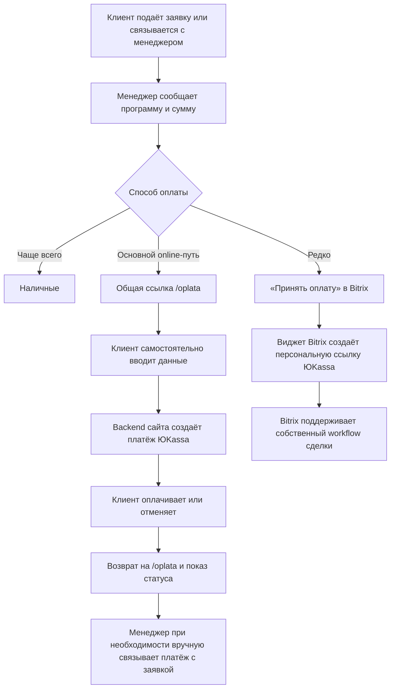

## Why

**Исправлено по ревью PR #90 (Codex, B1):** на момент написания первой редакции этого
раздела кнопка «Произвести оплату» на `/oplata` уже вела не на `/raspisanie-i-tseny`, а
на `#oplata-svyaz` — якорь блока контактов той же страницы. Промежуточный фикс #37
(`4576463`, «очистка перестала выдумывать адрес легаси-кнопок») убрал из
`normalizeLegacyControls` жёстко вписанный адрес расписания: функция
(`web/src/lib/html-cleaner.ts:601` на
`feat/sanitize-rich-html-content@3d10129265f183e2b746a5823012f42a0c115f73`) больше не решает сама, куда вести кнопку, а
принимает адрес от вызывающей страницы (`legacyCtaHref`); `oplata.astro:34` передаёт
`#oplata-svyaz`. Проверено сборкой на неизменённом `main`.

Это не отменяет саму проблему — паритета по-прежнему нет: посетитель нажимает кнопку и
попадает на блок «Свяжитесь с нами», а не к оплате. Формулировка ниже описывает именно
это, без утверждения о несуществующем более редиректе на расписание. **Следствие для
`tasks.md`:** сценарий «ссылки на расписание из переписанной кнопки не остаётся» уже
истинен на исходном коде — это характеризация существующего факта, а не новое поведение
этого change, и он размечен соответствующим тегом, а не `[RED]` (см. `design.md`,
Решение 9).

На боевом сайте (замещаемом, не нашем) та же кнопка открывает модальное окно, по
отправке которого создаётся платёж: `POST https://ikpk.su/api/payments`, затем
`GET /api/payments/{id}`. Способ оплаты назван в контенте самой страницы — банковской
картой через ЮKassa (плюс наличные в офисе); проверено живым сайтом 2026-08-07 (снято в
`payment-request-flow/proposal.md`, там же зафиксирован источник — этот и все
дальнейшие в этом документе пути внутри удалённого каталога `payment-request-flow`
объяснены ниже, в разделе «Отношение к `payment-request-flow`») и подтверждено
повторно текстом уже восстановленной панели «Способы оплаты?» в нашей собственной
сборке (`discovery/entities/collapsible_panels.json`, ключ `/oplata`; см. также
Requirement «Информационное содержание страницы сохраняется» в спеке — там же снята
находка ревью M9, см. ниже).

Это единственное место сайта, где деньги доходят до института онлайн, и единственный
раздел паритета, где посетитель не может довести действие до конца: страница подробно
объясняет условия оплаты и возврата, а заплатить на ней негде.

**Дополнено 2026-08-13:** организационная половина процесса подтверждена ответом
заказчика, а клиентский контракт замещаемого сайта восстановлен и проверен на production.
Оба разбора — ниже, в разделах «Фактический процесс оплаты» и «Восстановленный контракт
замещаемого сайта». Прежняя редакция этого раздела знала только два адреса
(`POST /api/payments`, `GET /api/payments/{id}`) и способ оплаты из текста страницы; теперь
известны состав тела запроса, формат ответа статуса, боевой магазин ЮKassa и то, как платёж
соотносится с заявкой (никак — сопоставление ручное).

## Фактический процесс оплаты (ответ заказчика, 2026-08-13)

Ответ на вопрос, стоявший внешним prerequisite (прежняя редакция Ограничения объёма №5),
получен. Процесс подтверждён такой:

1. клиент может подать заявку на семинар;
2. заявка с сайта автоматически создаёт **лид в Bitrix**;
3. менеджер подтверждает место, программу и сумму;
4. для онлайн-оплаты менеджер обычно отправляет **общую** ссылку `https://ikpk.su/oplata`;
5. `/oplata` — **самостоятельная публичная форма**: не требует существующего лида или
   сделки Bitrix, не требует предварительной регистрации на семинар, не получает `leadId`,
   не создаёт и не обновляет лид;
6. клиент сам вводит ФИО, семинар, сумму, дату, место проведения и контакты;
7. сайт создаёт платёж через собственный backend и переводит клиента на ЮKassa;
8. при необходимости менеджер **вручную** сопоставляет платёж с заявкой в Bitrix;
9. чаще всего клиенты платят **наличными**;
10. отдельно и редко существует второй путь — кнопка «Принять оплату» в Bitrix:
    marketplace-виджет создаёт персональную ссылку ЮKassa и поддерживает собственный
    workflow сделки. Новый сайт этот механизм **не заменяет и не изменяет**.



**Главное следствие: контракт этого change подтверждён, а не изменён.** Эндпоинт
спроектирован под самостоятельную форму без `leadId` и без обращения к Bitrix — именно так
работает и замещаемый сайт. Никакой новой интеграции с Bitrix change не делает; возможное
будущее развитие описано со статусом `Proposed / Not accepted` в `design.md`, «Архитектурные
альтернативы».

**Два следствия, которые легко пропустить:**

- **пункт 8 объясняет, зачем `description`/`metadata.requestId`** (`design.md`, Решение 2):
  сопоставление платежа с заявкой ручное, значит платёж обязан быть опознаваем в панели
  ЮKassa. Это не удобство, а единственный механизм, которым сегодня живёт процесс;
- **пункт 10 превращает гипотезу в факт.** Решение 5а (п. 4) требует игнорировать
  webhook-уведомление о платеже, которого нет в нашей таблице, и обосновывало это
  предположением «id может принадлежать операции того же мерчант-аккаунта, сделанной другим
  каналом». Такой канал существует и работает: платежи из Bitrix идут в тот же магазин. То
  есть требование закрывает не гипотетический, а действующий случай.

## Восстановленный контракт замещаемого сайта (13.08.2026)

Frontend замещаемого сайта вызывает:

```http
POST https://ikpk.su/api/payments
```

Тело:

```json
{
  "city": "...",
  "email": "...",
  "firstname": "...",
  "lastname": "...",
  "phoneNumber": "...",
  "price": 1,
  "seminarDate": "YYYY-MM-DD",
  "seminarName": "...",
  "userId": "optional"
}
```

Ответ содержит URL, по которому frontend переводит браузер на страницу оплаты. Статус
проверяется через `GET https://ikpk.su/api/payments/{internalId}`, и ответ — **текстовый**
статус, например `pending`.

**Результаты безопасной black-box-проверки production.** 13.08.2026 создана **одна**
тестовая неоплаченная попытка на 1 ₽; банковские данные не вводились, деньги не списывались.
Повторять проверку не нужно. Наблюдено:

| Что | Значение |
|---|---|
| `shopId` боевого магазина | `409285` |
| `shopName` | `https://ikpk.su` |
| `testMode` | `false` |
| Назначение платежа | «Услуги по дополнительному образованию» |
| order/payment ID ЮKassa | `320fc67a-000f-5001-9000-15e948df2de7` |
| внутренний UUID замещаемого сайта | `4fd26360-31d6-410f-9aff-3388f624ab7e` |
| возврат при успехе, неуспехе и выходе из checkout | `https://ikpk.su/dashboard?id=<внутренний UUID>` |
| `GET /api/payments/<внутренний UUID>` | `200 pending` |
| `GET /api/payments/<ID ЮKassa>` | ошибка |

**Что этим доказано, а что нет.** Доказано: замещаемый backend хранит соответствие
`внутренний id ↔ id платежа ЮKassa` (иначе запрос по внутреннему UUID не мог бы отвечать
статусом, а запрос по идентификатору ЮKassa не отвечал бы ошибкой). Не доказано и не
выведено: полное серверное тело запроса к ЮKassa — checkout подтверждает магазин и
наблюдаемое клиентское поведение, но состав `receipt`, `vat_code`, `payment_subject`,
`payment_mode` и режим списания из браузера не видны. Они остаются внешним prerequisite
(Ограничение объёма №6). Секретный ключ магазина в браузере не раскрывается и не должен
попадать во frontend, репозиторий или логи.

**Следствия для контракта нашего эндпоинта:**

- **боевой контур обязан использовать тот же магазин ЮKassa `409285`.** Иначе платежи
  разойдутся по двум аккаунтам, а сверка и бухгалтерия заказчика — вместе с ними. `shopId`
  секретом не является (он виден в checkout любому плательщику), секретный ключ — является и
  передаётся только защищённым окружением;
- **имена полей мы не копируем, и это не отступление от паритета.** `/api/payments`
  замещаемого сайта — внутренний контракт между его frontend и его же backend, а не сторонняя
  интеграция, которую кто-то ещё вызывает; наш backend пишется заново по официальному API
  ЮKassa. Соответствие полей при этом полное: `firstname`/`lastname`/`seminarName`/`price`/
  `seminarDate`/`city`/`email`/`phoneNumber` ↔ `firstName`/`lastName`/`seminar`/`amount`/
  `startDate`/`venue`/`email`/`phone`. Отличия ровно два — `userId` (личный кабинет, «Вне
  объёма») у нас отсутствует, а `consent` и `requestId` добавлены;
- **состав полей формы подтверждён production, а не выведен из мокапов** — восемь полей
  требования «Состав полей формы оплаты» совпадают с фактически отправляемыми;
- **адресация статуса по своему идентификатору — status quo, а не наше изобретение.**
  Замещаемый сайт спрашивает статус по внутреннему UUID и отвечает ошибкой на идентификатор
  ЮKassa; наш `GET .../payments/{requestId}/status` устроен так же (Решение 2, Risks). Разница
  одна: наш `requestId` формирует клиент, а внутренний UUID замещаемого сайта — сервер;
- **`price: 1` — наблюдаемый факт: боевая форма создаёт платёж на 1 ₽.** Отсюда переписано
  Решение 6 (см. ниже, «Границы суммы»);
- **немой возврат на `/dashboard` не воспроизводится, и это одобренное отступление.**
  Замещаемый сайт отправляет браузер на `/dashboard?id=<UUID>` во всех трёх исходах, ничего
  не говоря о результате; `/dashboard` — часть личного кабинета, которая у нас «Вне объёма»,
  то есть воспроизвести этот возврат нельзя даже при желании. Принятая замена — возврат на
  `/oplata?paymentRequest=<requestId>` с показом различимых состояний (Решение 2в и требования
  про возврат). Это сознательное UX-улучшение, не изменение организационного процесса.

**Отношение к решению об объёме MVP.** `docs/client-requests.md` (пункт 11) фиксирует
согласованный DoD MVP явно **без** онлайн-оплаты. Это решение не отменяется тихо: онлайн-
оплата выходит из-под него по прямому решению владельца от 2026-08-11 (план
`witty-wiggling-fountain.md`, «Решения владельца», п. 2 — «ЮKassa, полный объём,
несмотря на риски из ревью»), с честным условием — если тестовый магазин ЮKassa
окажется недостижим без реквизитов юрлица, результат называется `blocked (external)`, а
не подменяется суррогатом.

## Отношение к `payment-request-flow` (change удалён; раздел историчен)

**Времена в этом разделе исправлены 2026-08-13 по задаче повторного ревью спеки.** Прежняя
редакция была написана в настоящем времени и читалась так, будто `payment-request-flow`
остаётся действующим change со своей живой спецификацией, от которой зависит наша работа. Это
не так: **каталог `openspec/changes/payment-request-flow/` удалён в PR #90** (коммит
`a35b4051a7f707c2c89f373f83e61e4799a3f248`, сокращённо `a35b405`, «spec(payment):
online-payment-flow — полный путь оплаты ЮKassa»), а `online-payment-flow` ни от какой его
части не зависит: единственное нужное требование скопировано сюда как **своя** возможность
(`specs/request-form-transport/spec.md`).

Раздел сохранён как запись происхождения решений, а не как описание текущего состояния
репозитория. Ниже — прошедшее время там, где речь о том change.

Change `payment-request-flow` (был утверждён после двух независимых ревью, `0a77a5b`, #34)
описывал **первую половину** того же пути — форму заявки на оплату без движения денег:
модалка → отправка на настраиваемый транспорт → семь честных состояний. Реализован он **не
был**: его реализация ждала появления транспорта (его `design.md`, «Предварительное
условие»), тестов по нему тоже не появилось.

Оба change требовали одну и ту же механику: модальное окно, доступность, согласие на ПДн,
идемпотентный повтор по `requestId`, честные состояния, работу без JS. Различие было в
одном шаге: `payment-request-flow` заканчивался отправкой заявки адресату;
`online-payment-flow` продолжает его до создания платежа в ЮKassa, редиректа и проверки
результата.

**Что из этого следует практически, чтобы раздел не пришлось перечитывать целиком:** активной
спецификации заявки в репозитории нет, `/oplata` от неё ничего не наследует в момент
исполнения, а требования к модальному окну и согласию живут в `specs/request-form-transport/`
**этого** change. Отдельно и позже появится **baseline существующего транспорта заявки** — это
другая работа, не этот удалённый change; зависимость от неё названа ниже, в разделе
«Capabilities» (`Modified Capabilities`), и в `tasks.md`, 7.8.

**Варианты:**

1. **`online-payment-flow` — первый этап, `payment-request-flow` реализуется отдельно и
   раньше.** Заявка (без денег) закрывает паритет страницы уже сейчас, независимо от
   того, когда решится вопрос тестового магазина ЮKassa (blocked-точка №2 ниже может
   растянуться на непредсказуемый срок — получение реквизитов юрлица не в руках
   исполнителя). Цена: два раунда мокапов и тестов вместо одного, и модалка
   `payment-request-flow` частично выбрасывается, когда `online-payment-flow`
   реализуется поверх неё.
2. **`online-payment-flow` заменяет `payment-request-flow` целиком.** Серверный
   компонент, который нужен для приёма самой заявки (Решение 1 `payment-request-flow` —
   «транспорт — это конфигурация»), в любом случае приходится строить для реального
   платежа: тот же сервис умеет и создать платёж, и принять заявку как запасной путь.
   Строить промежуточный транспорт заявки, зная, что через один и тот же цикл разработки
   он будет заменён платёжным эндпоинтом, — двойная работа на инфраструктуре, которая не
   переживёт следующий этап. `payment-request-flow` в этом случае не архивируется как
   выполненный: он помечается замещённым до реализации, а его согласованные требования
   (модальность, доступность, согласие, идемпотентность, поведение без JS) переносятся в
   `request-form-transport`, на который `online-payment-flow` опирается как на готовую
   спецификацию, не переписывая её текст.

**Решено владельцем (2026-08-11): вариант 2, заменён — change делается одним, не
делится.** Предпосылка, на которой первая редакция строила альтернативу (регистрация
тестового магазина ЮKassa практически требует реквизитов юрлица и может растянуться на
непредсказуемый срок), **оказалась неверной** — находка владельца по документации
ЮKassa: тестовый режим доступен сразу после регистрации, до заполнения сведений о
компании и заключения договора; тестовые платежи не переводят реальных денег, и в том
же тестовом контуре проверяются чеки по 54-ФЗ (см. Развилку 3 ниже, тоже пересмотренную
этой находкой). Раз тестовый магазин заводится быстро, а не «когда-нибудь, если повезёт
с реквизитами», необходимость в промежуточном этапе, который закрывает паритет
независимо от срока ожидания, отпадает — сначала просто создаётся тестовый магазин
(`tasks.md`, 2.1–2.2), и разработка идёт по полному объёму сразу.

**Самодостаточность после решения (P1-4, см. Capabilities).** Раз `payment-request-flow`
не реализовывался и не архивировался, требование, которое жило только в его делте
(`request-form-transport`), скопировано в `online-payment-flow` как собственная
возможность — иначе зависимость указывала бы на спецификацию, которой никогда не
появится в `openspec/specs/`. **После удаления каталога (PR #90) той делты не существует
вовсе**, и единственная действующая копия текста — `specs/request-form-transport/spec.md`
этого change; формулировка исправлена с настоящего времени на прошедшее 2026-08-13, потому что
«живущее только в его делте» описывало состояние до #90.

**Каталог `payment-request-flow` удалён из `openspec/changes/` — это уже случилось, в PR #90
(P1-A, владелец).** Прежняя редакция говорила «удалён этим же PR»: верно на момент написания
(тогда «этот PR» был #90), **неверно сегодня** — с тех пор #90 слит, и фраза читалась как
обещание удаления в текущем PR. Точный адрес факта:
`a35b4051a7f707c2c89f373f83e61e4799a3f248` (`a35b405`), PR #90. Оставлять каталог на месте —
пусть даже с пометкой «замещён» в собственных файлах — создавало бы два источника истины и
риск, что кто-то запустит `/opsx:archive payment-request-flow`, не прочитав этот change.
Удаление устранило риск структурно, а не текстовым предупреждением, которое можно не
заметить. Содержимое не потеряно: оно доступно в истории git по коммиту `0a77a5b` (#34) и в
коммите удаления. **Все ссылки на `payment-request-flow/design.md` и
`payment-request-flow/proposal.md` в этом change (их много — они цитируют
происхождение уже принятых решений) относятся к этому историческому, более не
существующему в рабочем дереве каталогу**, а не к живому файлу; ссылка остаётся
проверяемой через git, не через файловую систему.

## Предварительное условие

**Дополнено и тем же днём переписано 2026-08-13.** Утром у change появился внешний
prerequisite — ответ заказчика о текущей связи сайта, Bitrix и ЮKassa, — и он блокировал
production-контракт и архивирование. **Ответ получен**: Ограничение объёма №5 закрыто, эта
блокировка снята, процесс описан выше («Фактический процесс оплаты»). Остаются внешние
prerequisite другого рода — настройки ЮKassa, которые из браузера не видны (Ограничение
объёма №6). Исходники замещаемого backend в этот перечень **не входят**: внешний клиентский
контракт восстановлен наблюдением, а серверную часть мы пишем заново по официальному API
ЮKassa, поэтому доступ к чужому коду перестал быть условием работы.

Реализация начинается **строго после** merge PR-1 демо-гигиены: она затрагивает
`scripts/deploy-web.sh`, `web/src/lib/forms.ts` (семантика `DEMO_FORMS`) и
`web/tests/repo-hygiene.test.ts` — те же файлы, которые PR-1 меняет первым. Спецификация
и тесты можно готовить раньше; код — нет (конфликт правок одного файла в двух ветках).

Сайт статический (`output: 'static'`, GitHub Pages), исполняемого кода на сервере, где
раздаётся сайт, сейчас нет ни одного. Создание платежа требует серверного секрета
(`shopId` + секретный ключ ЮKassa) — секрет не может жить ни в статической сборке, ни в
браузере. Рантайм для этого секрета **выбран владельцем** — минимальный отдельный сервис
на существующей VPS, одна реплика (`design.md`, Решение 1 и Решение 1б); открытой
развилкой это больше не является.

## What Changes

- **Модальное окно оплаты на `/oplata`** — открывается кнопкой, как на замещаемом сайте,
  вместо нынешнего переписывания в ссылку на расписание.
- **Полный платёжный путь**: форма → создание платежа на сервере (секрет никогда не
  покидает сервер) → редирект на страницу оплаты ЮKassa → возврат на сайт → проверка
  статуса платежа.
- **Согласие на обработку персональных данных** — то же требование, что в
  `payment-request-flow`, применённое к форме, которая теперь ведёт к реальному платежу,
  а не только к заявке.
- **Честные состояния** — набор состояний `request-form-transport` (минимальный, не
  закрытый — см. `specs/request-form-transport/spec.md`) расширяется тем, что нужно
  только платежу: платёж создан и идёт ожидание оплаты, оплата подтверждена, оплата
  отклонена или отменена, статус не удалось проверить, и — **добавлено по находке
  ревью #97 (minor), не названо в первой редакции** — исход, отдельный от всех
  перечисленных: платёж не завершён, а автоматически подтвердить содержимое повторной
  попытки нельзя, поэтому ни успех, ни отказ не утверждаются, а посетителю предлагается
  связаться напрямую (`design.md`, Решение 2а/3б, «Третий исход»). **Дополнено
  четвёртым раундом ревью #97 при буквальной сверке перечней между файлами:** сюда же
  относится состояние «данные попытки изменились, отправьте как новую попытку» — оно
  появилось в таблице отображения `design.md` и в спеке (сценарий про несовпадение
  содержимого у уже отменённого платежа) в более поздних раундах, а этот перечень с тех
  пор не перечитывался. Перечень здесь **описательный**: нормативны спека возможности
  `online-payment` и таблица отображения `design.md`, и при расхождении правится этот
  список, а не они.
- **Идемпотентность создания платежа** — повторная отправка формы или повторное
  открытие страницы возврата не создаёт второй платёж на ту же попытку.
- **Незавершённая попытка переживает перезагрузку страницы** — **внесено решением
  владельца 2026-08-12 (P3)**. Запрет формировать новый `requestId` до завершённого
  исхода действовал только в пределах одной жизни страницы: `requestId` не хранился
  нигде, и `F5` в состоянии «нужна сверка» возвращал чистую форму — путь ко второму
  настоящему платежу, ради защиты от которого третий исход и вводился. Два слоя:
  клиентское удержание попытки со сводкой её данных и серверный контроль по отпечатку,
  ловящий тот же состав под новым `requestId`. Что каждый слой не ловит и какой выход у
  записи без идентификатора платежа — `design.md`, Решение 2е. **Уточнено вторым раундом
  ревью #112:** удержание ставится в момент отправки, а не по ответу; снимается по четырём
  названным основаниям (включая ответ CI/preview mock-обработчика); не ставится только в
  CI/preview mock-сборке. На установленном стенде удержание работает так же, как в production,
  потому что там создаётся тестовый платёж.
  **Переписано решениями владельца от 2026-08-13:** исход хранит **сервер** —
  `verification_required` стало сохраняемым состоянием записи и возвращается проверкой
  статуса, поэтому после `F5` состояние восстанавливается из ответа сервера, а не из памяти
  браузера; браузер постоянно держит только `requestId` и время создания попытки, а значения
  полей — до конца сессии браузера; серверная блокировка по отпечатку ограничена сверху
  ровно 14 сутками.
- **Состояние «нужна сверка» становится требованием, а не картинкой** — предупреждение
  «платёж мог быть создан, повторять не нужно», отсутствие элемента, создающего **новую**
  попытку, прежде несли только мокапы, то есть ничто. (Копируемый идентификатор попытки был в
  этом перечне до 18.08.2026 — решением владельца показ убран, см. ниже.)
  **Формулировка уточнена 2026-08-13 (вариант B):** запрещено создание попытки **вместо**
  удерживаемой, а элемент
  продолжения этой же обязателен — прежнее «отсутствие элемента отправки» противоречило бы
  безопасному продолжению.
  **Дополнено вторым раундом ревью #112:** предупреждение и запрет подменять удерживаемую попытку
  требуются от состояний по действующему удержанию, **кроме пяти исключений:** отправка
  (предупреждение преждевременно); отклонение по проверке, лимит частоты, демо, вопрос о
  повторной оплате (в последних четырёх ответ доказывает отсутствие платежа);
  исход отличается машинным признаком,
  исход объявляется вспомогательной технологии без перевода фокуса
  (норма `request-form-transport`; прежнее «фокус переходит в панель исхода» снято
  решением владельца от 2026-08-14).
  **Дополнено решением владельца от 2026-08-13:** при совпадении отпечатка сервер возвращает
  **канонический** `requestId` исходной попытки, и клиент переключается на него, удерживая
  попытку по нему. **Уточнено 18.08.2026:** это правило про **протокол**, а не про показ —
  решением владельца показ и копирование идентификатора убраны целиком, поэтому прежний вывод
  «показываемый идентификатор всегда тот, под которым платёж лежит у оператора» больше не
  является обещанием посетителю. Цена в приватности названа отклонением в `design.md`,
  Решение 2е.
- **Ручного выхода из состояния «нужна сверка» в change НЕТ, и это решение владельца от
  2026-08-13.** Операторская команда сервиса не принята, административная панель отвергнута,
  искусственного перевода записи в терминальное состояние человеком в контракте нет
  (`design.md`, «Архитектурные альтернативы», A2, статус `Proposed / Not accepted`). Удержание
  снимается только четырьмя автоматическими основаниями: терминальный статус от оператора платежей,
  «записи нет», ответ демонстрационного обработчика на проверку статуса, 14 суток. Открытыми остаются кто уполномочен заключить, что платежа не было, и
  чем это подтверждается — внешняя роль и операционный критерий, из репозитория не выводимые.
  **Порядок этого пункта исправлен по находке MAJOR-6 ревью #112:** прежняя редакция открывалась
  утвердительным «решением владельца это операторская команда сервиса» и доходила до отрицания
  лишь через четыре предложения, двумя последовательными оговорками, — то есть в списке того,
  **что строится**, читатель первой строки получал вывод, прямо противоположный разделу «Вне
  объёма» того же файла. История решения не потеряна: она в `design.md`, Решение 2ж и 2з.
- **Повторная оплата того же состава после подтверждённой — вопрос, а не запрет (решение
  владельца от 2026-08-13).** Первый запрос с новым `requestId`, отпечаток которого совпал с
  подтверждённой оплатой, платёж по которой подтверждён не ранее 14 суток назад, платежа не создаёт: посетителя спрашивают, создавать
  ли ещё один, и платёж идёт только по явному подтверждению. Защита **серверная** — модального
  окна недостаточно. Внесено по находке состязательного ревью: прежняя редакция прямо
  предписывала создать платёж, то есть посетитель, повторивший тот же состав после успешной
  оплаты, платил второй раз без предупреждения.
- **Одна незавершённая попытка больше не запирает оплату другого семинара (решение владельца
  от 2026-08-13).** В удержанном состоянии два действия: продолжить эту оплату или начать
  другую; браузер удерживает несколько попыток, храня постоянно только идентификаторы и время.
  Последней защитой остаётся серверный поиск по отпечатку. Названная граница: система различает
  **нормализованный состав полей**, а не «другой семинар», — правка одного поля обходит защиту,
  пока у семинара нет отдельного идентификатора.
- **Уведомление о нашем платеже восстанавливает запись, у которой идентификатор не был получен
  (решение владельца от 2026-08-13).** Тело уведомления по-прежнему не источник истины: данные
  берутся авторитетным запросом к API, а привязка разрешена только при шести условиях, включая
  признак нашего канала в метаданных платежа. Новую запись webhook не создаёт никогда. Это
  возвращает автоматический выход тому классу записей, для которого спека говорила «выход один —
  14 суток».
- **Продолжение незавершённой попытки — решение владельца от 2026-08-13 (вариант B).** В
  удержанном состоянии разрешён элемент, отправляющий запрос **с тем же `requestId`**; запрещено
  только создание новой попытки **вместо** удерживаемой (неявная подмена); явное действие
  «оплатить другой семинар» разрешено и обязательно. Это единственный исполнитель безопасного
  продолжения (прежде названного «автоматическим выходом»): проверка статуса остаётся без
  побочных действий, сервер сам повтор не инициирует, оператора нет. Внесено по двум блокерам
  ревью #112 — правило без исполнителя и прямое противоречие с `request-form-transport`, который
  требует, чтобы повтор после неизвестного исхода уходил с тем же идентификатором. Если значения
  полей утрачены вместе с сессией браузера, посетитель вводит их заново под тем же `requestId`, а
  сервер сверяет отпечаток — постоянно персональные данные не хранятся.
- **Описание порядка оплаты обязано соответствовать поведению формы** — **внесено
  решением владельца 2026-08-12 (P4)**. Ответ «Как оплатить?» на `/oplata` описывает
  заявку и звонок менеджера; с появлением формы это становится ложью, и не запрещало
  этого ничто (`design.md`, Решение 12). Правило двустороннее: пока формы нет, описание
  не обещает оплату на сайте. **Сужено вторым раундом ревью #112 до страницы `/oplata`:**
  прежняя формулировка говорила о описании «на сайте» вообще, то есть шире зоны, изъятой у
  соседнего change, — а требование шире изъятого либо невыполнимо, либо тихо заходит в чужую
  зону. Описания порядка оплаты вне `/oplata`, если найдутся, предмет отдельной работы.
- **Проверка суммы и лимит частоты создания платежа** — сумма проверяется на то, что она
  целое число рублей и **строго больше нуля**; лимит частоты (Решение 5б) нужен в первую
  очередь для **боевого** контура, где учётные данные и деньги настоящие — стенд с тестовыми
  учётными данными ЮKassa лишь первое окружение, где отсутствие лимита стало заметно при
  разборе объёма, не причина требования. **Исправлено по находке ревью #97 (minor):** первая
  редакция этого пункта называла только верхнюю границу суммы и объясняла лимит частоты
  публичностью стенда — обе неточности противоречили уже принятым решениям 5б и 6 в
  `design.md`.
  **Переписано 2026-08-13 по production-наблюдению: диапазон `1 000 – 200 000 ₽` убран из
  требований.** Боевая форма создаёт платёж на **1 ₽** — это наблюдаемый факт (см.
  «Восстановленный контракт замещаемого сайта»), а нижняя граница 1 000 ₽ его запрещала, то
  есть была не паритетом, а новым ограничением, выданным за существующее поведение. Верхняя
  граница 200 000 ₽ — того же класса: она выведена нами из прайса семинаров
  (`discovery/entities/schedule_entries.json`), на замещаемом сайте не наблюдалась и
  заказчиком не подтверждена. **Обе границы вынесены отдельным решением владельца** (задача
  0.7, `design.md`, Решение 6): пока решения нет, нормативна только положительность суммы. От
  card-testing защищают лимит частоты (Решение 5б), защита от автоматических отправок
  (`request-form-transport`) и наблюдаемость — а не молчаливо поднятая минимальная сумма.
- **Секреты не попадают на клиента** — ни во frontend-код, ни в `dist`, ни в браузерные
  логи, ни в тексты автоматических тестов; включая случай, когда секрет используется в
  заголовке `Authorization: Basic`, а не в URL — сообщения об ошибках всё равно проверяются
  на отсутствие в них секрета.
- **`normalizeLegacyControls` не меняется.** Новое поведение кнопки описывается на
  уровне вызывающей страницы (`web/src/pages/oplata.astro:36` на
  `feat/sanitize-rich-html-content@3d10129265f183e2b746a5823012f42a0c115f73`), а не
  правкой общей функции очистки контента: она сознательно не знает адреса, на который
  ведёт кнопка (`html-cleaner.ts:601-619` на том же SHA), и это разделение сохраняется.
  Rich HTML `/oplata` остаётся в центральном `RichContent` с `sinkId="static-page-oplata"`;
  change SHALL NOT добавлять `set:html` / `is:raw` / `srcdoc`.
- **Именованные ограничения объёма** (см. «Ограничения объёма» ниже) — четыре точки,
  которые change не может закрыть исполнителем в одиночку.

### Вне объёма

- личный кабинет (`auth/*`, `my-seminars`, `passed-seminars`);
- расширение способов оплаты сверх банковской карты (наличные в офисе остаются офлайн,
  как сейчас);
- аналитика и отчётность по платежам сверх того, что даёт панель ЮKassa — платёж не
  журналируется на нашей стороне сверх данных, необходимых для проверки статуса и
  идемпотентности (см. `design.md`);
- страница FAQ на `/oplata` — область change `education-trust-and-admission-clarity`
  (см. «Пересечение областей» ниже);
- **автоматическая интеграция сайта с Bitrix — не входит и не принята** (внесено
  2026-08-13). Ни передача `leadId` в платёж, ни создание/обновление лида платежом, ни
  персональные ссылки на оплату, инициируемые из Bitrix: возможное будущее развитие описано
  в `design.md`, «Архитектурные альтернативы», со статусом `Proposed / Not accepted`.
  Существующий путь «Принять оплату» из Bitrix (виджет marketplace) change не заменяет и не
  изменяет — он живёт вне сайта целиком;
- **операторский интерфейс любого вида** — ни командная строка, ни административная панель
  (внесено 2026-08-13, там же).

## Ограничения объёма (blocked-точки)

Ниже — точки, где исполнение зависит не от кода, а от внешних условий или решений
владельца. Каждая формулируется как named blocked, а не замалчивается и не подменяется
суррогатом. **Точка 1 закрыта решением владельца 2026-08-12, точка 5 — ответом заказчика
2026-08-13; открытыми остаются точки 2, 3, 4 и 6.**
Нумерация сохранена и только дополняется в конец: на «Ограничение объёма №2/№3/№4» ссылаются
`design.md`, `tasks.md` и спека, и сдвиг номеров сделал бы эти ссылки ложными. Точка 5
добавлена 2026-08-13 — раньше их было четыре, и это сказано здесь, чтобы «пятая точка» не
читалась как то, что кто-то потерял из виду. Точка 6 добавлена тем же днём, уже после ответа
заказчика: она собирает настройки ЮKassa, которых ответ не касался и которые из браузера не
наблюдаемы, — чтобы закрытие точки 5 не прочиталось как «внешних условий больше нет».

1. **Рантайм секрета — РЕШЕНО (владелец, 2026-08-12).** Сайт статический; секрет ЮKassa
   требует исполняемого кода на стороне сервера. Принято: **минимальный отдельный сервис
   на существующей VPS, ровно одна реплика, секрет — файл окружения** (`design.md`,
   Решение 1, Решение 1б, Решение 7). Владелец файла в исходном решении — отдельный
   системный пользователь сервиса; **пересмотрено владельцем 2026-08-18: `root:root`,
   права `0600`** — основание и границы пересмотра в Решении 1 `design.md`, задача 4.5. Вариант «отдельная VPS только под платежи» **отложен, а не отвергнут** —
   условие возврата названо в Решении 1. Разбор четырёх вариантов, по которому
   принималось решение, — `docs/decisions/payment-runtime-options.md` (слит #107); это
   материал для решения, **не источник требований**: требования живут здесь и в `specs/`.

   **Граница решения.** Оно разблокирует серверную работу (раздел 4 `tasks.md`) и тесты
   старта процесса, но **не** приёмку боевого пути: та ждёт домена и HTTPS — точка 3 ниже,
   `design.md`, Решение 5, задачи 2.3 и 7.3a.
2. **Тестовый магазин ЮKassa — внешний prerequisite, но не долгий.** **Исправлено по
   находке владельца (P1-1):** первая редакция ошибочно утверждала, что создание личного
   кабинета «практически требует реквизитов юридического лица заказчика» — по
   документации ЮKassa тестовый режим доступен сразу после регистрации, до сведений о
   компании и договора. Реквизиты юрлица и договор нужны для перехода в боевой режим, не
   для тестового. Вопросы «кто именно нажимает кнопку регистрации» и «куда попадают
   `shopId`/секретный ключ» остаются — их решает не код, а роль исполнителя, — но
   ожидаемый срок закрытия точки резко короче, чем предполагала первая редакция.
   **Вопросы владельцу/заказчику:**
   - кто заводит личный кабинет ЮKassa — заказчик или мы (заведение исполнителем на себя
     означало бы, что «тестовые» реквизиты физически принадлежат исполнителю; это
     решение владельца, не действие по умолчанию, и происходит только по отдельному
     явному разрешению);
   - кто выдаёт `shopId`/секретный ключ и как они передаются (канал, не попадающий в
     репозиторий и переписку с логами);
   - кто настраивает адрес webhook в личном кабинете ЮKassa (кабинет и сервер могут быть
     на разных сторонах).

   **Сужено 2026-08-13 production-наблюдением: первый вопрос закрыт, остальные — нет.**
   Личный кабинет ЮKassa у заказчика **уже существует** и работает в боевом режиме: магазин
   `409285`, `shopName https://ikpk.su`, `testMode=false` (см. «Восстановленный контракт
   замещаемого сайта»). Значит «кто заводит кабинет» больше не вопрос — он заведён заказчиком,
   и заводить второй нельзя: боевой контур обязан использовать **тот же** магазин, иначе
   платежи разойдутся по двум аккаунтам. Открытым осталось то, что наблюдением не берётся:
   доступ к этому аккаунту для создания **тестового** магазина внутри него, канал передачи
   тестового и боевого секретных ключей, и кто настраивает адрес webhook в кабинете. Ни один
   из них из браузера не виден и кодом не решается.

   Без этих данных change доводится до mock/contract-тестов серверного эндпоинта;
   реальное создание платежа и его подтверждение — `blocked (external)` до появления
   реквизитов. Оговорка не снята полностью (доступ к кабинету всё ещё внешнее действие, не
   код этого change), но её вероятный срок больше не обосновывает разделение объёма
   (см. «Отношение к `payment-request-flow`» выше).
3. **Webhook требует публичного HTTPS — и поэтому webhook на стенде не используется.**
   Стенд поднимается `bootstrap-vps.sh` с `listen 80` — только HTTP, и ЮKassa не станет
   слать уведомления на адрес без TLS. **Решением владельца от 2026-08-18 вывод сделан
   обратный прежнему:** HTTP на нынешнем стенде разрешён явно, HTTPS отнесён к прод-контуру,
   а исход платежа стенд узнаёт опросом ЮKassa со своей стороны — webhook ускоряет, но
   условием работы не является. Отдельной подзадачи «Certbot на стенде» у этого change
   больше нет; она же
   частично закрывает отсутствие TLS/заголовков на стенде (пункт B4 упоминался в
   рабочей заметке аудита безопасности, но сам файл этой заметки не существует ни в
   этой ветке, ни в `main` — **исправлено по minor-находке ревью #97**: утверждение
   про отсутствие TLS проверяется по факту `listen 80` в `bootstrap-vps.sh`, не по
   документу). **Отдельно от стенда**: у прод-контура,
   где API раздаётся на другом origin и страница отдаётся по HTTPS, без TLS на API-стороне
   браузер блокирует как смешанный контент само создание платежа, не только webhook (см.
   `design.md`, Решение 5). **Решением владельца от 2026-08-18 это перестало быть условием
   текущей фазы:** стенд объявляет API на своём же origin (`/api/payments`), поэтому схемы
   совпадают по построению; `api.ikpk.su` не поднимается, и HTTPS на API-стороне остаётся
   предусловием прод-контура.
4. **Живой e2e против контура ЮKassa — вне обязательного workflow `Tests`.** `Tests` —
   гейт публикации всего сайта (см. `AGENTS.md`, «Гейт публикации»); ставить публикацию
   всего сайта в зависимость от доступности внешнего платёжного сервиса неверно по
   конструкции, а не только по цене прогона. В `Tests` входят только mock/contract-тесты
   серверного эндпоинта и клиентские тесты состояний формы на замоканном транспорте.
   Проверка тестовой картой — ручная приёмка со свидетельством (команда/адрес/вывод/
   снимок) **либо** отдельный `workflow_dispatch` с секретами, не входящий в гейт
   публикации. Регистрация личного кабинета исполнителем на себя требует отдельного
   явного разрешения владельца (см. п. 2).

5. **Ответ заказчика о текущей связи сайта, Bitrix и ЮKassa — ЗАКРЫТА 2026-08-13 (ответ
   получен).** Точка была внесена утром того же дня и блокировала production-контракт,
   архивирование и операторский workflow. Ответ пришёл; процесс описан выше, «Фактический
   процесс оплаты», перечень прежних неизвестных и что с каждым стало — `design.md`,
   Решение 2и.

   **Что снято:** блокировка production-контракта (контракт эндпоинта ответом **подтверждён**,
   а не переделан: `/oplata` и в production самостоятельна, `leadId` не участвует) и
   блокировка **архивирования** — теперь известно, чему требования дельта. Архивирование
   остаётся под обычным Definition of Done (тесты, реализация, приёмка) и под точками 2–4 и 6;
   снят именно этот внешний ответ, а не необходимость доделать работу.

   **Что не снято, и это разные вещи:** «существующий бизнес-процесс не меняется без
   согласования» остаётся в силе — теперь как **знание** о процессе, а не как ожидание письма:
   выкладка боевой формы согласуется, потому что она добавляет путь оплаты в живой процесс
   института. **Операторский workflow по-прежнему не проектируется** — по прямому указанию
   владельца, а операторская командная строка понижена до `Proposed / Not accepted`
   (`design.md`, «Архитектурные альтернативы»). Из пяти прежних неизвестных четыре ответом
   закрыты, **пятое — какое сообщение получает клиент после оплаты и кто его отправляет — в
   ответе не названо** и остаётся открытым (`design.md`, Решение 2и): наблюдаемо только то,
   что замещаемый сайт возвращает на `/dashboard` молча, а уведомления на стороне ЮKassa
   зависят от настроек чеков, то есть от точки 6 ниже.

6. **Настройки ЮKassa, не видимые из браузера, — внешний prerequisite production, но не
   спеки и не тестов. Внесено 2026-08-13.** Checkout подтверждает магазин и наблюдаемое
   клиентское поведение и **не раскрывает** серверного тела запроса к ЮKassa. Поэтому
   решёнными не объявляются:

   - безопасная передача тестового и боевого секретных ключей (канал — не репозиторий и не
     переписка с логами; точка 2 выше);
   - параметры чеков и фискализации — включён ли на аккаунте механизм чеков
     (`RECEIPT_ENABLED`, Решение 2г);
   - НДС и значение `vat_code`;
   - `payment_subject` и `payment_mode` — **переведены из нормативных в подтверждаемые**
     этим же обновлением: прежняя редакция Решения 2г фиксировала `"service"` и
     `"full_payment"` как решённые, а подтверждения им нет;
   - подтверждение одностадийного режима создания платежа (`capture`) — точное имя поля и
     его значение (Решение 2д);
   - webhook и TLS (пересекается с точкой 3, но не совпадает: там наш HTTPS, здесь — адрес
     уведомлений в кабинете заказчика);
   - политика хранения и резервного копирования платёжных сопоставлений. Числа change
     остаются его решением (TTL 14 суток, Решение 4; копия не реже 4 часов, Решение 4а), но
     **политикой, согласованной с заказчиком, они не являются** и до согласования такими не
     объявляются.

   **Две половины этой точки гейтят разное, и это надо различать** (уточнено по находке
   minor-13 ревью #112): **наблюдение** на тестовом магазине (`tasks.md`, 2.2a) — состав полей
   чека, режим создания платежа, перечень статусов — блокирует **написание красных тестов**
   раздела 3, потому что от него зависит контракт (то же правило, что закрыло Развилку 3);
   **письменное подтверждение** (2.9) — канал секретов, НДС, политика хранения — блокирует
   **боевой запуск**, но не тесты и не демо. Прежняя формулировка объединяла их в одно «до
   красных тестов», а задача 2.9 говорила «не блокирует тесты» — противоречие, из-за которого
   сессия тестов могла написать тесты по неподтверждённому составу чека.

Итог: change закрывается либо полной реализацией и приёмкой, либо честным `blocked
(external)` на конкретной из точек **2, 3, 4 или 6** (точка 1 закрыта решением владельца
2026-08-12, точка 5 — ответом заказчика 2026-08-13; `blocked` на них больше невозможен) без
суррогатных зелёных проверок — в духе `Definition of Done итерации` плана
`witty-wiggling-fountain.md`, п. 1. Ни одна из оставшихся точек больше не блокирует
**архивирование** само по себе — этим точка 5 от них и отличалась, и её закрытие эту разницу
устранило: препятствием к архиву остаётся незаконченная работа, а не отсутствующий внешний
ответ.

## Пересечение областей: `education-trust-and-admission-clarity`

Change `education-trust-and-admission-clarity` (спека утверждена и слита, `#87`,
`main@26483e579b17dd6235205ca05496874708b00395` (сокращённо `26483e5`); **код и
разметку commit не трогает** — сам коммит называет это явно,
«Кода не трогает») добавит на `/oplata` находимую секцию FAQ поверх уже существующих
аккордеонов страницы («Как оплатить?», «Способы оплаты?», «Условия возврата денежных
средств?»), когда дойдёт до реализации. Секции страницы разводятся явно уже на уровне
спек, чтобы оба change не правили одну и ту же разметку по расходящимся
предположениям:

- `education-trust-and-admission-clarity` владеет содержательными аккордеонами страницы
  (их подписи, порядок, обрамление секцией FAQ) — они лежат в `body_html` страницы и
  проходят через `cleanBodyHtml`. **Уточнено решением владельца 2026-08-12 (P4):** одно
  исключение из этого владения — **тело ответа «Как оплатить?»**. Оно описывает порядок
  оплаты, а порядок оплаты меняет `online-payment-flow`; правит его тот change, который
  меняет фактическое поведение, иначе описание расходится с кнопкой на той же странице.
  Разделение по предмету, а не по файлу: тот change отвечает за то, что вопрос находится
  и раскрывается, этот — за то, что ответ на него не врёт (`design.md`, Решение 12,
  и требование «Публикуемое описание порядка оплаты соответствует поведению формы»).
  **Правка и проверка — разные объёмы, уточнено вторым раундом ревью #112:** правит
  `online-payment-flow` только тело этого ответа, а **проверяет** собранную страницу
  `/oplata` целиком — ложное обещание оплаты в соседнем абзаце той же страницы так же ложно,
  и гейт, глядящий в один блок, его пропустит. Обнаружение такого текста вне тела ответа —
  повод согласовать правку с владельцем зоны, а не править молча;
- `online-payment-flow` владеет блоком контактов (`#oplata-svyaz`,
  `web/src/pages/oplata.astro:18-31` на
  `main@8b4d13bf4c3a41c40636f5d4c4f1d7eeb2b8d850`; диапазон исправлен четвёртым раундом
  ревью #97 — прежде `16-30` здесь и `17-30` в спеке, оба неверны) и точкой входа в
  модальное окно — кнопкой,
  переписанной из легаси-контента, и самим модальным окном как отдельным компонентом
  страницы, не приходящим из `body_html`.

Правок в общей зоне (аккордеоны из `body_html`) `online-payment-flow` не производит —
**кроме названного выше тела ответа «Как оплатить?»**. Прежняя редакция этой строки была
безусловной, и после уточнения границы она стала бы неверной; исключение названо здесь,
а не оставлено расхождением между двумя абзацами одного раздела. Порядок остаётся тем
же: `education-trust-and-admission-clarity` сливается первым и **не трогает** тело этого
ответа (иначе он пообещает оплату, которой ещё нет), `online-payment-flow` правит его
вместе с появлением формы.
**Спека** `education-trust-and-admission-clarity` уже утверждена и слита (см. выше) —
это условие для реализации `online-payment-flow` на `/oplata` выполнено на уровне
намерения. Условие для самой **реализации** (кода) — не спека, а фактическая разметка:
мокапы FAQ выбраны владельцем и слиты **в код** `/oplata`. Пока этого не произошло,
реализация `online-payment-flow` на `/oplata` либо ждёт, либо стороны явно
договариваются об очерёдности на уровне PR (кто мержится первым, кто ребейзит вторым)
— смешивать «спека слита» с «код слит» здесь нельзя: первое уже верно, второе пока нет.

## Пересечение областей: `sanitize-rich-html-content`

Sink-контракт rich HTML на `/oplata` уже реализован:
`feat/sanitize-rich-html-content@3d10129265f183e2b746a5823012f42a0c115f73`,
`web/src/pages/oplata.astro:36` — `<RichContent … sinkId="static-page-oplata" />`.
Этот change SHALL:

- оставить тело страницы в том же центральном sink и SHALL NOT добавлять `set:html`,
  `is:raw` или `srcdoc`;
- навешивать прогрессивное улучшение кнопки (`LEGACY_CTA_ATTR`) на уровне
  `oplata.astro`, не меняя `normalizeLegacyControls`;
- не переносить `data-testid` и layout wrappers внутрь sanitized root.

Mapped flex/spacing `/oplata` уже уехали в локальные classes (`rc-display-flex` и
соседи); визуальный эталон `oplata-*` обязан это учитывать, а не требовать inline
`style` обратно.

## Развилки, решённые владельцем (2026-08-11)

Четыре пункта ниже — находки ревью PR #90 (B2, M2, M3, M11), которые нельзя было
закрыть исполнителем в одиночку: каждая меняла форму контракта или объём change, а не
только код. Владелец ответил на все четыре; текст ниже — не открытый вопрос, а запись
решения с обоснованием, которое к нему привело (обоснование остаётся, чтобы следующий
читатель не задавал решённый вопрос заново).

### Развилка 1 (B2): на каком origin живёт прод-эндпоинт — РЕШЕНО

Ошибка первой редакции: `proposal.md` называл прод «статическим, GitHub Pages», а
`design.md` — «`dist` раздаётся Nginx», и Решение 1 целиком построено на
reverse-proxy `/api/*` за тем же Nginx. Проверено по `.github/workflows/deploy.yml`:
прод публикуется через `actions/upload-pages-artifact` + `actions/deploy-pages` —
**GitHub Pages**, а не VPS. Nginx с `scripts/bootstrap-vps.sh` держит только
демо-стенд. Оба файла change были правы про разные контуры и противоречили друг
другу, не называя этого.

Из этого следует больше, чем неточность факта: страница `ikpk.su` на Pages всегда
отдаётся по HTTPS, и браузер блокирует как смешанный контент **любое** обращение с неё
к API по обычному HTTP — независимо от webhook. Решение 5 `design.md` («HTTPS не
блокирует основной путь») верно только там, где страница и API используют одну схему
уже сегодня (демо-стенд, всё на HTTP); на проде HTTPS для API-эндпоинта требуется для
самого создания платежа, не только для необязательного вебхука. Это фактически
поднимает Ограничение объёма №3 с «нужен для вебхука» до «нужен для прод-пути целиком».

**Варианты:**

1. **API — отдельный, HTTPS-контур на VPS** (например, `api.ikpk.su`), фронтенд
   остаётся на Pages как есть. Требует: CORS (allowlist ровно на `ikpk.su`, а не
   отражённый `Origin`), TLS для нового поддомена, преflight-обработку. Не трогает уже
   работающий гейт публикации основного сайта.
2. **Прод целиком переезжает с Pages на VPS**, как в исходном архитектурном плане
   (`docs/architecture/new-architecture.md`) — тогда страница и API снова на одном
   origin, CORS не нужен вовсе. Это отдельная миграция хостинга уровня проекта, а не
   часть объёма этого change: она меняет гейт публикации, DNS, наблюдаемость —
   решения, которые сами требуют отдельного change.

**Решено владельцем — вариант 1: `https://api.ikpk.su` на VPS, сайт остаётся на GitHub
Pages.** Меньше побочных эффектов: не трогает уже работающий и проверенный
(`AGENTS.md`, «Гейт публикации») конвейер Pages. CORS-политика (allowlist ровно на
`https://ikpk.su`, преflight-обработка) — теперь нормативное требование, а не заметка
в proposal (см. `design.md`, Решение про CORS, и `specs/online-payment/spec.md`); HTTPS
на новом поддомене приоритизирован выше, чем в первой редакции design (там он был
отложен как второстепенный для вебхука).

### Решение владельца 2026-08-18: форма обязательна на стенде и в production

Найдено после реализации: обычная боевая сборка уже публикует форму с адресом
`https://api.ikpk.su`, хотя такого доступного API ещё нет. Проверка буквального адреса
успешна и потому не ловит главный дефект — адрес синтаксически правильный, но весь путь
оплаты не развёрнут. Оставлять это поведением по умолчанию нельзя.

Владелец выбрал не выключатель для установленных контуров, а строгую матрицу выпуска:

| Контур | Форма | Магазин ЮKassa | Допустимость публикации |
|---|---|---|---|
| обязательный workflow `Tests` / локальный preview | может отсутствовать либо работать с локальным mock-обработчиком | ни один | артефакт не является стендовым или боевым релизом |
| демо-стенд | обязательна и выполняет настоящий тестовый платёж | тестовый `shopId=1440249` | только после проверки доступности API и личности тестового контура |
| production | обязательна и выполняет боевой платёж | существующий боевой `shopId=409285` | только после проверки HTTPS, CORS, доступности API и личности боевого контура |

То есть платежи **не отключаются** ни на стенде, ни в production. Если соответствующий
API или магазин не готовы, деплой этого контура завершается отказом; он не публикует
форму на несуществующий адрес и не подменяет её информационным состоянием. Возможность
собрать страницу без оплаты существует только для обязательного workflow `Tests` и
локального preview без секретов. Такой артефакт обязан быть объективно отличим и не
может пройти гейт выкладки как `stand` или `prod`.

**Состояние дерева на момент записи названо отдельно, чтобы норму не прочитали как факт:**
сегодня боевая сборка несёт форму с адресом `https://api.ikpk.su` и переписанный текст про
оплату на странице, а роли сборки ещё нет. Всё сказанное про роль `ci` — требование к
результату задач 5.10 и 5.10d, а не описание текущего вывода.

Workflow публикации GitHub Pages (`deploy.yml`) к этому исключению **относится** — решение
владельца от 2026-08-18: Pages платёжной поверхностью не является. Его артефакт собирается
без активной формы и без обещания оплаты на странице, поэтому ветвь `prod` гейта к нему не
применяется. Прежняя редакция утверждала обратное; она держалась на посылке «Pages выпускает
production-оплату».

**Объём уточнён решением владельца от 2026-08-18 (заменяет отложение, записанное тем же
днём ранее).** Разграничение теперь такое:

- **входит в работу этой ветки:** демо-стенд с **тестовым магазином `1440249`** — полный
  путь создания платежа и проверки статуса против настоящей ЮKassa, роли сборки
  `ci|stand|prod`, readiness-ответ, гейт выкладки стенда;
- **не входит:** интеграция с API **замещаемого сайта** — это отдельная задача, и её
  артефакты в этот change не входят. Разговор с заказчиком 19.08.2026 относится к ней, а не
  к стенду. Здесь намеренно не названы ни файл инвентаризации, ни номер записи технического
  долга: в дереве этого change их нет, а утверждение о состоянии постороннего дерева стареет
  молча и проверке не поддаётся;
- **не входит:** прод-контур. `api.ikpk.su` не поднимается (решение владельца от
  2026-08-18), поэтому ни его HTTPS, ни его CORS, ни боевой магазин `409285` в текущую фазу
  не входят.

Практическое следствие для PR #112: препятствие «боевая сборка несёт форму с адресом,
которого не существует» снимается не поднятием адреса, а тем, что артефакт без работающего
контура не несёт ни формы, ни обещания оплаты на странице.

**Цена M1 была названа, принята — и снята тем же днём, когда исчезла её причина.** Прежняя
редакция: раз production не имеет ветви выключения формы, а гейт требует доступного API, то
до появления `https://api.ikpk.su` останавливается выкладка **любого** нового
Pages-артефакта, включая изменения, к оплате не относящиеся; работающий `api.ikpk.su`
объявлялся предусловием **слияния** PR #112 (`tasks.md`, 2.3b), а адресом стенда —
`https://api.staging.ikpk.su` (`tasks.md`, 2.3a). Обе посылки сняты решениями владельца от
2026-08-18: Pages платёжной поверхностью не является, а стенд раздаёт API на своём же origin
по `/api/payments`, без отдельного имени и сертификата. Записано как история, потому что
рассуждение ещё понадобится, когда прод-контур появится: ветви выключения формы у него
по-прежнему нет.

Стенд и production — две одновременно существующие изолированные инстанции сервиса:
общий код, но разные env-файлы, порты и хранилища состояния. Переключение одного процесса
между магазинами не считается реализацией этой матрицы.

Прежний термин «демонстрационная сборка» ниже относился сразу и к стенду, и к безопасному
mock-режиму без ЮKassa. Решение разводит их: **стенд** теперь всегда работает с тестовым
магазином; **CI/preview** может не иметь формы или использовать mock, но не является
развёрнутым стендом.

### Развилка 2 (M2): документ о персональных данных — РЕШЕНО

Форма передаёт данные посетителя (ФИО, телефон, почта, сумма, семинар) третьей
стороне — процессинговому оператору ЮKassa — а не только принимает их сама. Документ,
на который ссылается согласие (`web/public/terms/Пользовательское_соглашение_и_политика_конфиденциальности.pdf`),
принадлежит заказчику; подтвердить, упоминает ли он передачу данных операторам
платежей, может только заказчик — это внешний prerequisite, а не текст, который можно
подправить рядом с чекбоксом.

**Варианты:** (а) дождаться письменного подтверждения заказчика, что документ
покрывает передачу оператору платежей, прежде чем формулировать текст согласия
окончательно; (б) сформулировать общую фразу («данные передаются оператору платежей
для проведения оплаты») уже сейчас, не блокируя тесты и мокапы, и зафиксировать
проверку соответствия документу как отдельную задачу перед боевым запуском.

**Решено владельцем — вариант (б): временная явная формулировка используется сейчас**
(«данные передаются оператору платежей для проведения оплаты»), подтверждение
заказчика, что документ покрывает эту передачу, — **обязательное условие перед
production** (`tasks.md`, приёмка), не блокирует спеку, мокапы и тесты.

### Развилка 3 (M3): 54-ФЗ — до теста или после — РЕШЕНО

Фискализация (нужен ли чек по 54-ФЗ на стороне мерчант-аккаунта ЮKassa, и какие поля
контракта он требует) — решение бухгалтерии/владельца на уровне личного кабинета
ЮKassa, не код этого change.

Первая редакция предлагала оставить контракт «предварительным в части чека» и ждать
ответ бухгалтерии независимо от сессии тестов — **отвергнуто владельцем**: та же
находка, что закрыла Развилку 4 и «Отношение к `payment-request-flow`» (тестовый
магазин ЮKassa доступен сразу после регистрации), означает, что чек можно проверить в
тестовом контуре **до** написания тестов, а не после реализации. Оставлять контракт
предварительным при доступной возможности проверить его сейчас — не экономия времени, а
перенос работы туда, где она дороже: полям чека, добавленным постфактум, пришлось бы
менять уже написанные и отревьюенные тесты.

**Решено владельцем: 54-ФЗ определяется до красной тест-сессии.** Структура полей чека
зафиксирована в контракте нормативно уже в этой редакции (`design.md`, Решение 2, «Что
уходит в ЮKassa»); точное значение `vat_code` подтверждается по тестовому магазину
(`tasks.md`, 2.2a) прежде, чем пишутся красные тесты раздела 3 — контракт при их
написании обязан быть окончательным, а не предварительным.

### Развилка 4 (M11): делить ли `online-payment-flow` на два этапа — РЕШЕНО, основание находки было неверным

Первая редакция предлагала разделение как страховку на случай, если личный кабинет
ЮKassa не появится в разумный срок (Ограничение объёма №2 в прежней формулировке) — иначе
честный `blocked (external)` держал бы **весь** change в подвешенном состоянии
неопределённо долго, включая точку входа и модальное окно, которые от ЮKassa не зависят
вовсе.

**Основание отпало (P1-1, находка владельца):** предпосылка «регистрация практически
требует реквизитов юрлица» была неверной — тестовый магазин ЮKassa доступен сразу после
регистрации, до сведений о компании и договора. Раз внешняя точка закрывается быстро, а
не «когда-нибудь», разделение объёма ради страховки от долгого ожидания решает проблему,
которой на самом деле нет, ценой двух раундов мокапов, тестов и ревью вместо одного.

**Решено владельцем: change делается одним, не делится.** Условие тем не менее названо
явно, а не отброшено молча: если бы регистрация тестового магазина оказалась внешним
препятствием без короткого срока — вопрос о разделении переоткрывался бы. Пока это не
так, единый объём остаётся в силе. Это решение прямо согласовано с «Отношение к
`payment-request-flow`» выше: раз change не делится, `payment-request-flow` замещается
целиком, а не становится первым этапом.

## Capabilities

### New Capabilities

- `online-payment`: создание платежа за семинар на `/oplata`, редирект в ЮKassa,
  возврат и проверка статуса, идемпотентность (включая защиту от повтора с изменённым
  содержимым), канал корреляции возврата, CORS для кросс-origin API, лимиты публичного
  стенда, требования к обращению с секретом.
- `request-form-transport`: общий механизм форм-заявок — доставка адресату, наблюдаемые
  состояния, безопасный повтор, согласие на обработку ПДн, опознавание формы в сборке,
  семантика диалога, поведение без скриптов и в демо-сборке. **Исправлено по находке
  ревью (P1-4):** первая редакция называла эту возможность «зависимостью» на
  `payment-request-flow`, не объявляя её собственной — при решении владельца, что
  `payment-request-flow` замещён и не реализуется, зависимость указывала бы на
  возможность, которая никогда не появится в `openspec/specs/`. Текст скопирован
  дословно (см. `specs/request-form-transport/spec.md`, «Происхождение текста») и
  становится частью **этого** change, чтобы `online-payment-flow` был самодостаточен
  независимо от судьбы `payment-request-flow`.

### Modified Capabilities

Нет. **Исправлено (P2-C, факт устарел):** первая редакция утверждала, что
`openspec/specs/` пуста — это перестало быть верным после merge `baseline-article-catalog`
(#88, `main@490b10fd867955b48bf4bebf72c34fa38ec91178`, сокращённо `490b10f`): в
`openspec/specs/` уже есть `article-catalog`. `online-payment-flow`
эту возможность не касается, поэтому `Modified Capabilities` по-прежнему нет — но не
потому, что каталог пуст, а потому что области не пересекаются. Возможность
`payment-request` **не существует нигде**: записью `openspec/specs/` она не была, а делта,
внутри которой она жила, удалена вместе с каталогом `payment-request-flow` в PR #90
(`a35b405`). **Формулировка исправлена 2026-08-13:** прежняя говорила «существует только как
делта внутри неархивированного `payment-request-flow`» — это описывало состояние до #90 и
читалось как наличие живой параллельной спецификации. Ни `Modified Capabilities`, ни
зависимости отсюда не возникает; происхождение текста описано выше, в разделе «Отношение к
`payment-request-flow`».

**Отдельно и в будущем — baseline существующего транспорта заявки.** Это не удалённый change, а
самостоятельная работа, которой в `openspec/changes/` пока нет. Когда её основная спека появится
в `openspec/specs/`, пересекающаяся часть **этого** change (возможность
`request-form-transport`) должна быть пересмотрена относительно неё — до архивирования, а не
после. Порядок и запрет преждевременного архива — в `tasks.md`, 7.8; общее правило —
`AGENTS.md`, раздел про baseline (пункты 7–8).

## Impact

**Код:**

- `web/src/pages/oplata.astro` — размещение модального окна, прогрессивное улучшение
  переписанной кнопки в триггер окна;
- новый серверный компонент (см. `design.md`) — создание платежа, приём webhook или
  опрос статуса, хранение минимального состояния идемпотентности;
- `web/src/lib/forms.ts` — режим `DEMO_FORMS` распространяется на адрес платёжного
  эндпоинта так же, как на формы заявки;
- `scripts/deploy-web.sh` — гейт состава ссылок расширяется на адрес платёжного
  эндпоинта. **Исправлено по находке ревью #97 (minor):** не «та же схема», что для
  ссылок Bitrix24 в `payment-request-flow` — та ищет адрес в атрибуте `href` и
  сравнивает regex'ом по образцу хоста (нескольких легитимных порталов). Платёжный
  эндпоинт объявляется в **собственном** атрибуте (не `href`) и сравнивается
  буквальным равенством значению, переданному в сборку (canonical, единственный
  адрес) — отдельный проход, описанный в `design.md`, Решение 1а/8, и находка ревью
  m1 (см. также `payment-request-flow/design.md`, где та же неточность уже названа
  для транспорта заявки);
- `scripts/bootstrap-vps.sh` — location обратного прокси для `/api/payments…` на стенде
  (HTTPS/Certbot этим change больше не затрагивается — см. ограничение объёма №3);
- `web/tests/repo-hygiene.test.ts` — состав проверяемых признаков расширяется.

**Внешние зависимости:** ЮKassa — **существующий боевой магазин заказчика `409285`**
(наблюдён 2026-08-13, боевой контур обязан использовать его, а не новый), тестовый магазин
`1440249`, закреплённый за демо-стендом, API v3. Webhook — прод-контур: на стенде исход
берётся опросом. Certbot/Let's Encrypt — тоже прод-контур (решение владельца от 2026-08-18:
нынешний стенд работает по HTTP). CI/preview не получает секретов ни одного из магазинов.

**Риски:**

- **Исправлено по находке владельца (P1-1):** тестовые платежи ЮKassa реальных денег
  не переводят — прежняя формулировка «деньги реальные, пусть и в тестовом режиме» была
  неточной. Риск существует не в тестовом контуре, а в переходе на боевой: ошибка в
  проверке суммы или в обработке webhook, не пойманная тестами, проявится там, где
  деньги уже настоящие — и именно поэтому mock/contract-тесты и ручная приёмка на
  тестовом магазине (раздел 7 `tasks.md`) обязаны предшествовать боевому запуску, а не
  потому что тестовый контур сам по себе опасен;
- секрет живёт на новом рантайме, которого в проекте раньше не было — новая
  поверхность для утечки, если рантайм окажется неудачно изолирован (см. `design.md`).
  Риск не снят выбором рантайма, а назван вместе с ним: секрет оказывается на том же
  хосте, что демо-стенд и ключ деплоя, ходящего под `root`
  (`scripts/deploy-web.sh:50-52`). Принятая мера — процесс под отдельным системным
  пользователем сервиса, env-файл у `root:root` `0600` и вне досягаемости деплоя
  (пересмотр владельца env-файла 2026-08-18, `design.md`, Решение 1); полная изоляция —
  отложенный вариант «отдельная VPS»
  там же, с условием возврата;
- регистрация тестового магазина ЮKassa — внешнее действие вне кода этого change; по
  находке владельца (P1-1) ожидается быстрой, но остаётся зависимостью от того, кто её
  выполняет, а не гарантией;
- пересечение с `education-trust-and-admission-clarity` на одной странице — разведено
  явно выше, но требует согласования порядка merge на практике, а не только на бумаге;
- **без границ суммы ошибка ввода (лишний ноль) не отлавливается ничем на нашей стороне —
  названный остаточный риск, внесён 2026-08-13.** Прежний диапазон её ловил, но ценой
  запрета законных сумм (1 ₽ платится на боевом сайте уже сегодня), то есть ловил её
  ограничением, которого в паритете нет. Пока владелец не примет границы (задача 0.7),
  расхождение суммы с фактической стоимостью остаётся тем же операционным риском, что и
  «оплата не той суммы» в `design.md`, Risks: его замечает куратор при сверке, а не код;
- **боевой магазин ЮKassa — общий с существующим процессом.** В `409285` уже идут платежи, в
  том числе созданные виджетом Bitrix (см. «Фактический процесс оплаты», п. 10). Наш сервис
  обязан не считать чужие платежи своими: webhook игнорирует неизвестный ему идентификатор
  (Решение 5а, п. 4). Риск не гипотетический — второй канал в этот магазин работает.
